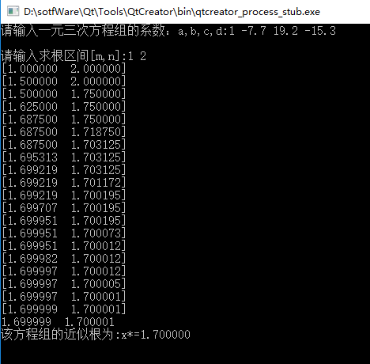

### 二分法求解方程的根
* 用二分法求`f(x) = x*x*x - 7.7*x*x + 19.2*x - 15.3`在区间[1,2]之间的根

### 代码实现

    /********************************************
     * > File Name: Binary.c
     * > Author:WangRenhong
     * > School:NUC-16070641班
     * > Created Time: 2018年10月30日 星期二
    **************************************************/
    #include <stdio.h>
    #include <math.h>
    const double eps = 1e-6; //定义计算的精度
    double a,b,c,d;//假定输入的函数是一元三次方程组，a*x*x*x+b*x*x+c*x+d=0
    double f(double x) //定义我们的函数
    {
        return a*x*x*x + b*x*x + c*x + d;
    }
    int main()
    {
        double m,n;//求根区间[m,n]
        double i,j,sum;
        printf("请输入一元三次方程组的系数：a,b,c,d:");
        scanf("%lf%lf%lf%lf",&a,&b,&c,&d);
        printf("\n请输入求根区间[m,n]:");
        scanf("%lf%lf",&m,&n);
        if(f(m)*f(n)<0)
        {
            while(fabs(m-n)>eps)
            {
                i=(m+n)/2.0;
                sum=f(i);
                printf("[%lf  %lf]\n",m,n);
                if(fabs(sum)<eps)
                {
                    break;
                }
                else if(f(i)*f(m)<0)
                {
                    n=i; //修正区间，将[m,n]换成[m,i],这里的i是中点
                }
                else if(f(i)*f(n)<0)
                {
                    m=i;//修正区间，将[m,n]换成[i,n],这里的i是中点
                }
            }
        }
        printf("%lf  %lf",m,n);
        j=(m+n)/2;
        printf("\n该方程组的近似根为:x*=%lf\n",j);
        return 0;
    }

### 运行截图

