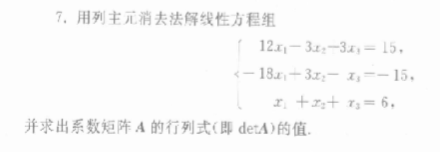
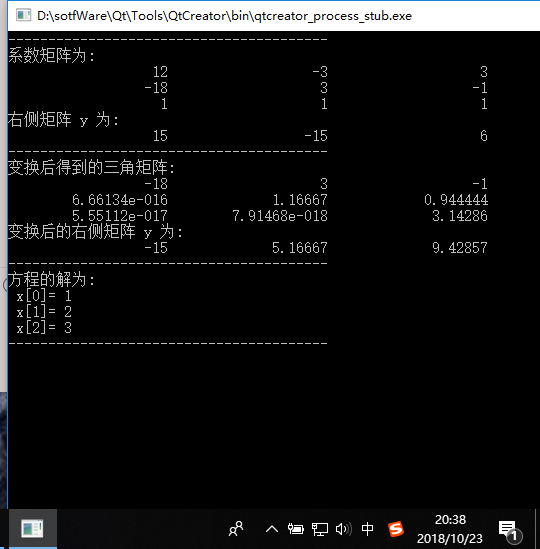

### 题目描述
* 利用主元消去法解线性方程

### 代码实现

    #include<iostream>
    #include<math.h>
    #include<iomanip>
    using namespace std;
    #define N 3

    void ColPivot(double c[N][N+1],double []); //函数声明

    int main()
    {
        int i,j;
        double x[N];
        double c[N][N+1]={12,-3,3,15,
                          -18,3,-1,-15,
                          1,1,1,6};
        cout<<"----------------------------------------"<<endl;
        cout<<"系数矩阵为: \n";
        for(i=0;i<N;i++)
        {
            for(j=0;j<N;j++)
            {
                cout<<setw(20)<<c[i][j];
            }
            cout<<endl;
        }
        cout<<"右侧矩阵 y 为: \n";
        for(i=0;i<N;i++)
        {
            cout<<setw(20)<<c[i][N];
        }
        cout<<endl;
        cout<<"----------------------------------------"<<endl;

        ColPivot(c,x); //调用函数，进行高斯消去法变换

        cout<<"变换后得到的三角矩阵: \n";
        for(i=0;i<N;i++)
        {
            for(j=0;j<N;j++)
            {
                cout<<setw(20)<<c[i][j];
            }
            cout<<endl;
        }
        cout<<"变换后的右侧矩阵 y 为: \n";
        for(i=0;i<N;i++)
        {
            cout<<setw(20)<<c[i][N];
        }
        cout<<endl;
        cout<<"----------------------------------------"<<endl;

        cout<<"方程的解为: \n";
        for(i=0;i<N;i++)
        {
            cout<<" x["<<i<<"]= "<<x[i]<<endl;
        }
        cout<<"----------------------------------------"<<endl;
        return 0;
    }

    void ColPivot(double c[N][N+1],double x[])
    {
        int i,j,k;
        double p,max;
        double t[N];
        for(i=0;i<=N-2;i++)
        {
            max=0;
            k=i;
            for(j=i+1;j<N;j++)
            {
                if(fabs(c[j][i])>max)
                {
                    k=j;
                    max=fabs(c[j][i]); //选主元
                }
            }
            if(k!=i)
            {
                for(j=i;j<=N;j++)
                {
                    p=c[i][j];
                    c[i][j]=c[k][j]; //选出主元后进行交换
                    c[k][j]=p;
                }
            }
            for(j=i+1;j<N;j++)
            {
                p=c[j][i]/c[i][i];
                for(k=i;k<=N;k++)
                {
                    c[j][k]-=p*c[i][k]; //高斯消去，进行计算
                }
            }
        }
        for(i=0;i<N;i++)
        {
            t[i]=c[i][N];
        }
        for(i=N-1;i>=0;i--) //利用回代法求最终解
        {
            for(j=N-1;j>i;j--)
            {
                t[i]-=c[i][j]*x[j];
            }
            x[i]=t[i]/c[i][i];
        }
    }

### 运行截图

