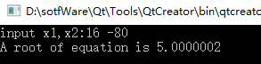

### 问题描述

* 用弦截法求方程 f(x)=x^3-5x^2+16x-80 的根

### 代码实现

    /********************************************
     * > File Name: xianJie.c
     * > Author:WangRenhong
     * > School:NUC-16070641班
     * > Created Time: 2018年10月30日 星期二
    **************************************************/
    #include<iostream>
    #include<iomanip>
    #include<cmath>
    using namespace std;
    double f(double);             //函数声明
    double xpoint(double,double); //函数声明
    double root(double,double);   //函数声明

    int main( )
    {
        double x1,x2,f1,f2,x;
        do{
            cout<< "input x1,x2:";
            cin >> x1 >> x2;
            f1=f(x1);
            f2=f(x2);
        } while(f1*f2 >= 0);
        x = root(x1,x2);
        cout << setiosflags(ios::fixed) << setprecision(7);//指定输出7位小数
        cout << "A root of equation is " << x << endl;
        return 0;
    }

    //定义f函数
    double f(double x)
    {
        double y;
        y = x * x * x - 5 * x * x + 16 * x - 80;
        return y;
    }
    //定义spoint 函数,求出弦与 x 轴的交点
    double xpoint(double x1,double x2)
    {
        double y;
        //在 xpoint 函数中调用 f 函数
        y = ( x1 * f(x2) - x2 * f(x1))/(f(x2) - f(x1));
        return y;
    }

    double root(double x1,double x2)                         //定义 root 函数，求近似根
    {
        double x,y,y1;
        y1 = f(x1);
        do{
            x = xpoint(x1,x2);                                 //在 root 函数中调用 xpoint 函数
            y = f(x);                                            //在 root 函数中调用 f 函数
            if(y*y1 > 0)
            {
                y1 = y;
                x1 = x;
            }
            else
                x2 = x;
        }while(fabs(y)>= 0.00001);
        return x;
    }

### 运行截图

