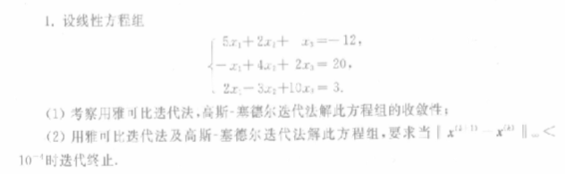
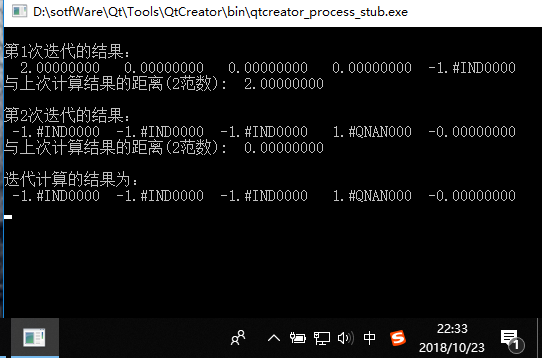

# 题目描述

* 按照给定的误差要求选雅克比或者高斯赛德尔迭代的一种求解

### 代码实现

      #include<stdio.h>
      #include<math.h>

      int main(void)
      {
          double A[3][4] = {{5,2,1,-12},
                         {-1,4,2,20},
                         {2,-3,10,3}};
          double b[5] = {10,0,0,0,0};
          double x[5] = {0}; //第k+1次迭代的结果
          double xx[5] = {0}; //第k次迭代的结果
          int size = 5;
          int Max = 100;  //最大迭代次数
          double residual = 0.0;  //
          double sum = 0.0;
          double dis = 0.0;
          double dif = 1.0;  //相邻迭代的结果差
          double eps = 1.0e-3; //迭代精度

          for(int k=1;(k<Max)&&(dif>eps);k++)
          {
              dif = 0.0;
              printf("\n第%d次迭代的结果：\n",k);

              for(int i=0;i<size;i++)
              {
                  for(int j=0;j<size;j++)
                  {
                      if(i!=j)
                      {
                          sum +=A[i][j]*xx[j];
                      }

                  }
                  x[i] = (b[i]-sum)/A[i][i];
                  sum = 0.0;

              }
              residual=0.0;
              //计算相邻迭代的结果差
              for(int m=0;m<size;m++)
              {
                  dis=fabs(x[m]-xx[m]);
                  if(dis>residual)
                  residual=dis;
              }
              dif=residual;
              //打印第k次的结果

              for(int i = 0;i<size;i++)
              {
                  printf("%12.8f ",x[i]);
                  xx[i]=x[i];
              }
              printf("\n与上次计算结果的距离(2范数):%12.8f \n",dif);

          }
          printf("\n迭代计算的结果为：\n");

          for(int k=0;k<size;k++)
          {
              printf("%12.8f ",xx[k]);
          }
          printf("\n");
          return 0;
      }
### 运行截图

