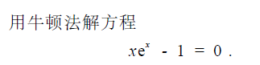
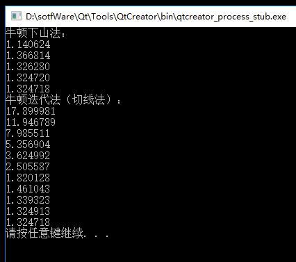

### 问题描述

### 代码实现

    /********************************************
     * > File Name: Newton.c
     * > Author:WangRenhong
     * > School:NUC-16070641班
     * > Created Time: 2018年10月30日 星期二
    **************************************************/
    #include <stdio.h>
    #include <stdlib.h>
    #include <math.h>
    #define  E 0.000001
    float fun(float x, int chs)
    {
        float y;
        if( 0 == chs )//原函数
            y = x*x*x -x -1;
        if( 1 == chs )//导数
            y = 3*x*x -1;
        return y;
    }
    //牛顿下山法
    float newton_downhill_method(float (*fun)(float, int), int iter, float x, float C, float E1, float E2)
    {
        int i = 1;
        float delta;
        float x0, x1;
        float f0, df0;
        float f1, df1;
        float landa = 1;

        if ( 0 == C )
        {
            C = 1;
        }
        x0 = x;
        while( i++ < iter )
        {
            f0 = fun(x0, 0);
            df0 = fun(x0, 1);
            x1 = x0 - f0/df0;
            f1 = fun(x1, 0);
            df1 = fun(x1, 1);
            //添加下山法
            landa = 1;
            while(1)
            {
                if( fabs(f0) > fabs(f1) )
                    break;
                landa = landa/2;
                x1 = x0 - landa*f0/df0;
                f1 = fun(x1, 0);
            }
            if( x1 < C )
                delta = fabs(x1 -x0);
            else
                delta = fabs(x1 -x0)/fabs(x1);

            x0 = x1;
            printf("%f\n", x0);
            if( delta<E1 || fabs(f1)<E2)
                break;
            if( 0 == df1)
            {
                printf("Error：df1=0,iterative calculation failure.\n");
                break;
            }
        }
        if ( i == iter )
        {
            printf("Error：The iteration upper limit is reached.\n");
            return 0;
        }
        return x1;
    }

    //牛顿迭代法（切线法）
    float newton_method(float (*fun)(float, int), int iter, float x, float C, float E1, float E2)
    {
        int i = 1;
        float delta;
        float x0, x1;
        float f0, df0;
        float f1, df1;

        if ( 0 == C )
        {
            C = 1;
        }
        x0 = x;
        while( i++ < iter )
        {
            f0 = fun(x0, 0);
            df0 = fun(x0, 1);
            x1 = x0 - f0/df0;
            f1 = fun(x1, 0);
            df1 = fun(x1, 1);
            if( x1 < C )
                delta = fabs(x1 -x0);
            else
                delta = fabs(x1 -x0)/fabs(x1);

            x0 = x1;
            printf("%f\n", x0);
            if( delta<E1 || fabs(f1)<E2)
                break;
            if( 0 == df1)
            {
                printf("Error：df1=0,iterative calculation failure.\n");
                break;
            }
        }
        if ( i == iter )
        {
            printf("Error：The iteration upper limit is reached.\n");
            return 0;
        }
        return x1;
    }

    int main()
    {
        int iter  = 1000;
        float x0  = 0.6;
        float C  = 1;
        printf("牛顿下山法：\n");
        newton_downhill_method(fun, iter, x0, C, E, E);
        printf("牛顿迭代法（切线法）：\n");
        newton_method(fun, iter, x0, C, E, E);
        system("pause");
        return 0;
    }

### 运行截图

