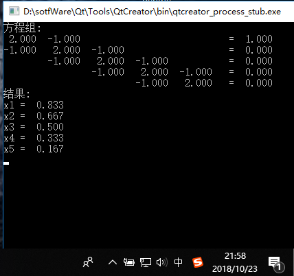

### 题目描述

* 用追赶法解三对角方程组

### 代码实现

    #include<stdio.h>
    //定义实验初始数据，根据题目不同修改
    #define N 5
    #define M N+1
    //为方便理解算法，数组0下标元素初始化为0，且不使用
    double a[M]={0,0,-1,-1,-1,-1};
    double b[M]={0,2,2,2,2,2};
    double c[M]={0,-1,-1,-1,-1,0};
    double f[M]={0,1,0,0,0,0};

    //打印显示方程组
    void OutputFormula(double a[M],double b[M],double c[M],double f[M],int n)
    {
        int loopi,loopj;
        printf("方程组:\n");
        for(loopi=1;loopi<=n;loopi++)
        {
            if(loopi==1)
            {
                 printf("%6.3f  %6.3f  ",b[loopi],c[loopi]);
                 for(loopj=1;loopj<=n-2;loopj++)
                        printf("\t");
                 printf(" = %6.3f\n",f[loopi]);
            }
            else if (loopi==n)
            {
                for(loopj=1;loopj<=n-2;loopj++)
                    printf("\t");
                printf("%6.3f  %6.3f  ",a[loopi],b[loopi]);
                printf(" = %6.3f\n",f[loopi]);
            }
            else
            {
                for(loopj=1;loopj<=loopi-2;loopj++)
                    printf("\t");
                printf("%6.3f  %6.3f  %6.3f  ",a[loopi],b[loopi],c[loopi]);
                for(loopj=1;loopj<=N-loopi-1;loopj++)
                    printf("\t");
                printf(" = %6.3f\n",f[loopi]);
            }
        }
    }

    //按追赶法公式求解三对角方程组
    void CalFormula(double a[M],double b[M],double c[M],double f[M],int n,double x[M])
    {
        int i;
        double Beta[M];     //记录追赶法中计算的Beta
        double y[M];  //记录追赶发中计算的y
        //1、计算BETA(i)
        Beta[1]=c[1]/b[1];
        for(i=2;i<=n-1;i++)
        {
              Beta[i]=c[i]/(b[i]-a[i]*Beta[i-1]);
        }
        //2、求解y[i]
        y[1]=f[1]/b[1];
        for(i=2;i<=n;i++)
        {
              y[i]=(f[i]-a[i]*y[i-1])/(b[i]-a[i]*Beta[i-1]);
        }
        //3、求解x[i]
        x[n]=y[n];
        for(i=n-1;i>=1;i--)
        {
            x[i]=y[i]-Beta[i]*x[i+1];
        }
    }
    //打印输出解的结果
    void OutputResult(double x[M],int n)
    {
        int i;
        printf("结果: \n");
        for(i=1;i<=n;i++)
        {
            printf("x%d = %6.3f",i,x[i]);
            printf("\n");
        }
    }

    //程序主函数
    int main()
    {
        double x[M]; //记录方程组解
        //打印显示方程组
        OutputFormula(a,b,c,f,N);
        //按追赶法公式求解三对角方程组
        CalFormula(a,b,c,f,N,x);
        //打印输出结果
        OutputResult(x,N);
        return 0;
    }

### 运行截图

