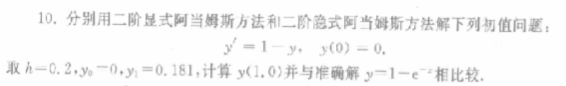
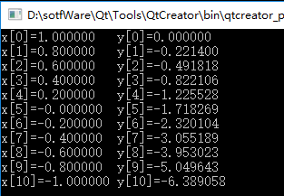

### 问题描述

### 代码实现

    #include<stdio.h>
    float f1(float x,float y)
    {
        return 1 - y;//方程
    }
    //四阶龙格库塔提供出发值
    void runge(float(*f)(float x,float y),float a,float b,float y0,int N,float yy[])
    {
        float x = a,y = y0,K1,K2,K3,K4;
        float h = (b-a)/N; int i;
        for(i=1;i<=3;i++)
        {
            K1 = (*f)(x,y);
            K2 = (*f)(x+h/2,y+h*K1/2);
            K3 = (*f)(x+h/2,y+h*K2/2);
            K4 = (*f)(x+h,y+h*K3);
            y = y+h*(K1+2*K2+2*K3+K4)/6;
            x = a+i*h;
            yy[i-1] = y;
        }
    }
    //阿当姆斯方法
    void adams(float a,float b,int N,float(*f)(float x,float y),float y0)
    {
        int i;
        float y1,y2,y,yp,yc,yy[3],h,x;
        printf("x[0]=%f\ty[0]=%f\n",a,y0);
        runge(f,a,b,y0,N,yy);
        y1 = yy[0];
        y2 = yy[1];
        y = yy[2];
        h = (b-a)/N;
        for(i=1;i<=3;i++)
            printf("x[%d]=%f\ty[%d]=%f\n",i,a+i*h,i,yy[i-1]);
        for(i=3;i<N;i++)
        {
            x = a+i*h;
            yp = y+h*(55*(*f)(x,y)-59*(*f)(x-h,y2)+37*(f)(x-2*h,y1)-9*(*f)(x-3*h,y0))/24;
            yc = y+h*(9*(*f)(x+h,yp)+19*(*f)(x,y)-5*(*f)(x-h,y2)+(*f)(x-2*h,y1))/24;
            printf("x[%d]=%f\ty[%d]=%f\n",i+1,x+h,i+1,yc);
            y0 = y1;
            y1 = y2;
            y2 = y;
            y = yc;
        }
    }
    int main()
    {
        float a = 1,b = -1,y0 = 0;
        int N = 10;
        adams(a,b,N,f1,y0);
        return 0;
    }

### 运行截图

