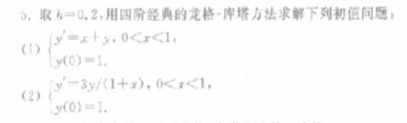
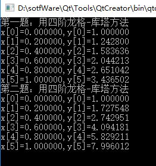

## 问题描述

### 代码实现

    #include<stdlib.h>
    #include<stdio.h>
    /*n表示几等分，n+1表示他输出的个数*/
    int RungeKutta(double y0,double a,double b,int n,double *x,double *y,
                                int style,double (*function)(double,double))
    {
        double h=(b-a)/n,k1,k2,k3,k4;
        int i;
        x[0]=a;
        y[0]=y0;
        switch(style)
        {
        case 2:
            for(i=0;i<n;i++)
            {
                x[i+1]=x[i]+h;
                k1=function(x[i],y[i]);
                k2=function(x[i]+h/2,y[i]+h*k1/2);
                y[i+1]=y[i]+h*k2;
            }
            break;
        case 3:
            for(i=0;i<n;i++)
            {
                x[i+1]=x[i]+h;
                k1=function(x[i],y[i]);
                k2=function(x[i]+h/2,y[i]+h*k1/2);
                k3=function(x[i]+h,y[i]-h*k1+2*h*k2);
                y[i+1]=y[i]+h*(k1+4*k2+k3)/6;
            }
            break;
        case 4:
            for(i=0;i<n;i++)
            {
                x[i+1]=x[i]+h;
                k1=function(x[i],y[i]);
                k2=function(x[i]+h/2,y[i]+h*k1/2);
                k3=function(x[i]+h/2,y[i]+h*k2/2);
                k4=function(x[i]+h,y[i]+h*k3);
                y[i+1]=y[i]+h*(k1+2*k2+2*k3+k4)/6;
            }
            break;
        default:
            return 0;
        }
        return 1;
    }
    //第一题 例子求y'=x+y(0<x<1);y0=1;
    double function1(double x,double y)
    {
        return x+y;
    }
    //第一题 例子求y'=3*y/(1+x)(0<x<1);y0=1;
    double function2(double x,double y)
    {
        return 3*y/(1+x);
    }

    int main()
    {
        double x[6],y[6];
        printf("第一题：用四阶龙格-库塔方法\n");
        RungeKutta(1,0,1,5,x,y,4,function1);
        for(int i=0;i<6;i++)
            printf("x[%d]=%f,y[%d]=%f\n",i,x[i],i,y[i]);
        printf("第二题：用四阶龙格-库塔方法\n");
        RungeKutta(1,0,1,5,x,y,4,function2);
        for(int i=0;i<6;i++)
            printf("x[%d]=%f,y[%d]=%f\n",i,x[i],i,y[i]);
        return 1;
    }

### 运行截图

