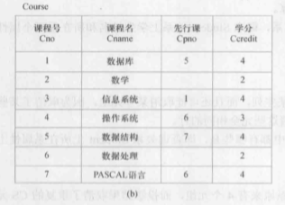

<h1 align="center">实验一：数据定义和数据库的完整性</h1>

### 一、实验目的:
* 1、掌握SQL的数据定义功能
* 2、掌握SQL语言对数据库完整性的支持。

### 二、实验内容：
* 1、建立一个数据库XSCJ，自行规定数据文件和日志文件各项参数。

      CREATE DATABASE [XSCJ];

* 2、参照课本56页建立Course表，并录入数据库表中相应元组。

     

      CREATE TABLE [XSCJ].[dbo].[Course](
        [Cno] [varchar](50) NOT NULL PRIMARY KEY,
        [Cname] [varchar](50) default NULL,
        [Cpno] [varchar](50) default NULL,
        [Ccredit] [varchar](50) default NULL
      )
      
      INSERT into [XSCJ].[dbo].Course (Cno,Cname,Cpno,Ccredit) values ('1','数据库','5','4');
      INSERT into Course values ('2','数学','','2');
      INSERT into Course values ('3','信息系统','1','4');
      INSERT into Course values ('4','操作系统','6','3');
      INSERT into Course values ('5','数据结构','7','4');
      INSERT into Course values ('6','数据处理','','2');
      INSERT into Course values ('7','PASCAL语言','6','4');

* 3、修改Course表增加一列，开课学期，数据类型自行定义。

      ALTER TABLE [XSCJ].[dbo].Course add Cterm [varchar](50);

* 4、为Course表的Cname列建立一个唯一索引，索引名Cname_idx。

      CREATE unique index Cname_idx on [XSCJ].[dbo].Course(Cname);

* 5、删除唯一索引Cname_idx。

      DROP Index Cname_idx on [XSCJ].[dbo].Course;

* 6、删除基本表Course。

      DROP TABLE [XSCJ].[dbo].Course;

* 7、删除数据库XSCJ

      DROP DATABASE XSCJ;

* 8、创建创建一个名为BSXT的数据库，其初始大小为5MB，最大大小10MB，允许数据库自动增长，增长方式是按10%比例增长；日志文件初始为2MB，最大可增长到5MB，按1MB增长。

      CREATE DATABASE [BSXT]
       CONTAINMENT = NONE
       ON  PRIMARY 
      ( 
        NAME = N'BSXT',
        FILENAME = N'D:\BSXT.mdf' , 
        SIZE = 5120KB , 
        MAXSIZE = 10240KB , 
        FILEGROWTH = 10%)
       LOG ON 
      ( 
        NAME = N'BSXT_log', 
        FILENAME = N'D:\BSXT_log.ldf' ,
        SIZE = 2048KB , 
        MAXSIZE = 5120KB , 
        FILEGROWTH = 1024KB 
      )
      GO

* 9、将以上BSXT据库的主数据文件的最大大小改为不限制。

      ALTER DATABASE BSXT 
      modify file 
      (
        name = BSXT, 
        maxsize = unlimited
      )

* 10、在BSXT系统中建立表1至表3共张表，要求采用T-SQL提供的六种约束创建三张表的实体完整性、参照完整性和用户定义的完整性定义。

<h5 align="center">表1 学生表（student）</h5>

<table>
   <tr>
      <td>中文含义</td>
      <td>字段名称</td>
      <td>数据类型</td>
      <td>长度</td>
      <td>是否可以为空</td>
      <td>备注</td>
   </tr>
   <tr>
      <td>学号</td>
      <td>Sno</td>
      <td>字符</td>
      <td>10</td>
      <td>No</td>
      <td>主码</td>
   </tr>
   <tr>
      <td>姓名</td>
      <td>Sname</td>
      <td>字符</td>
      <td>10</td>
      <td>No</td>
      <td></td>
   </tr>
   <tr>
      <td>性别</td>
      <td>Ssex</td>
      <td>字符</td>
      <td>2</td>
      <td>Yes</td>
      <td>‘男’或‘女’</td>
   </tr>
   <tr>
      <td>班级</td>
      <td>Sclass</td>
      <td>字符</td>
      <td>10</td>
      <td>Yes</td>
      <td></td>
   </tr>
   <tr>
      <td>联系电话</td>
      <td>Stel</td>
      <td>字符</td>
      <td>11</td>
      <td>No</td>
      <td></td>
   </tr>
   <tr>
      <td>分组</td>
      <td>Sgroup</td>
      <td>字符</td>
      <td>1</td>
      <td>No</td>
      <td></td>
   </tr>
   <tr>
      <td>密码</td>
      <td>Spassword</td>
      <td>字符</td>
      <td>10</td>
      <td>No</td>
      <td></td>
   </tr>
</table>

<h5 align="center">表2 教师表（Teacher）</h5>

<table>
   <tr>
      <td>中文含义</td>
      <td>字段名称</td>
      <td>数据类型</td>
      <td>长度</td>
      <td>是否可以为空</td>
      <td>备注</td>
   </tr>
   <tr>
      <td>教师号</td>
      <td>Tno</td>
      <td>字符</td>
      <td>10</td>
      <td>No</td>
      <td>主码</td>
   </tr>
   <tr>
      <td>姓名</td>
      <td>Tname</td>
      <td>字符</td>
      <td>10</td>
      <td>No</td>
      <td>取值唯一</td>
   </tr>
   <tr>
      <td>性别</td>
      <td>Tsex</td>
      <td>字符</td>
      <td>2</td>
      <td>Yes</td>
      <td>‘男’或‘女’</td>
   </tr>
   <tr>
      <td>系别</td>
      <td>Tdept</td>
      <td>字符</td>
      <td>20</td>
      <td>No</td>
      <td>默认为“计算机科学与技术系”</td>
   </tr>
   <tr>
      <td>学历</td>
      <td>Tdegree</td>
      <td>字符</td>
      <td>8</td>
      <td>Yes</td>
      <td></td>
   </tr>
   <tr>
      <td>职称</td>
      <td>Ttitle</td>
      <td>字符</td>
      <td>10</td>
      <td>Yes</td>
      <td></td>
   </tr>
   <tr>
      <td>教师身份</td>
      <td>Tright</td>
      <td>Bit </td>
      <td>1</td>
      <td>No</td>
      <td>1表示普通教师，0表示管理员</td>
   </tr>
   <tr>
      <td>联系电话</td>
      <td>Ttel</td>
      <td>字符</td>
      <td>11</td>
      <td>No</td>
      <td></td>
   </tr>
   <tr>
      <td>邮箱地址</td>
      <td>Temail</td>
      <td>字符</td>
      <td>50</td>
      <td>Yes</td>
      <td></td>
   </tr>
   <tr>
      <td>分组</td>
      <td>Tgroup</td>
      <td>字符</td>
      <td>1</td>
      <td>No</td>
      <td></td>
   </tr>
   <tr>
      <td>密码</td>
      <td>Tpassword</td>
      <td>字符</td>
      <td>10</td>
      <td>No</td>
      <td></td>
   </tr>
</table>

<h5 align="center">表3 毕业设计题目信息表</h5>

<table>
   <tr>
      <td>中文含义</td>
      <td>字段名称</td>
      <td>数据类型</td>
      <td>长度</td>
      <td>是否为空</td>
      <td>备注</td>
   </tr>
   <tr>
      <td>编号</td>
      <td>Hno</td>
      <td>字符</td>
      <td>4</td>
      <td>No</td>
      <td>主键</td>
   </tr>
   <tr>
      <td>设计题目</td>
      <td>Hname</td>
      <td>字符</td>
      <td>50</td>
      <td>No</td>
      <td></td>
   </tr>
   <tr>
      <td>题目状态</td>
      <td>Hstatus</td>
      <td>字符</td>
      <td>5</td>
      <td>No</td>
      <td></td>
   </tr>
   <tr>
      <td>设计任务和要求</td>
      <td>Hcontent </td>
      <td>字符</td>
      <td>200</td>
      <td>yes</td>
      <td></td>
   </tr>
   <tr>
      <td>备注</td>
      <td>dircetion</td>
      <td>字符</td>
      <td>200</td>
      <td>Yes</td>
      <td></td>
   </tr>
   <tr>
      <td>出题教师号</td>
      <td>Tno</td>
      <td>字符</td>
      <td>10</td>
      <td>Yes</td>
      <td>外码</td>
   </tr>
   <tr>
      <td>选题学生学号</td>
      <td>Sno</td>
      <td>字符</td>
      <td>10</td>
      <td>Yes</td>
      <td>外码</td>
   </tr>
</table>

      CREATE TABLE student
      (
        Sno char(10) NOT NULL PRIMARY KEY,
        Sname char(10) NOT NULL,
        Ssex char(2) default NULL CHECK(Ssex='男' or Ssex='女'),
        Sclass char(10) default NULL,
        Stel char(11) NOT NULL,
        Sgroup char(1) NOT NULL,
        Spassword char(10) NOT NULL
      )

      CREATE TABLE Teacher
      (
        Tno char(10) NOT NULL PRIMARY KEY,
        Tname char(10) NOT NULL UNIQUE,
        Tsex char(2) default NULL check(Tsex='男' or Tsex='女'),
        Tdept char(20) NOT NULL default '计算机科学与技术',
        Tdegree char(8) default NULL,
        Ttitle char(10) default NULL,
        Tright bit NOT NULL check(Tright=0 or Tright=1),
        Ttel char(11) NOT NULL,
        Temail char(50) default NULL,
        Tgroup char(1) NOT NULL,
        Tpassword char(10) NOT NULL
      )

      CREATE TABLE Question
      (
        Hno char(4) NOT NULL PRIMARY KEY,
        Hname char(50) NOT NULL,
        Hstatus char(5) NOT NULL,
        Hcontent char(200) default NULL,
        direction char(200) default NULL,
        Tno char(10) default NULL references Teacher(Tno),
        Sno char(10) default NULL references Student(Sno)
      )

      insert into Student (Sno,Sname,Ssex,Stel,Sgroup,Spassword) 
                            values ('1','张三','男','18406587219','8','root')
      insert into Teacher (Tno,Tname,Tsex,Tright,Ttel,Tgroup,Tpassword) 
                            values ('1','李四','女',0,'18406587218','6','lisi')
                            
      SELECT *,CASE Ssex WHEN '男' THEN '0' ELSE '1' END AS sex FROM student 

