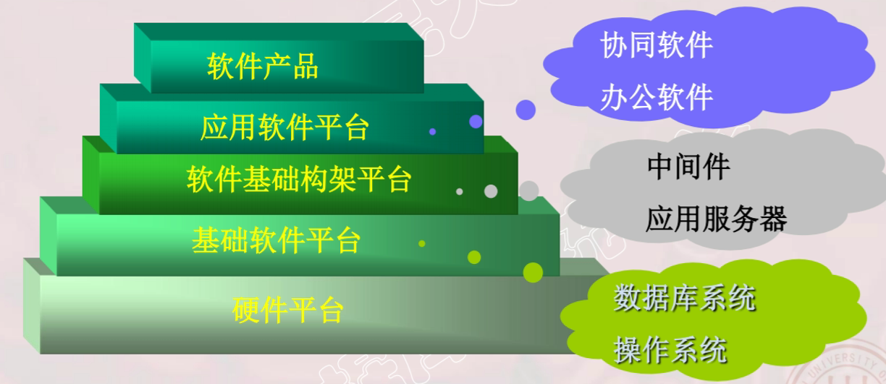
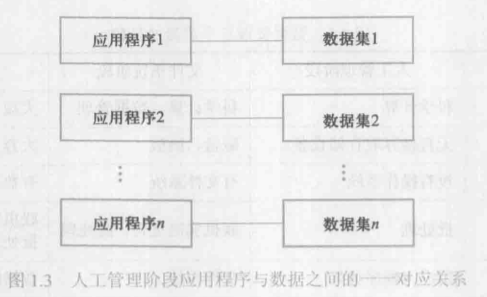
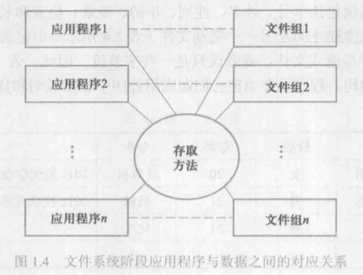
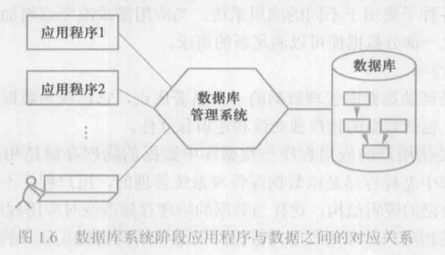

# 1.1数据库系统概述

### 1.1.1 数据库的四个基本概念

* 1、数据（data）

  * 定义：描述事物的符号记录称为数据。
  * 含义：数据的含义称为数据的语义。数据与其语义是不可分的。
  * 数据是数据库中存储的基本对象
  * 数据的种类
    * 文本、图形、图像、音频、视频、学生的档案记录、货物的运输情况等
  * 数据的特点
    * 数据与其语义是不可分的

* 2、数据库（DataBase，DB）

  * 数据库的定义
     * 数据库(Database,简称DB)是长期储存在计算机内、有组织的、可共享的大量数据的集合。
  * 数据库的基本特征
     * 数据按一定的数据模型组织、描述和储存
     * 可为各种用户共享
     * 冗余度（redundancy）较小
     * 数据独立性（data independency）较高
     * 易扩展（scalability）

* 3、数据库管理系统（DataBase Management System，DBMS）

  * DBMS的定义
    * 位于用户与操作系统之间的一层数据管理软件。
    * 计算机系统的基础软件，是一个大型复杂的软件系统
  * DBMS的用途
    * 科学地组织和存储数据、高效地获取和维护数据
  * 数据库管理系统是计算机的基础软件
  
  * 数据库在计算机系统中的位置
  
      

  
  * 主要功能：
  
    * 1>数据定义功能——数据定义语言（Data Definition Language，DDL）
    
    * 2>数据组织、存储和管理——如何实现数据之间的连系    （如：索引查找、hash查找、顺序查找等。 ）

    * 3>数据操纵功能——数据操纵语言（Data Manipulation Language，DML） 如：查询、插入、删除、修改等
    
    * 4>数据库事务管理和运行管理
    
    * 5>数据库的建立和维护功能
    
    * 6>其他功能（数据库管理系统与网络中其他软件系统的通信功能、一个数据库管理系统与另一个数据库管理系统或文件系统的数据转换功能、异构数据库之间的互访和互操作功能等）
    
* 4、数据库系统（DataBase System，DBS）

  * 数据库系统是由数据库、数据库管理系统（及其应用开发工具）、应用程序和数据库管理员（DataBase Administrator，DBA）组成的存储、管理、处理和维护数据的系统。
  
    * 数据库：提供数据的存储功能；
    
    * 数据库管理系统：提供数据的组织、存取、管理和维护等基础功能；
    
    * 数据库应用系统：根据应用需求使用数据库；
    
    * 数据库管理员：负责全面管理数据库系统。
    
    

  
### 1.1.2 数据管理技术的产生和发展

* 1、人工管理阶段

  * <1>特点
  
    * 1>数据不保存
    
    * 2> 应用程序管理数据
    
    * 3>数据不共享
    
    * 4>数据不具有独立性

  * <2>应用程序与数据之间的 一 一 对应关系
  
       

* 2、文件系统阶段

  * <1>优点：
  
    * 1>数据可以长期保存
    
    * 2>由文件系统管理数据
    
  * <2>缺点：
  
    * 1>数据共享性差，冗余度大
    
    * 2>数据独立性差
    

  * <3>文件系统阶段应用程序与数据之间的对应关关系：
  
      

* 3、数据库系统阶段（20世纪60年代后期）

  * 从文件系统到数据库系统标志着数据管理技术的飞跃。

* 4、数据库管理三个阶段的比较

### 1.1.3 数据库系统的特点

* 1、数据结构化

  * 1>数据库系统实现整体数据的结构化，这是数据库的主要特征之一，也是数据库系统与文件系统的本质区别。
  
  * 2>所谓“整体”结构化是指数据库中的数据不再仅仅针对某一个应用，而是面向整个组织或企业；不仅数据内部是结构化的，而且整体是结构化的，数据之间是具有连系的。
  
  

* 2、数据的共享性搞、冗余度低且易扩充

  * 1>数据共享可以大大减小数据冗余，节约存储空间。数据共享还能避免数据之间的不相容性与不一致性。
  
  * 2>数据库系统弹性大，易于扩充。
  
* 3、数据独立性高

  * 1>物理独立性：是指用户的应用程序与数据库中数据的物理存储是相互独立的。
  
  * 2>逻辑独立性：是指用户的应用程序与数据库中数据的逻辑结构是相互独立的。

* 4、数据库由数据库管理系统统一管理和控制

  * 1>数据的安全性（security）保护：指保护数据以防止不合法使用造成的数据泄密和破坏。
  
  * 2>数据的完整性（integrity）检查：指数据的正确性、有效性和相容性。
  
  * 3>并发（concurrency）控制
  
  * 4>数据库恢复（recovery）
  
    * 数据库管理系统必须具有将数据库从错误状态恢复到某一已知的正确状态（亦称为完整状态或一致状态）的功能，这就是数据库的恢复功能。
    
      

    
  * 数据库是长期存储在计算机内有组织、大量、共享的数据集合。它可以供各种用户共享，具有最小冗余度和较高的数据独立性。数据库管理系统在数据库建立、运用和维护时对数据库进行统一控制，以保证数据库的完整性和安全性，并在多用户同时使用数据库时进行并发控制，在发生故障后对数据库进行恢复。
  
  * 数据库系统的出现使信息系统从以加工数据的程序为中心转向围绕共享的数据库为中心的新阶段。

