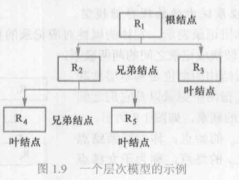
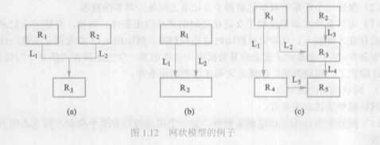

# 1.2数据模型

* 数据模型（data model）：也是一种模型，是对现实世界数据特征的抽象。
* 数据模型是数据库的核心和基础。
* 定义
    * 数据模型是对现实世界的模拟，在数据库中用于抽象、表示和处理现实世界中的数据和信息的工具。
* 要求
    * 能比较真实地模拟现实世界
    * 容易为人所理解
    * 便于在计算机上实现

### 1.2.1 两类数据模型

* 1、概念模型

* 2、逻辑模型和物理模型

* 首先将现实世界抽象为信息世界，然后将信息世界转换为机器世界。

    

### 1.2.2 概念模型

* 1、信息世界中的基本概念：

  * 1>实体（entity）：客观存在并可相互区别的事物称为实体。
  * 2>属性（attribute）：实体所具有的某一特性称为属性。
  * 3>码（key）：唯一标识实体的属性集称为码。
  * 4>实体型（entity type）：用实体名及其属性名集合来抽象和刻画同类实体，称为实体型。
  * 5>实体集（entity set）：同一类型实体的集合称为实体集。
  * 6>联系（relationship）：实体之间的联系通常是指不同实体集之间的联系。实体之间的

* 2、概念模型的一种表达方式：实体——联系方法

  * 实体——联系方法（Entity——Relationship approach）用E—R图（E—R diagram）来描述现实世界的概念模型，E—R方法也称为E-R模型。

### 1.2.3 数据模型的组成要素（数据模型通常由数据结构、数据操作和数据的完整性约束条件三部分组成）

* 1、数据结构：数据结构描述数据库的组成对象以及对象之间的联系。
* 2、数据操作：数据操作是指对数据库中各种对象（型）的实例（值）允许执行的操作的集合，包括操作及有关的操作规则。
* 3、数据的完整性约束条件：数据的完整性约束条件是一组完整性规则。

### 1.2.4 常用的数据模型

* 数据库领域中主要的逻辑数据模型：

    * 层次模型（hierarchical model）
    * 网状模型（network model）
    * 关系模型（relational model）
    * 面向对象数据模型（object origined data model）
    * 对象关系数据模型（object relational data model）
    * 半结构化数据模型（semistructure data model）

* 基本层次联系：是指两个记录以及它们之间的一对多（包括一对一）的联系，如下图所示：

    

### 1.2.5 层次模型

* 1、层次模型的数据结构：

    * 在数据库中定义满足下面两个条件的基本层次联系的集合为层次模型：
    
        * 1>有且只有一个节点没有双亲节点，这个节点称为根节点；
        * 2>根以外的其他节点有且只有一个双亲节点。
    
    * 在层次模型中，每个节点表示一个记录类型，记录类型之间的联系用节点之间的连线（有向边）表示，这种联系是父子之间的一对多的联系。
    
        

    
        * 层次模型像一棵倒立的树，节点的双亲是唯一的。

### 1.2.6 网状模型（典型代表是DBTG系统，亦称CODASYL系统）

* 1、网状模型的数据结构：

    * 在数据库中定义满足下面两个条件的基本层次联系的集合为网状模型：
    
        * 1>允许一个以上的节点无双亲；
        * 2>一个节点可以有多余一个的双亲。

        

