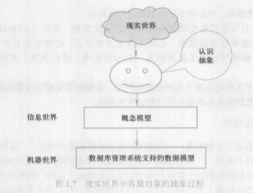
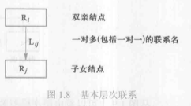

# 1.2数据模型

* 数据模型（data model）：也是一种模型，是对现实世界数据特征的抽象。
* 数据模型是数据库的核心和基础。

### 1.2.1 两类数据模型

* 1、概念模型

* 2、逻辑模型和物理模型

* 首先将现实世界抽象为信息世界，然后将信息世界转换为机器世界。

    

### 1.2.2 概念模型

* 1、信息世界中的基本概念：

  * 1>实体（entity）：客观存在并可相互区别的事物称为实体。
  * 2>属性（attribute）：实体所具有的某一特性称为属性。
  * 3>码（key）：唯一标识实体的属性集称为码。
  * 4>实体型（entity type）：用实体名及其属性名集合来抽象和刻画同类实体，称为实体型。
  * 5>实体集（entity set）：同一类型实体的集合称为实体集。
  * 6>联系（relationship）：实体之间的联系通常是指不同实体集之间的联系。实体之间的

* 2、概念模型的一种表达方式：实体——联系方法

  * 实体——联系方法（Entity——Relationship approach）用E—R图（E—R diagram）来描述现实世界的概念模型，E—R方法也称为E-R模型。

### 1.2.3 数据模型的组成要素（数据模型通常由数据结构、数据操作和数据的完整性约束条件三部分组成）

* 1、数据结构：数据结构描述数据库的组成对象以及对象之间的联系。
* 2、数据操作：数据操作是指对数据库中各种对象（型）的实例（值）允许执行的操作的集合，包括操作及有关的操作规则。
* 3、数据的完整性约束条件：数据的完整性约束条件是一组完整性规则。

### 1.2.4 常用的数据模型

* 数据库领域中主要的逻辑数据模型：

    * 层次模型（hierarchical model）
    * 网状模型（network model）
    * 关系模型（relational model）
    * 面向对象数据模型（object origined data model）
    * 对象关系数据模型（object relational data model）
    * 半结构化数据模型（semistructure data model）

* 基本层次联系：是指两个记录以及它们之间的一对多（包括一对一）的联系，如下图所示：

    

