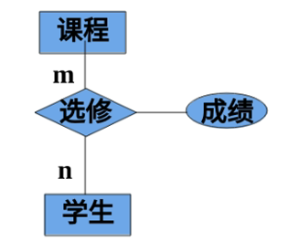

# 1.2数据模型

* 数据模型（data model）：也是一种模型，是对现实世界数据特征的抽象。
* 数据模型是数据库的核心和基础。
* 定义
    * 数据模型是对现实世界的模拟，在数据库中用于抽象、表示和处理现实世界中的数据和信息的工具。
* 要求
    * 能比较真实地模拟现实世界
    * 容易为人所理解
    * 便于在计算机上实现

### 1.2.1 两类数据模型

* 1、概念模型
     * 按用户的观点来对数据和信息建模，用于数据库设计，也称作信息模型。  
* 2、逻辑模型和物理模型
     * 逻辑模型是指按计算机系统的观点对数据建模，用于DBMS实现。
     * 物理模型是对数据最底层的抽象，描述数据在系统内部的表示方式和存取方法，在磁盘或磁带上的存储方式和存取方法。

* 首先将现实世界抽象为信息世界，然后将信息世界转换为机器世界。

    

### 1.2.2 概念模型

* 1、信息世界中的基本概念：

  * 1>实体（entity）：客观存在并可相互区别的事物称为实体。
  * 2>属性（attribute）：实体所具有的某一特性称为属性。
  * 3>码（key）：唯一标识实体的属性集称为码。
  * 4>实体型（entity type）：用实体名及其属性名集合来抽象和刻画同类实体，称为实体型。
  * 5>实体集（entity set）：同一类型实体的集合称为实体集。
  * 6>联系（relationship）：现实世界中事物内部以及事物之间的联系在信息世界中反映为实体内部的联系和实体之间的联系。
      * 实体内部的联系通常是指组成实体的各属性之间的联系
      * 实体之间的联系通常是指不同实体集之间的联系
  * 7>域（Domain）：属性的取值范围。

* 2、概念模型的一种表达方式：实体——联系方法

  * 实体——联系方法（Entity——Relationship approach）
      * 用E—R图（E—R diagram）来描述现实世界的概念模型
      * E—R方法也称为E-R模型。

    

* 3、用途
   * 概念模型用于信息世界的建模，是现实世界到机器世界的一个中间层次，数据库设计人员和用户之间进行交流的语言。
* 4、要求
   * 较强的语义表达能力
   * 简单、清晰、易于用户理解

### 1.2.3 数据模型的组成要素（数据模型通常由数据结构、数据操作和数据的完整性约束条件三部分组成）

* 1、数据结构：数据结构描述数据库的组成对象以及对象之间的联系。
   
   * 定义
      * 描述数据库的组成对象，以及对象之间的联系
   * 描述的内容
      * 与数据类型、内容、性质有关的对象
      * 与数据之间联系有关的对象
   * 数据结构是对系统静态特性的描述

* 2、数据操作：数据操作是指对数据库中各种对象（型）的实例（值）允许执行的操作的集合，包括操作及有关的操作规则。

   * 数据操作
      * 对数据库中各种对象(型)的实例(值)允许执行的
      * 操作及有关的操作规则
   * 数据操作的类型和定义
      * 查询、更新(包括插入、删除、修改)
      * 操作的确切含义、操作符号、操作规则（如优先级）、实现操作的语言
   * 数据操作是对系统动态特性的描述

* 3、数据的完整性约束条件：数据的完整性约束条件是一组完整性规则。

   * 数据的完整性约束条件
      * 一组完整性规则的集合。
      * 完整性规则：给定的数据模型中数据及其联系所具有的制约和储存规则
      * 目的：用以限定符合数据模型的数据库状态以及状态的变化，以保证数据的正确、有效、相容。

   * 数据模型对完整性约束条件的定义
      * 反映和规定本数据模型必须遵守的基本的通用的完整性约束条件。例如在关系模型中，任何关系必须满足实体完整性和参照完整性两个条件。
      * 提供定义完整性约束条件的机制，以反映具体应用所涉及的数据必须遵守的特定的语义约束条件。

### 1.2.4 常用的数据模型

* 数据库领域中主要的逻辑数据模型：

    * 层次模型（hierarchical model）
    * 网状模型（network model）
    * 关系模型（relational model）
    * 面向对象数据模型（object origined data model）
    * 对象关系数据模型（object relational data model）
    * 半结构化数据模型（semistructure data model）

* 基本层次联系：是指两个记录以及它们之间的一对多（包括一对一）的联系，如下图所示：

    

### 1.2.5 层次模型（层次模型用树形结构来表示各类实体以及实体间的联系）

* 1、层次模型的数据结构：

    * 在数据库中定义满足下面两个条件的基本层次联系的集合为层次模型：
    
        * 1>有且只有一个节点没有双亲节点，这个节点称为根节点；
        * 2>根以外的其他节点有且只有一个双亲节点。
    
    * 在层次模型中，每个节点表示一个记录类型，记录类型之间的联系用节点之间的连线（有向边）表示，这种联系是父子之间的一对多的联系。
    
        

    
        * 层次模型像一棵倒立的树，节点的双亲是唯一的。
* 2、层次模型的特点：
   * 结点的双亲是唯一的
   * 只能直接处理一对多的实体联系
   * 每个记录类型可以定义一个排序字段，也称为码字段
   * 任何记录值只有按其路径查看时，才能显出它的全部意义
   * 没有一个子女记录值能够脱离双亲记录值而独立存在
* 3、层次模型的优点
   * 层次模型的数据结构比较简单清晰 
   * 查询效率高，性能优于关系模型，不低于网状模型
   * 层次数据模型提供了良好的完整性支持
* 4、层次模型的缺点
   * 多对多联系表示不自然
   * 对插入和删除操作的限制多，应用程序的编写比较复杂 
   * 查询子女结点必须通过双亲结点
   * 由于结构严密，层次命令趋于程序化 

### 1.2.6 网状模型（典型代表是DBTG系统，亦称CODASYL系统）

* 1、网状模型的数据结构：

    * 在数据库中定义满足下面两个条件的基本层次联系的集合为网状模型：
    
        * 1>允许一个以上的节点无双亲；
        * 2>一个节点可以有多余一个的双亲。

        

* 2、网状模型的优点
   * 能够更为直接地描述现实世界，如一个结点可以有多个双亲
   * 具有良好的性能，存取效率较高
* 3、网状模型的缺点
   * 结构比较复杂，而且随着应用环境的扩大，数据库的结构就变得越来越复杂，不利于最终用户掌握
   * DDL、DML语言复杂，用户不容易使用
   * 记录之间联系是通过存取路径实现的，用户必须了解系统结构的细节

### 1.2.7 关系模型

* 1、在用户观点下，关系模型中数据的逻辑结构是一张二维表，它由行和列组成。
* 2、关系模型的数据结构
   * 关系（Relation）
      * 一个关系对应通常说的一张表
   * 元组（Tuple）
      * 表中的一行即为一个元组
   * 属性（Attribute）
      * 表中的一列即为一个属性，给每一个属性起一个名称即属性名
   * 主码（Key）
      * 表中的某个属性组，它可以唯一确定一个元组。
   * 域（Domain）
      * 属性的取值范围。
   * 分量
      * 元组中的一个属性值。
   * 关系模式
      * 对关系的描述

* 3、最基本的规范条件：关系的每一个分量必须是一个不可分的数据项
* 4、关系数据模型的操纵与完整性约束
   * 数据操作是集合操作，操作对象和操作结果都是关系
   * 存取路径对用户隐蔽，用户只要指出“干什么”，不必详细说明“怎么干”
   * 关系的完整性约束条件 
      * 实体完整性
      * 参照完整性
      * 用户定义的完整性
* 5、关系模型的优缺点
   * 优点
      * 建立在严格的数学概念的基础上
      * 概念单一
      * 关系模型的存取路径对用户透明
   * 缺点
      * 存取路径对用户透明导致查询效率不如非关系数据模型
      * 为提高性能，必须对用户的查询请求进行优化，增加了开发DBMS的难度

