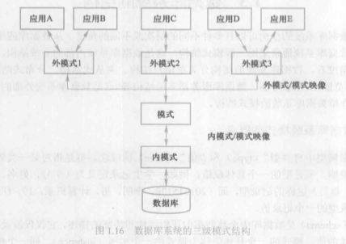

# 1.3 数据库系统的结构

### 1.3.1 数据库系统模式的概念

* 在数据模型中有“型”（type）和值（value）的概念。
* 模式是相对稳定的，而实例是相对变动的。
* 数据库管理系统通常都具有相同的特征，即采用三级模式结构，并提供两级映像功能。

### 1.3.2 数据库系统的三级模式结构

* 1、模式（schema）：模式也称逻辑模式，是数据库中全体数据的逻辑结构和特征的描述，是所有用户的公共数据视图。
* 2、外模式（external schema）：外模式也称子模式（subschema）或用户模式，它是数据库用户（包括应用程序员和最终用户）能够看见和使用的局部数据的逻辑结构和特征的描述,是数据库用户的数据视图，是与某一应用有关的数据的逻辑表示。
* 3、内模式（Internal schema）：内模式也称存储模式（storage schema），一个数据库只有一个内模式。它是数据库物理结构和存储方式的描述，是数据在数据库内部的组织方式。

### 1.3.3 数据库的二级映像功能与数据独立

* 1、外模式/模式映像

    当模式改变时（例如增加新的关系、新的属性、改变属性的数据类型等），由数据库管理员对各个外模式/模式的映像作相应改变，可以使外模式保持不变。应用程序是依据数据的外模式编写的，从而应用程序不必修改，保证了数据与程序的逻辑独立性，简称数据的逻辑独立性。

* 2、模式/内模式映像

    当数据的存储结构改变时（例如选用了另一种存储结构），由数据库管理员对模式/内模式映像作相应改变，可以使模式保持不变，从而应用程序也不必改变。保证了数据与程序的物理独立性，简称数据的物理独立性。
    
    数据与程序之间的独立性使得数据的定义和描述可以从应用程序中分离出去。另外，由于数据的存取由数据库管理系统管理，从而简化了应用程序的编制，大大减少了应用程序的维护和修改。

