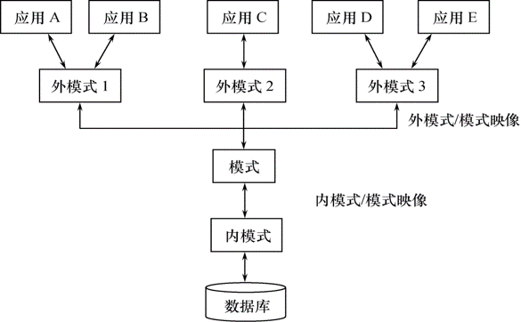

# 1.3 数据库系统的结构

* 数据库系统外部的体系结构
    * 单用户结构
    * 主从式结构
    * 分布式结构
    * 客户／服务器
    * 浏览器／应用服务器／数据库服务器多层结构等
* 数据库系统内部的系统结构
    * 模式（Schema） 
    * 外模式（External Schema）
    * 内模式（Internal Schema）

### 1.3.1 数据库系统模式的概念

* 在数据模型中有“型”（type）和值（value）的概念。
    * 型(Type)：对某一类数据的结构和属性的说明
    * 值(Value)：是型的一个具体赋值
* 模式是相对稳定的，而实例是相对变动的。
    * 模式（Schema）
        * 数据库逻辑结构和特征的描述
        * 是型的描述
        * 反映的是数据的结构及其联系
        * 模式是相对稳定的
    * 实例（Instance）
        * 模式的一个具体值
        * 反映数据库某一时刻的状态
        * 同一个模式可以有很多实例
        * 实例随数据库中的数据的更新而变动

* 数据库管理系统通常都具有相同的特征，即采用三级模式结构，并提供两级映像功能。

### 1.3.2 数据库系统的三级模式结构

* 1、模式（schema）：模式也称逻辑模式，是数据库中全体数据的逻辑结构和特征的描述，是所有用户的公共数据视图。
    * 模式（逻辑模式）
        * 数据库中全体数据的逻辑结构和特征的描述
        * 综合所有用户的需求
        * 一个数据库只有一个模式
    * 模式的内容
        * 数据的逻辑结构（数据项的名字、类型、取值范围等）
        * 数据之间的联系
        * 数据有关的安全性、完整性要求
    * 模式的地位：是数据库系统模式结构的中间层
        * 与数据的物理存储细节和硬件环境无关
        * 与具体的应用程序、开发工具及高级程序设计语言无关
* 2、外模式（external schema）：外模式也称子模式（subschema）或用户模式，它是数据库用户（包括应用程序员和最终用户）能够看见和使用的局部数据的逻辑结构和特征的描述,是数据库用户的数据视图，是与某一应用有关的数据的逻辑表示。
    * 外模式（子模式、用户模式）
        * 数据库用户（应用程序员、最终用户）使用的局部数据的逻辑结构和特征的描述
    * 外模式的地位：介于模式与应用之间
    * 模式与外模式的关系：一对多
        * 外模式是模式的子集
        * 对模式中同一数据，在外模式中的结构、类型、权限等都可以不同
    * 外模式的用途 
        * 逻辑的简化或扩展
        * 数据库安全性措施

* 3、内模式（Internal schema）：内模式也称存储模式（storage schema），一个数据库只有一个内模式。它是数据库物理结构和存储方式的描述，是数据在数据库内部的组织方式。
    * 内模式（也称存储模式）
        * 数据在数据库内部的组织方式，包括物理结构和存储方式的描述：
        * 数据存储记录结构的规定
        * 记录的存储方式：顺序存储，堆存储、聚簇存储等
        * 索引的组织方式
        * 压缩与否及类型
        * 加密与否及类型
    * 一个数据库只有一个内模式

* 目标
    * 程序和数据的分离
    * 数据和存储的分离

### 1.3.3 数据库的二级映像功能与数据独立

* 1、外模式/模式映像

    当模式改变时（例如增加新的关系、新的属性、改变属性的数据类型等），由数据库管理员对各个外模式/模式的映像作相应改变，可以使外模式保持不变。应用程序是依据数据的外模式编写的，从而应用程序不必修改，保证了数据与程序的逻辑独立性，简称数据的逻辑独立性。

    * 外模式/模式映象：外模式与模式之间的对应关系
    * 映象定义通常包含在各自外模式的描述中
    * 目的：保证数据的逻辑独立性

* 2、模式/内模式映像

    当数据的存储结构改变时（例如选用了另一种存储结构），由数据库管理员对模式/内模式映像作相应改变，可以使模式保持不变，从而应用程序也不必改变。保证了数据与程序的物理独立性，简称数据的物理独立性。
    
    数据与程序之间的独立性使得数据的定义和描述可以从应用程序中分离出去。另外，由于数据的存取由数据库管理系统管理，从而简化了应用程序的编制，大大减少了应用程序的维护和修改。

    * 模式/内模式映象：模式与内模式之间的对应关系
    * 该映象定义通常包含在模式描述中
    * 目的：保证数据的物理独立性

