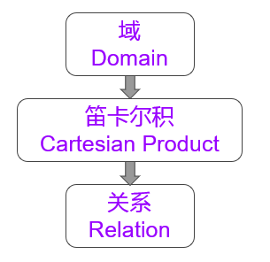
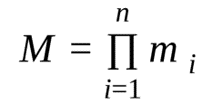

# 2.1关系数据结构及形式化定义

### 2.1.1  关系

* 1、关系的优越性
  * 单一的数据结构----关系
    * 现实世界的实体以及实体间的各种联系均用关系来表示
  * 逻辑结构----二维表
    * 从用户角度，关系模型中数据的逻辑结构是一张二维表
  * 建立在集合代数的基础上

* 2、关系的定义

   

------------------

* 3、域
  * 域是一组具有相同数据类型的值的集合。
    * 整数、实数、介于某个取值范围的整数、指定长度的字符串集合、{‘男’，‘女’}......
    * 基数(cadinal number)：一个域允许的不同取值个数

  >eg
  
    * D1:导师集合(SUPERVISOR) =｛张清玫，刘逸｝			m1=2
    * D2:专业集合(SPECIALITY) =｛计算机专业，信息专业｝	m2=2
    * D3:研究生集合(POSTGRADUATE) =｛李勇，刘晨，王敏｝m3=3

* 4、笛卡尔积
  * 笛卡尔积的定义
      * 给定一组域 D₁，D₂，…，Dn，这些域中可以有相同的。
      * D₁，D₂，…，Dn的笛卡尔积为：D₁×D₂×…×Dn ＝  ｛（d1，d2，…，dn）｜di∈Di，i＝1，2，…，n｝
        * 所有域的所有取值的一个组合
        * 不能重复
  >eg:
  
     D₁×D₂×D₃＝｛ (张清玫，计算机专业，李勇)，(张清玫，计算机专业，刘晨)， (张清玫，计算机专业，王敏)，(张清玫，信息专业，李勇)， (张清玫，信息专业，刘晨)，(张清玫，信息专业，王敏)， (刘逸，计算机专业，李勇)，(刘逸，计算机专业，刘晨)， (刘逸，计算机专业，王敏)，(刘逸，信息专业，李勇)， (刘逸，信息专业，刘晨)，(刘逸，信息专业，王敏) ｝

  * 笛卡尔积中的相关概念
    * 元组(Tuple)：笛卡尔积中每一个元素(d1，d2，…，dn)
    
         >(张清玫，计算机专业，李勇)、(张清玫，计算机专业，刘晨)

    * 分量(Component）：笛卡尔积元素中的每一个值di
    
         >张清玫、计算机专业、李勇、刘晨等都是分量

    * 基数（Cardinal number)：若Di(i＝1，2，…，n)为有限集，其基数为mi(i＝1，2，…，n)，则D1×D2×…×Dn的基数M为：

         

  * 表示方法
    * 笛卡尔积可表示为一个二维表
    * 表中的每行对应一个元组，表中的每列对应一个域

         

* 5、关系

  * 笛卡尔积的某个具有实际含义的子集
      * 限制：导师与专业：1:1，   导师与研究生：1:n
      * 实例：
      
            ｛ (张清玫，计算机专业，李勇)，
               (张清玫，计算机专业，刘晨)，
               (刘逸，信息专业，王敏)  }

  * 关系的定义
      * D₁×D₂×…×Dn的子集叫作在域D1，D2，…，Dn上的关系，表示为 `R（D₁，D₂，…，Dn）`
      * R：关系名，n：关系的目或度（Degree）

  * 属性
      * 列称为属性，对列起的名字，称为属性名，分量也称为属性值。
          * 候选码：若关系中的某一属性组的值能唯一标识一个元组
          * 全码：极端的情况下，关系模式的所有属性是候选码
          * 主码：若一个关系有多个候选码，则选定其中一个为主码
          * 主属性：候选码的诸属性称为主属性
          * 非主属性或非码属性：不包含在任何侯选码中的属性

  * 关系的性质
      * 列是同质的
      * 不同的列可出自同一个域
      * 列的次序无关
      * 任意两个元组的候选码不能相同
      * 行的次序无关
      * 分量必须取原子值

### 2.1.2  关系模式

* 关系模式是对关系的描述
   * 元组集合的结构
      * 属性构成
      * 属性来自的域          
      * 属性与域之间的映象关系
   * 完整性约束条件

* 关系模式可以形式化地表示为：

  *  `R(U, D, DOM, F)`
    
     >其中：
     
     * R是关系名，
     * U是组成该关系的属性名集合，
     * D是属性组U中属性所来自的域的集合，
     * DOM是属性向域的映象集合，
     * F是属性间的数据依赖关系集合
     
  * 例:    R是SAP
     
     * U=｛SUPERVISOR，SPECIALITY，POSTGRADUATE}
     * D=｛PERSON，SPECIALITY}
     * DOM=｛SUPERVISOR⟶PERSON
     * SPECIALITY⟶SPECIALITY，POSTGRADUATE}
     
     >关系模式可以简记为：R(U)或 R(A₁,A₂,…,An)

* 关系模式
    * 对关系的描述
    * 静态的、稳定的
* 关系
    * 关系模式在某一时刻的状态或内容
    * 动态的、随时间不断变化的
* 关系模式和关系往往统称为关系
    * 通过上下文加以区别

### 2.1.3 关系数据库

* 在一个给定的应用领域中，所有关系的集合构成一个关系数据库
* 关系数据库的组成
    * 关系数据库的型: 关系数据库模式
        * 若干域的定义
        * 在这些域上定义的若干关系模式
    * 关系数据库的值: 关系数据库模式在某一时刻对应的关系的集合
###  2.1.4 关系数据库的存储结构

