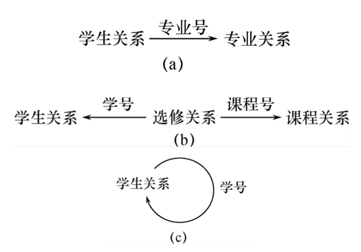

# 2.3 关系的完整性

* 实体完整性和参照完整性：
    * 关系模型必须满足的完整性约束条件，称为关系的两个不变性
    * 由关系系统自动支持
* 用户定义的完整性：
    * 应用领域需要遵循的约束条件，体现了具体领域中的语义约束

### 2.3.1  实体完整性

* 实体完整性规则（Entity Integrity）
    * 若属性A是基本关系R的主属性，则属性A不能取空值
* 实体完整性规则的说明 
    * 实体完整性规则是针对基本关系而言的。 一个基本表通常对应现实世界的一个实体集。 
    * 现实世界中的实体是可区分的，即它们具有某种唯 一性标识。 
    * 关系模型中以主码作为唯一性标识。 
    * 主码中的属性即主属性不能取空值。 

### 2.3.2  参照完整性

* 关系间的引用：
    * 关系R1的某个或某些属性的值全部来源于关系R2的某个或某些属性。
* 引用的类型：
    * 一对多联系：
      * 学生（学号，姓名，性别，专业号，年龄）
      * 专业（专业号，专业名）
    * 多对多联系：
      * 学生（学号，姓名，性别，专业号，年龄）
      * 课程（课程号，课程名，学分）
      * 选修（学号，课程号，成绩）
    * 关系内部的一对多联系： 
       * 学生（学号，姓名，性别，专业号，年龄，班长）

* 外码（Foreign Key）
    * 设F是基本关系R的一个或一组属性，但不是关系R的码。如果F与基本关系S的主码Ks相对应，则称F是基本关系R的外码。
    * 其中，基本关系R称为参照关系(Referencing Relation)，基本关系S称为被参照关系(Referenced Relation)或目标关系(Target Relation)。

   

* 参照完整性规则
   * 若属性(或属性组)F是基本关系R的外码，它与基本关系S的主码Ks相对应，则对于R中每个元组在F上的值必须为以下两者之一：
      * 空值(F的每个属性值均为空值)
      * 等于S中某个元组的主码值

### 2.3.3   用户定义的完整性

* 针对某一具体关系数据库的约束条件
* 某一具体应用所涉及的数据必须满足的语义要求
* 关系模型应提供定义和检验这类完整性的机制

    >例:	         课程(课程号，课程名，学分)

     * 非主属性“课程名”也不能取空值
     * “学分”属性只能取值{1，2，3，4}

