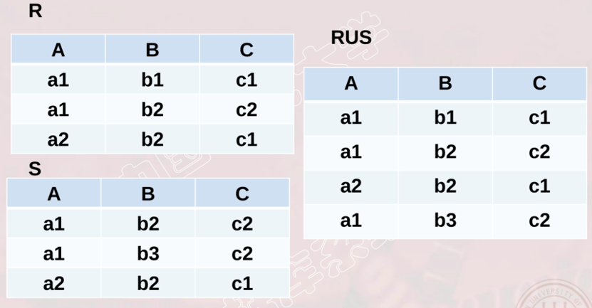
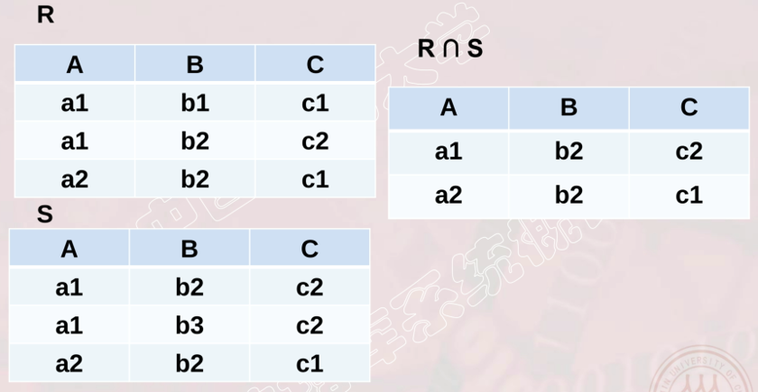
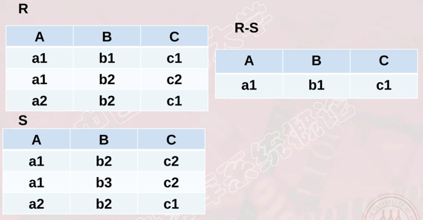
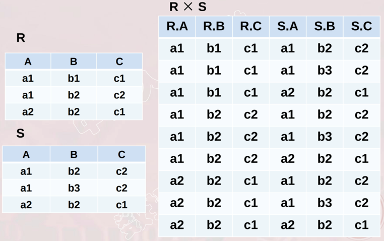
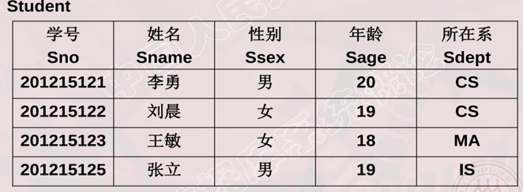
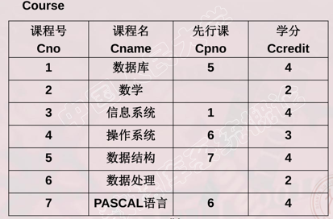
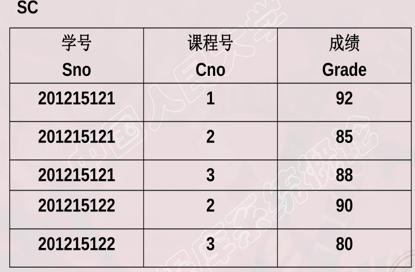
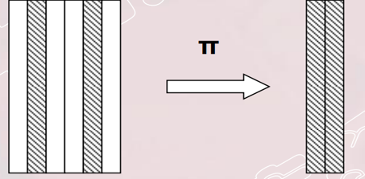
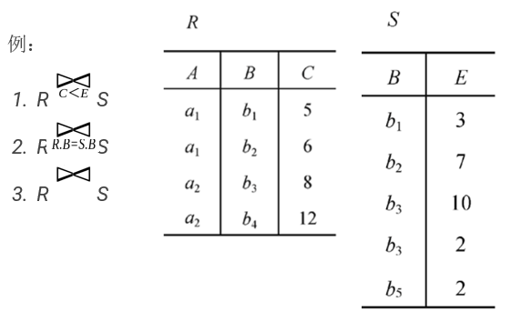

# 2.4关系代数

* 功能:
  * 关系代数是一种抽象的查询语言，通过对关系的运算来表达查询
* 形式:
  * 运算对象是关系
  * 运算结果亦为关系
  * 运算符类型：
    * 集合运算符:行的角度
    * 关系运算符:行和列的角度

### 2.4.1  传统的集合运算

* 1、并运算:	R ∪ S = { t | t ∈ R ∨ t ∈ S  }

   

* 2、交运算:	R ⋂ S = { t | t ∈ R ∧ t ∈ S }

   

* 3、差运算:	R - S = { t | t ∈ R ∧ t ∉ S }

   

* 4、笛卡尔积	R × S = { tr  ts | tr∈ R ∧ ts∈ S }

   

### 2.4.2 专门的关系运算

* 符号约定
  * 设关系模式为 R(A) 其中 A = { A1，A2，…，An }，t ∈ R
    * 属性组 X = { Ai1，Ai2，…，Aik }，即X ⊆ A
    * 属性组 X  = A - X
    * t[Ai] 则表示元组t中相应于属性Ai的一个分量
    * t[X] = t ( t[Ai1]，t[Ai2]，…，t[Aik] )
    * 象集  Zx = { t[Z] | t ∈ R ∧  t[X]=x} 其中 Z⊆ A，一般来说，X⋂ Z = Φ ⋀ A X∪ Z = A ，表示R中属性组X上值为x的诸元组在Z上的分量

   

   
   ---------

   

   
   ---------

   

-----------------

* 1、选择（selection）

* 在关系R(A)中选择满足给定条件的诸元组 

     `σF(R) = { t | t∈ R∧ F(t) = '真' }`
    
    * 其中，F是选择条件，其基本形式为：X θ Y

   

  * 例1 查询信息系（IS系）全体学生
  * 例2 查询年龄小于20岁的学生
  * 例3 查询计算机系的所有男生

* 2、投影（projection）

* 从R(A) 中选择出若干属性组成的新关系

     `πX(R) = { t[X] | t ∈ R }`      
     
     * 其中 X⊆ A

   

    * 例1 查询学生的姓名和所在系
    * 例2 查询学生关系Student中都有哪些系

* 3、连接（join）

   

   
   -------
   
   

* 悬浮元组：自然连接时被舍弃的元组
* 外连接(Outer Join)
    * 如果把悬浮元组也保存在结果关系中，而在其他属性上填空值(Null)，就叫做外连接
* 左外连接(LEFT OUTER JOIN或LEFT JOIN)
    * 只保留左边关系R中的悬浮元组
* 右外连接(RIGHT OUTER JOIN或RIGHT JOIN)
 	  * 只保留右边关系S中的悬浮元组

* 4、除（division）

    * 给定关系R (X，Y) 和S (Y，Z)，其中X，Y，Z为属性组。
    
      `R ÷ S = {tr[X]|tr∈ R ∧ πY(S)⊆ Yx}`
    
      * 其中，Yx是x在R中的象集，x = tr[X]

   

