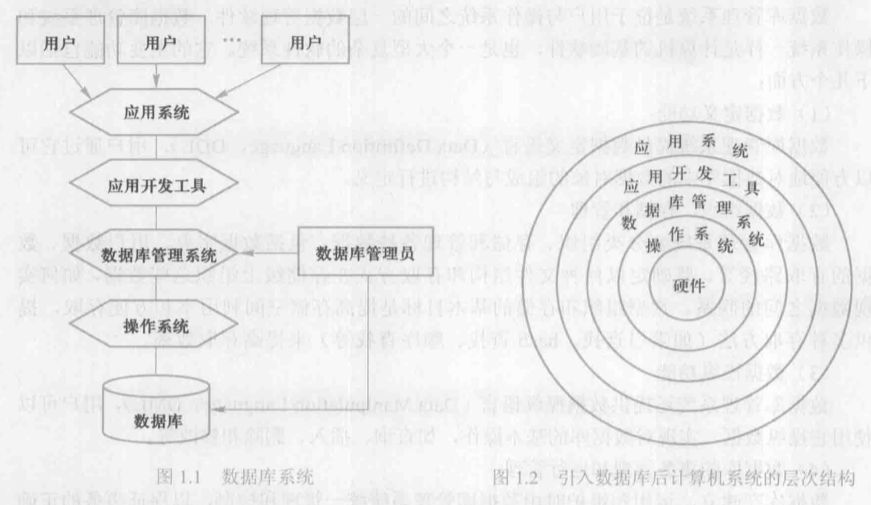

# 1.1数据库系统概述

### 1.1.1 数据库的四个基本概念

* 1、数据（data）

  * 定义：描述事物的符号记录称为数据。
  
  * 含义：数据的含义称为数据的语义。数据与其语义是不可分的。

* 2、数据库（DataBase，DB）

  * 数据库是长期存储在计算机内、有组织的、可共享的大量数据的集合。数据库中的数据按一定的数据模型组织、描述和存储，具有较小的冗余度（redundancy）、较高的数据独立性（data independency）和易扩展性（scalability），并可为各种用户共享。

* 3、数据库管理系统（DataBase Management System，DBMS）

  * 数据库管理系统是计算机的基础软件
  
  * 主要功能：
  
    * 1>数据定义功能——数据定义语言（Data Definition Language，DDL）
    
    * 2>数据组织、存储和管理——如何实现数据之间的连系    （如：索引查找、hash查找、顺序查找等。 ）

    * 3>数据操纵功能——数据操纵语言（Data Manipulation Language，DML） 如：查询、插入、删除、修改等
    
    * 4>数据库事务管理和运行管理
    
    * 5>数据库的建立和维护功能
    
    * 6>其他功能（数据库管理系统与网络中其他软件系统的通信功能、一个数据库管理系统与另一个数据库管理系统或文件系统的数据转换功能、异构数据库之间的互访和互操作功能等）
    
* 4、数据库系统（DataBase System，DBS）

  * 数据库系统是由数据库、数据库管理系统（及其应用开发工具）、应用程序和数据库管理员（DataBase Administrator，DBA）组成的存储、管理、处理和维护数据的系统。
  
    * 数据库：提供数据的存储功能；
    
    * 数据库管理系统：提供数据的组织、存取、管理和维护等基础功能；
    
    * 数据库应用系统：根据应用需求使用数据库；
    
    * 数据库管理员：负责全面管理数据库系统。
    
    

  
### 1.1.2 数据管理技术的产生和发展

* 1、人工管理阶段

  * <1>特点
  
    * 1>数据不保存
    
    * 2> 应用程序管理数据
    
    * 3>数据不共享
    
    * 4>数据不具有独立性

  * <2>应用程序与数据之间的 一 一 对应关系
  
       

* 2、文件系统阶段

  * <1>优点：
  
    * 1>数据可以长期保存
    
    * 2>由文件系统管理数据
    
  * <2>缺点：
  
    * 1>数据共享性差，冗余度大
    
    * 2>数据独立性差
    
      

