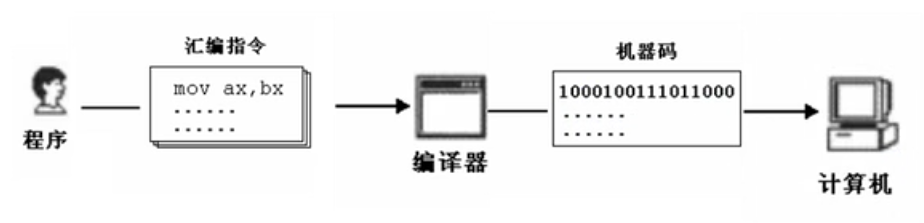
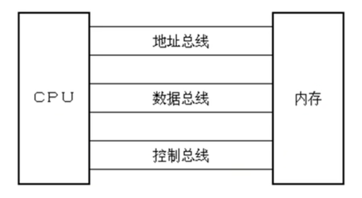
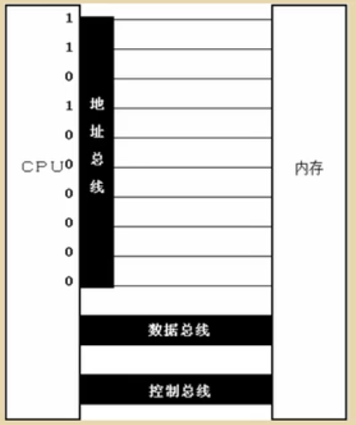
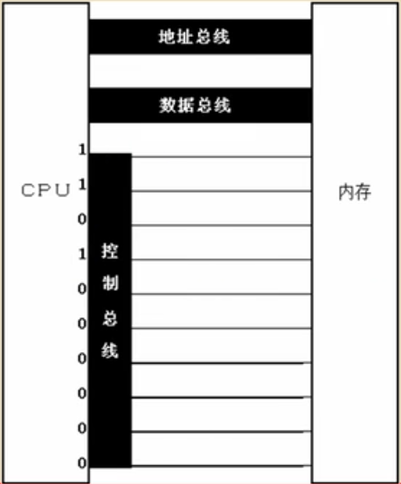
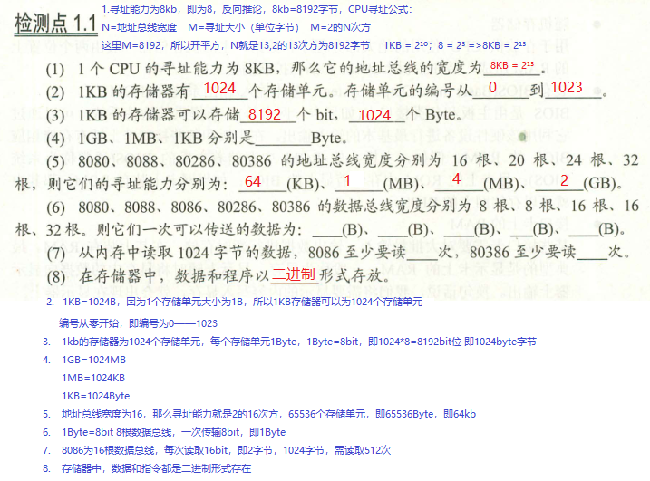
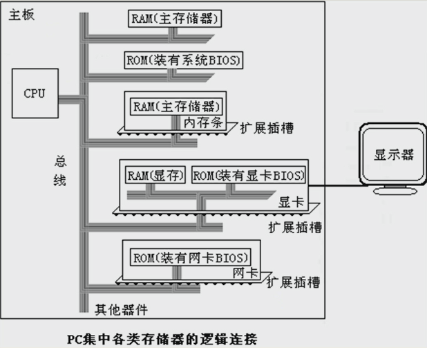
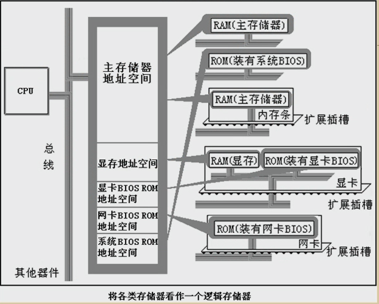
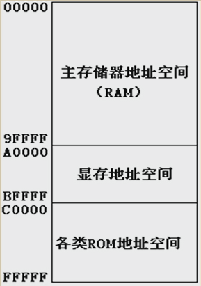

<h1 align="center">第一章：汇编语言——基础知识</h1>

## 1.1 机器语言

>eg

```asm
机器指令：1000 1001 1101 1000
操作：寄存器BX的内容送到AX中
汇编指令：MOV AX,BX
```


## 1.2 汇编语言的产生

* 汇编语言的主体是汇编指令
* 汇编指令和机器指令的差别在于指令的表示方法上。
	* 汇编指令是机器指令便于记忆的书写格式。
	* 汇编指令是机器指令的助记符。
* 寄存器
	* 简单的讲是CPU中可以存储数据的器件，一个CPU中有多个寄存器。

<div align="center"></div>

## 1.3 汇编语言的组成

* 汇编语言的组成
	* 1）汇编指令（机器码的助记符）
	* 2）伪指令（由编译器执行）
	* 3）其他符号（由编译器识别）
* 汇编语言的核心是汇编指令，它决定了汇编语言的特性。

## 1.4 存储器

* CPU是计算机的核心部件，它控制整个计算机运作并进行运算，要想让一个CPU工作，就必须向它提供指令和数据。
* 指令和数据在存储器中存放，也就是平时所说的内存。
* 在一台PC机中内存的作用仅次于CPU。
* 离开了内存，性能再好的CPU也无法工作。
* 磁盘不同于内存，磁盘上的数据或出现如果不读到内存中，就无法被CPU使用。

## 1.5 指令和数据

* 指令和数据是应用上的概念。
* 在内存和磁盘上，指令和数据没有任何区别，都是二进制信息。

  >eg
	
  ```asm
  二进制信息：
	1000 1001 1101 1000
		-->89D8H(数据)
	1000 1001 1101 1000
		-->MOV AX,BX(程序)
   ```

## 1.6 存储单元

* 存储器被划分为若干个存储单元，每个存储单元从0开始顺序编号。

  >eg
  
  ```asm
  一个存储器有128个存储单元，编号从0～127。
  ```

* 存储器计量容量的单位(B代表Byte)

  ```
  1KB = 1024B
  1MB = 1024KB
  1GB = 1024MB
  1TB = 1024GB
  ```

## 1.7 CPU对存储器的读写

* CPU要想进行数据的读写，必须和外部器件（标准的说法是芯片）进行三类信息的交互
	* 存储单元的地址（地址信息）
	* 器件的选择，读或写命令（控制信息）
	* 读或写的数据（数据信息）

* CPU是通过什么将地址、数据和控制信息传到存储芯片中的？
	* 电子计算机能处理、传输的信息都是电信号，电信号用导线传送。
	
* 在计算机中专门有连接CPU和其他芯片的导线，通常称为总线。
	* 物理上：一根根导线的集合；
	* 逻辑上划分为：
		* 地址总线
		* 数据总线
		* 控制总线

* 总线在逻辑上划分的图示：

<div align="center"></div>

* 对于8086CPU，下面的机器码能够完成从3号单元读取数据：
  ```asm
  机器码：1010 0000 0000 0011 0000 0000 
  含义：从3号单元读取数据送入寄存器AX
  CPU接收者条机器码后完成上述读写工作。
  ```

## 1.8 地址总线

* CPU是通过地址总线来指定存储单元的。
* 地址总线上能传送多少个不同的信息，CPU就可以对多少个存储单元进程寻址。
* 地址总线发送地址信息：

	<div align="center"></div>

* 一个CPU有N根地址总线，则可以说这个CPU的地址总线的宽度为N。这样的CPU最多可以寻找2的N次方个内存单元。

## 1.9 数据总线

* CPU与内存或其他器件之间的数据传送是通过数据总线来进行的。
* 数据总线的宽度决定了CPU和外界的数据传送速度。

## 1.10 控制总线

* CPU对外部器件的控制是通过控制总线来进行的。在这里控制总线是个总称，控制总线是一些不同控制线的集合。
* 有多少根控制总线，就意味着CPU提供了对外部器件的多少种控制。所以，控制总线的宽度决定了CPU对外部器件的控制能力。
* 控制总线上发送的控制信息。

	<div align="center"></div>

	* 以上所讲的内存读或写命令是由几根控制线综合发出的。
	* 其中有一根名为读信号输出控制线负责由CPU向外传送读信号，CPU向该控制线上输出低电平表示将要读取数据。
	* 有一根名为写信号输出控制线负责由CPU向外传送写信号。

## 小结

* （1）汇编指令是机器指令的助记符，同机器指令一一对应。
* （2）每一种CPU都有自己的汇编指令集。
* （3）CPU可以直接使用的信息在存储器中存放。
* （4）在存储器中指令和数据没有任何区别，都是二进制信息。
* （5）存储单元从零开始顺序编号。
* （6）一个存储单元可以存储8个bit（用作单位写成“b”），即8位二进制数。
* （7）
  ```
  1B = 8b       1KB = 1024B
  1MB = 1024KB  1GB = 1024MB
  ```
* (8)每一个CPU芯片都有许多管脚，这些管脚和总线相连。也可以说，这些管脚引出总线。一个CPU可以引出三种总线，他们的宽度标志了这个CPU的不同方面的性能：
	* 地址总线的宽度决定了CPU的寻址能力；
	* 数据总线的宽度决定了CPU与其他器件进行数据传送时的一次数据传送量；
	* 控制总线宽度决定了CPU对系统中其他器件的控制能力。

<div align="center"></div>

## 1.11 内存地址空间

* 一个CPU的地址线宽度为10，那么可以寻址1024个内存单元，这1024个可寻到的内存单元就构成了这个内存地址的空间。

## 1.12 主板

* 在每台PC机中，都有一个主板，主板上有核心器件和一些主要器件。
* 这些器件通过总线（地址总线、数据总线、控制总线）相连。

## 1.13 接口卡

* 计算机系统中，所有可用程序控制其工作的设备，必须受到CPU的控制
* CPU对外部设备不能直接控制，如显示器、音响、打印机等。直接控制这些设备进行工作的是插在扩展插槽上的接口卡。

## 1.14 各类存储器芯片

* 从读写属性分为：
	* 随机存储器（RAM）:断电后数据丢失，如内存，显存
	* 只读存储器（ROM）:关机后内存不消失，如主板，网卡的BIOS
* 从功能和连接上分：
	* 随机存储器（RAM)
	* 只读存储器（ROM）
	* 接口卡上的RAM

* 装有BIOS的ROM
	* BIOS：Basic Input/Output System,基于输入输出系统。
	* BIOS是由主板和各类接口卡（如:显卡、网卡等）厂商提供的软件系统，可以通过他利用该硬件设备进行最基本的输入输出。在主板和某些接口卡上插有存储相应BIOS的ROM。

* PC机中各类存储器的逻辑连接情况

	<div align="center"></div>

## 1.15 内存地址空间

* 上述的那些存储器在物理上是独立的器件，但是在逻辑上他们是相连的。
* 他们有以下两点上相同：
	* 都和CPU的总线相连；
	* CPU对他们进行读或写的时候都通过控制线发出内存读写命令。

* 将各类存储器看做一个逻辑存储器：
	
	<div align="center"></div>

* 不同的计算机系统的内存地址空间分配情况是不同的。
* 8086PC机的内存地址空间分配

	<div align="center"></div>

  ```asm
  8086 CPU的内存地址分配：
  00000—9FFFF为主存储器
  A0000—BFFFF为显存地址空间
  C0000—FFFFF为各类ROM地址空间
  ```

* 最终运行程序的是CPU，用汇编编程的时候，必须要从CPU的角度考虑问题。
* 对CPU来说，系统中的所有存储器中的存储单元都处于一个统一的逻辑存储器中，它的容量受CPU寻址能力的限制。这个逻辑存储器即是我们所说的内存地址空间。
