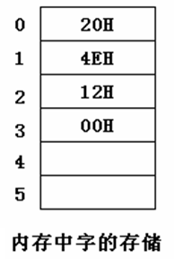
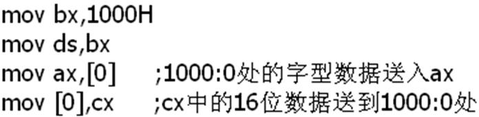
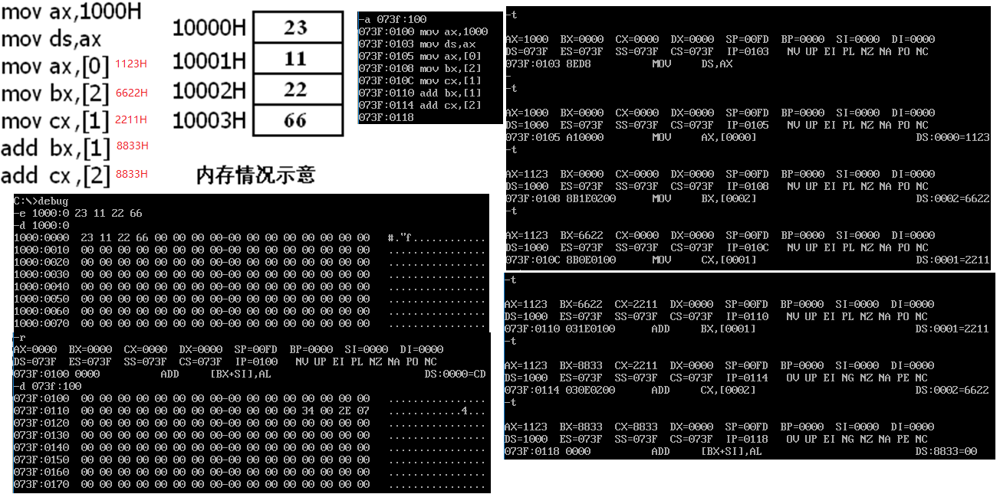
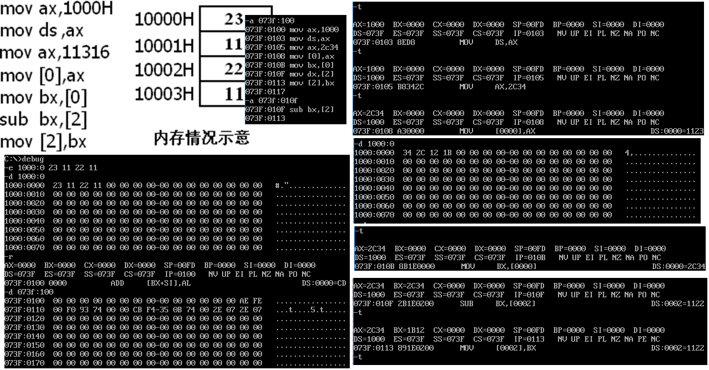

<h1 align="center">第三章寄存器(内存访问)</h1>

## 3.1 内存中字的存储

* 在0地址处开始存放20000(对应十六进制是4E20)：

	<div align="center"></div>

	* 0号单元是低地址单元，1号单元是高地址单元。
	* （1）0地址单元中存放的字节型数据是多少？**`20H`**
	* （2）0地址字单元中存放的字型数据是多少？**`4E20H`**
	* （3）2地址字单元中存放的字节型数据是多少？**`12H`**
	* （4）2地址单元中存放的字型数据是多少？**`0012H`**
	* （5）1地址字单元中存放的字型数据是多少？**`124EH`**


* 任何两个地址连续的内存单元，N号单元和 N+1号单元，可以将它们看成两个内存单元 ，也可以看成一个地址为N的字单元中的高位字节单元和低位字节单元。

## 3.2 DS和[address]

* CPU要读取一个内存单元的时候，必须先给出这个内存单元的地址；
* 在8086PC中，内存地址由段地址和偏移地址组成。
* 8086CPU中有一个 DS寄存器，通常用来存放要访问的数据的段地址。
  >例如：读取10000H单元的内容可以用如下程序段进行：

  ```asm
          mov bx,1000H
          mov ds,bx
          mov al,[0]
  上面三条指令将10000H（1000:0）中的数据读到al中。
  ```
  ```asm
  mov al,[0]
  已知的mov指令可完成的两种传送功能：
  （1）将数据直接送入寄存器；
  （2）将一个寄存器中的内容送入另一个寄存器中。
  mov 指令 还可以将一个内存单元中的内容送入一个寄存器。
  ```
	* 从哪个内存单元送到哪个寄存器中呢？

		* mov指令的格式：
	  	  ```asm
	  	  mov 寄存器名，内存单元地址
	  	  “[…]”表示一个内存单元， 
	  	  “[…]”中的0表示内存单元的偏移地址。
		  ```
	* 执行指令时，8086CPU自动取DS中的数据为内存单元的段地址。
	* 如何用mov指令从10000H中读取数据？
		* 10000H表示为`1000:0`（段地址:偏移地址）
		* 将段地址1000H放入ds
		* 用`mov al,[0]`完成传送（mov指令中的`[]`说明操作对象是一个内存单元，`[]`中的0说明这个内存单元的偏移地址是0，它的段地址默认放在ds中）
	* 如何把1000H送入ds？
		* 传送指令 `mov ax,1`
		* 相似的方式 `mov ds,1000H`?
			* 8086CPU不支持将数据直接送入段寄存器的操作，ds是一个段寄存器。
 （硬件设计的问题）
			* `mov ds,1000H` 是非法的。
		* 数据**->**一般的寄存器**->**段寄存器

	* 将`AL`中的数据送入内存单元10000H？
		* 分析问题本质：
			* 怎样将数据从寄存器送入内存单元？
		* 结论：
		  ```asm
		  mov bx,1000H
          mov ds,bx
          mov [0],al
		  ```

## 3.3 字的传送
* 因为8086CPU是16位结构，有16根数据线，所以，可以一次性传送16位的数据，也就是一次性传送一个字。
  >eg:

	<div align="center"></div>

* 习题
	* 问题3.3：内存中的情况如右图，写出下面指令执行后寄存器ax，bx，cx中的值。

		<div align="center"></div>

	* 问题3.4：内存中的情况如右图，写出下面指令执行后寄存器ax，bx，cx中的值。

		<div align="center"></div>

## 3.4 mov、add、sub指令

* mov指令的几种形式：
 	* mov 寄存器，数据`eg:mov ax,6`
 	* mov 寄存器，寄存器`eg:mov bx,ax`
 	* mov 寄存器，内存单元`eg:mov ax,[0]`
 	* mov 内存单元，寄存器`eg:mov [0],ax`
 	* mov 段寄存器，寄存器`eg:mov ds,ax`
 	* mov 寄存器，段寄存器`eg:mov ax,ds`

* sub指令的几种形式：
	* sub 寄存器，数据`eg:sub ax,6`
	* sub 寄存器，寄存器`eg:sub bx,ax`
	* sub 寄存器，内存单元`eg:sub ax,[0]`
	* sub 内存单元，寄存器`eg:sub [0],ax`

## 3.5 数据段


