<h1 align="center">第二章：寄存器(CPU工作原理)</h1>

## CPU概述

* 一个典型的CPU由**运算器、控制器、寄存器**等器件组成，这些器件靠内部总线相连。
* 内部总线与外部总线的区别：
	* 内部总线实现CPU内部各器件之间的联系；
	* 外部总线实现CPU和主板上其他器件的联系。
* 8086CPU有14个寄存器：
  ```asm
  通用寄存器：
  	数据寄存器：AX（累加器）、BX（基址変址）、CX（计数）、DX（数据）、
  	指针寄存器：SP（堆栈指针）、BP（基址指针）、
  	変址寄存器：SI（源変址）、DI（目的変址）、
  控制寄存器：
  IP（指令指针）、
  段寄存器：
  CS（代码）、SS（堆栈）、DS（数据）、ES（附加）、
  PSW
  ```

## 2.1 通用寄存器

* 8086CPU所有的寄存器都是16位的，可以存放两个字节。
* AX（累加器）、BX（基址変址）、CX（计数）、DX（数据）通常用来存放一般性数据被称为通用寄存器。
* 以AX为例，看寄存器的逻辑结构。 

	<div align="center">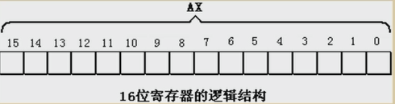</div>

* 一个16位寄存器可以存储一个16位的数据。
* 16位数据在寄存器中的存放情况

  >eg:
  
  ```asm
  数据：18
  二进制表示：1 0010
  在寄存器AX中的存储：
  ```

	<div align="center">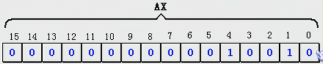</div>

* 一个16位寄存器所能存储的数据的最大值为2的16次方减一
* 8086上一代CPU中的寄存器都是8位的
* 为了保证兼容性，这四个（AX、BX、CX、DX）都可以分为两个独立的8位寄存器使用。
	* AX可分为AH和AL
	* BX可分为BH和BL
	* CX可分为CH和CL
	* DX可分为DH和DL

* 8086CPU的16位寄存器分为两个8位寄存器的情况：

	<div align="center"></div>

* AX的低8位（0位～7位）构成了AL寄存器，高8位（8位～15位）构成了AH寄存器。
* AH和AL寄存器是可以独立使用的8位寄存器。
* 8086CPU的8位寄存器数组存储情况：

	<div align="center">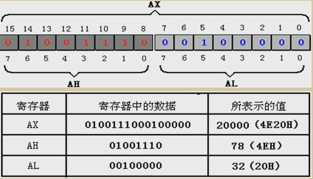</div>

## 2.2 字在寄存器中的存储

* 一个字可以存在一个16位寄存器中，这个字的高位字节和低位字节自然就存在这个寄存器的高8位和第8位寄存器中

## 2.3 几条汇编指令

	<div align="center">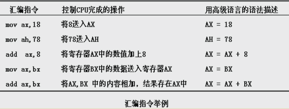</div>

* **汇编指令不区分大小写**
* CPU执行下表中的程序段的每条指令后，对寄存器中的数据进行改变。

	<div align="center">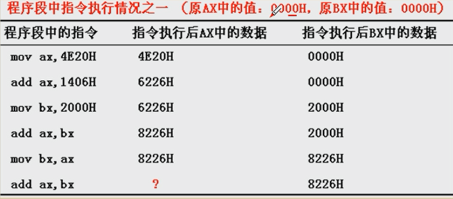</div>

	<div align="center">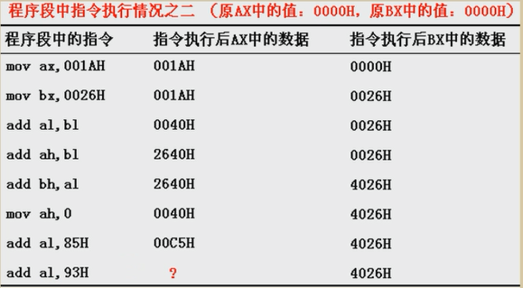</div>

	* 这里的丢失，指的是进位不能在8位寄存器中保存，但是CPU并不是真的丢弃这个值。

* 检测点2.1

	<div align="center">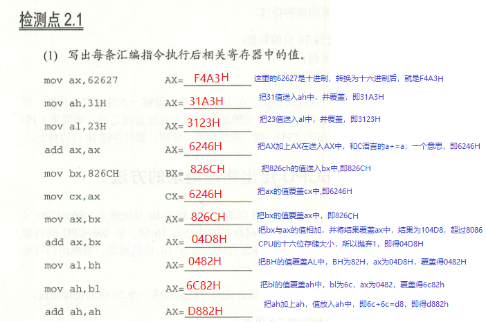</div>

	<div align="center">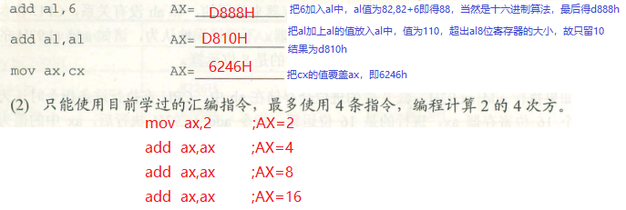</div>

## 2.4 物理地址

* CPU访问内存单元时要给出内存单元的地址。所有的内存单元构成的存储空间的一个一维的线性空间。
* 将这个唯一的地址称为物理地址。

## 2.5 16位结构的CPU

* 概括的讲，16位结构描述了一个CPU具有以下几方面的特征：
	* 1>运算器一次最多可以处理16位的数据；
	* 2>寄存器的最大宽度为16位；
	* 3>寄存器和运算器之间的通路是16位的。

## 2.6 8086CPU给出物理地址的方法

* 8086CPU有20位地址总线，可传送20位地址，寻址能力为1M。
* 8086内部为16位结构，它只能传送16位的地址，表现出的寻址能力却只有64K。
* 8086CPU如何用内部16位的数据转换成20位的地址？
	* 8086CPU采用一种在内部用两个16位地址合成的方法来形成一个20位的物理地址。

	<div align="center">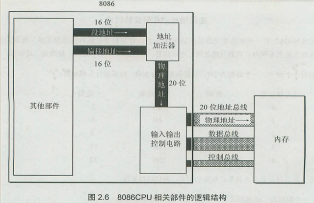</div>

* 8086CPU读写内存收拾：
	* 1>CPU中的相关部件提供两个16位的地址，一个称为段地址，另一个称为偏移地址；
	* 2>段地址和偏移地址通过内部总线送入一个称为地址加法器的部件；
	* 3>地址加法器将两个16位地址合并为一个20位的地址；

* 地址加法器合成物理地址的方法：
  ```assm
  物理地址 = 段地址 X 16 + 偏移地址 
  ```

	<div align="center">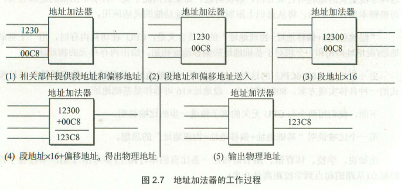</div>

* 由段地址乘16引发的问题
	* `段地址 X 16`有一个更为常用的说法就是数据左移四位。（二进制位）
	
	<div align="center">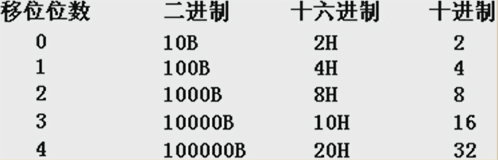</div>

	* 一个数据的二进制形式左移1位，相当于该数据乘以2；
	* 一个数据的二进制形式左移N为，相当于该数据乘以2的N次方；
	* 地址加法器如何完成段地址**乘16**的运算？
		* 以二进制形式存放在段地址左移4位。

	* 经过进一步分析思考
		* 一个数据的十六进制形式左移一位，相当于乘以16；
		* 一个数据的十进制形式左移一位，相当于乘以10；
		* 一个数据的X进制形式左移一位相当于乘以X......

## 2.7 “`物理地址 = 段地址 X 16 + 偏移地址`”的本质含义

* 两个比喻是说明：
	* 说明“`基础地址 + 偏移地址 = 物理地址`”的思想：

		<div align="center">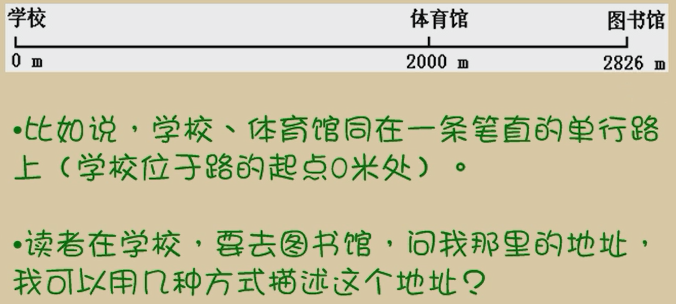</div>
		<div align="center">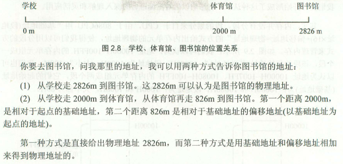</div>

	* 说明“`基础地址 X 16 + 偏移地址 = 物理地址`”的思想：

		<div align="center">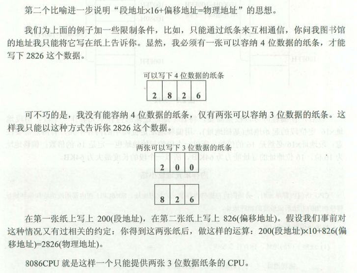</div>

	* 8086CPU就是这样一个只能提供两张3位数据纸条的CPU。

## 2.8 段的概念


