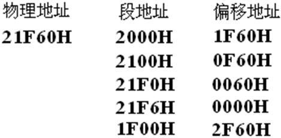
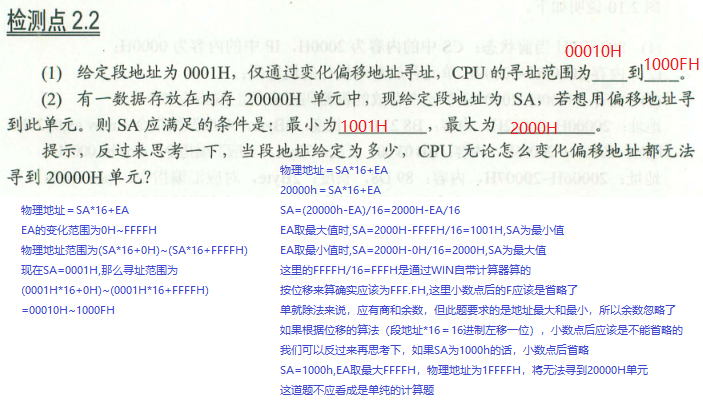
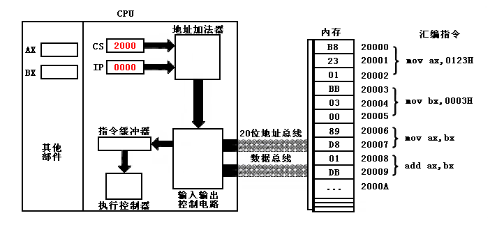
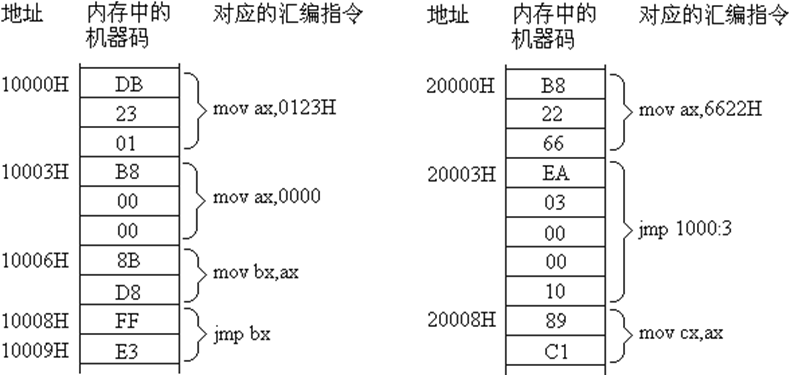
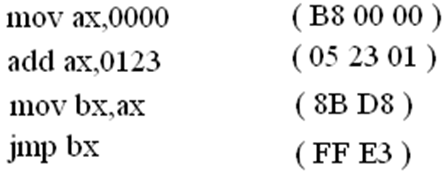
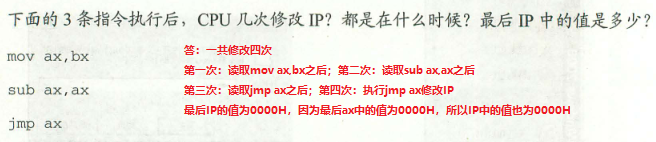

<h1 align="center">第二章：寄存器(CPU工作原理)</h1>

## CPU概述

* 一个典型的CPU由**运算器、控制器、寄存器**等器件组成，这些器件靠内部总线相连。
* 内部总线与外部总线的区别：
	* 内部总线实现CPU内部各器件之间的联系；
	* 外部总线实现CPU和主板上其他器件的联系。
* 8086CPU有14个寄存器：
  ```asm
  通用寄存器：
  	数据寄存器：AX（累加器）、BX（基址変址）、CX（计数）、DX（数据）、
  	指针寄存器：SP（堆栈指针）、BP（基址指针）、
  	変址寄存器：SI（源変址）、DI（目的変址）、
  控制寄存器：
  IP（指令指针）、
  段寄存器：
  CS（代码）、SS（堆栈）、DS（数据）、ES（附加）、
  PSW
  ```

## 2.1 通用寄存器

* 8086CPU所有的寄存器都是16位的，可以存放两个字节。
* AX（累加器）、BX（基址変址）、CX（计数）、DX（数据）通常用来存放一般性数据被称为通用寄存器。
* 以AX为例，看寄存器的逻辑结构。 

	<div align="center"></div>

* 一个16位寄存器可以存储一个16位的数据。
* 16位数据在寄存器中的存放情况

  >eg:
  
  ```asm
  数据：18
  二进制表示：1 0010
  在寄存器AX中的存储：
  ```

	<div align="center"></div>

* 一个16位寄存器所能存储的数据的最大值为2的16次方减一
* 8086上一代CPU中的寄存器都是8位的
* 为了保证兼容性，这四个（AX、BX、CX、DX）都可以分为两个独立的8位寄存器使用。
	* AX可分为AH和AL
	* BX可分为BH和BL
	* CX可分为CH和CL
	* DX可分为DH和DL

* 8086CPU的16位寄存器分为两个8位寄存器的情况：

	<div align="center"></div>

* AX的低8位（0位～7位）构成了AL寄存器，高8位（8位～15位）构成了AH寄存器。
* AH和AL寄存器是可以独立使用的8位寄存器。
* 8086CPU的8位寄存器数组存储情况：

	<div align="center"></div>

## 2.2 字在寄存器中的存储

* 一个字可以存在一个16位寄存器中，这个字的高位字节和低位字节自然就存在这个寄存器的高8位和第8位寄存器中

## 2.3 几条汇编指令

	<div align="center"></div>

* **汇编指令不区分大小写**
* CPU执行下表中的程序段的每条指令后，对寄存器中的数据进行改变。

	<div align="center"></div>

	<div align="center"></div>

	* 这里的丢失，指的是进位不能在8位寄存器中保存，但是CPU并不是真的丢弃这个值。

* 检测点2.1

	<div align="center"></div>

	<div align="center"></div>

## 2.4 物理地址

* CPU访问内存单元时要给出内存单元的地址。所有的内存单元构成的存储空间的一个一维的线性空间。
* 将这个唯一的地址称为物理地址。

## 2.5 16位结构的CPU

* 概括的讲，16位结构描述了一个CPU具有以下几方面的特征：
	* 1>运算器一次最多可以处理16位的数据；
	* 2>寄存器的最大宽度为16位；
	* 3>寄存器和运算器之间的通路是16位的。

## 2.6 8086CPU给出物理地址的方法

* 8086CPU有20位地址总线，可传送20位地址，寻址能力为1M。
* 8086内部为16位结构，它只能传送16位的地址，表现出的寻址能力却只有64K。
* 8086CPU如何用内部16位的数据转换成20位的地址？
	* 8086CPU采用一种在内部用两个16位地址合成的方法来形成一个20位的物理地址。

	<div align="center"></div>

* 8086CPU读写内存收拾：
	* 1>CPU中的相关部件提供两个16位的地址，一个称为段地址，另一个称为偏移地址；
	* 2>段地址和偏移地址通过内部总线送入一个称为地址加法器的部件；
	* 3>地址加法器将两个16位地址合并为一个20位的地址；

* 地址加法器合成物理地址的方法：
  ```assm
  物理地址 = 段地址 X 16 + 偏移地址 
  ```

	<div align="center"></div>

* 由段地址乘16引发的问题
	* `段地址 X 16`有一个更为常用的说法就是数据左移四位。（二进制位）
	
	<div align="center"></div>

	* 一个数据的二进制形式左移1位，相当于该数据乘以2；
	* 一个数据的二进制形式左移N为，相当于该数据乘以2的N次方；
	* 地址加法器如何完成段地址**乘16**的运算？
		* 以二进制形式存放在段地址左移4位。

	* 经过进一步分析思考
		* 一个数据的十六进制形式左移一位，相当于乘以16；
		* 一个数据的十进制形式左移一位，相当于乘以10；
		* 一个数据的X进制形式左移一位相当于乘以X......

## 2.7 “`物理地址 = 段地址 X 16 + 偏移地址`”的本质含义

* 两个比喻是说明：
	* 说明“`基础地址 + 偏移地址 = 物理地址`”的思想：

		<div align="center"></div>
		<div align="center"></div>

	* 说明“`基础地址 X 16 + 偏移地址 = 物理地址`”的思想：

		<div align="center"></div>

	* 8086CPU就是这样一个只能提供两张3位数据纸条的CPU。

## 2.8 段的概念

* 错误认识：
	* 内存呗划分成了一个一个的段，没一个段有一个段地址。
* 其实：
	* 内存并没有分段，段的划分来自于CPU，由于8086CPU用“`(段地址 X 16) + 偏移地址 = 物理地址`”的方式给出内存单元的物理地址，使得我们可以用分段的方式来管理内存。

* 分段

	<div align="center"></div>

* 在编程时可以根据需要，将若干地址连续的内存单元看作一个段，用“`段地址 X 16`”定位段的起始地址（基础地址），用偏移地址定位段中的内存单元。

* 两点注意：
	* （1）`段地址×16`必然是16的倍数，所以一个段的起始地址也一定是16的倍数；
	* （2）偏移地址为16位，16 位地址的寻址能力为 64K，所以一个段的长度最大为64K


* 内存单元地址小结
	* CPU访问内存单元时，必须向内存提供内存单元的物理地址。
	* 8086CPU在内部用段地址和偏移地址移位相加的方法形成最终的物理地址。

	* 思考问题
		* 1）观察下面的地址，有什么发现？
		
			<div align="center"></div>
	
			* 结论：CPU可以用不同的段地址和偏移地址形成同一个物理地址。
	
		* （2）如果给定一个段地址，仅通过变化偏移地址来进行寻址，最多可以定位多少内存单元？
			* 结论：偏移地址16位，变化范围为0~FFFFH，仅用偏移地址来寻址最多可寻64K个内存单元。
			* 比如：给定段地址1000H，用偏移地址寻址，CPU的寻址范围为：10000H~1FFFFH。
	
	* 在8086PC机中，存储单元的地址用两个元素来描述。即段地址和偏移地址。
	* “数据在21F60H内存单元中。”对于8086PC机的两种描述：
		* （a）数据存在内存2000:1F60单元中；
		* （b）数据存在内存的2000段中的1F60H单元中。
	* 可根据需要，将地址连续、起始地址为16的倍数的一组内存单元定义为一个段。

* 检测点2.2

	<div align="center"></div>

## 2.9 段寄存器

* 段寄存器就是提供段地址的。
	* 8086CPU有4个段寄存器：
	  ```asm
	  CS（代码）、SS（堆栈）、DS（数据）、ES（附加）
	  ```

* 当8086CPU要访问内存时，由这4个段寄存器提供内存单元的段地址。

## 2.10 CS和IP

* CS和IP是8086CPU中最关键的寄存器，它们指示了CPU当前要读取指令的地址。
    * CS为代码段寄存器；
    * IP为指令指针寄存器。

* 8086PC读取和执行指令相关部件

	<div align="center"></div>

	* 8086PC工作过程的简要描述
		* （1）从CS:IP指向内存单元读取指令，读取的指令进入指令缓冲器；
		* （2）IP = IP + 所读取指令的长度，从而指向下一条指令；
		* （3）执行指令。 转到步骤 （1），重复这个过程。
		* 在 8086CPU 加电启动或复位后（ 即 CPU刚开始工作时）CS和IP被设置为CS=FFFFH，IP=0000H，即在8086PC机刚启动时，CPU从内存FFFF0H单元中读取指令执行，FFFF0H单元中的指令是8086PC机开机后执行的第一条指令。

* 内存中指令和数据没有任何区别，都是二进制信息，CPU在工作的时候把有的信息看作指令，有的信息看作数据。
* CPU根据什么将内存中的信息看作指令？
	* CPU将CS:IP指向的内存单元中的内容看作指令。
* 在任何时候，CPU将CS、IP中的内容当作指令的段地址和偏移地址，用它们合成指令的物理地址，到内存中读取指令码，执行。
* 如果说，内存中的一段信息曾被CPU执行过的话，那么，它所在的内存单元必然被CS:IP指向过。

## 2.11 修改CS、IP的指令

* 在CPU中，程序员能够用指令读写的部件只有寄存器，程序员可以通过改变寄存器中的内容实现对CPU的控制。
* CPU从何处执行指令是由CS、IP中的内容决定的，程序员可以通过改变CS、IP中的内容来控制CPU执行目标指令。
* 我们如何改变CS、IP的值呢？
	* 8086CPU必须提供相应的指令
	
	  >先回想我们如何修改AX中的值？

	  ```asm
	  mov 指令
	  如：mov ax,123
	  mov指令可以改变8086CPU大部分寄存器的值，被称为传送指令。
	  能够通过mov 指令改变CS、IP的值吗？
	  mov指令不能用于设置CS、IP的值，8086CPU没有提供这样的功能。
	  ```

	* 8086CPU为CS、IP提供了另外的指令来改变它们的值：转移指令
	  ```asm
	  同时修改CS、IP的内容：
	  jmp 段地址：偏移地址
		  jmp 2AE3:3
		  jmp 3:0B16
	  功能：用指令中给出的段地址修改CS，偏移地址修改IP。

	  仅修改IP的内容：
	  jmp 某一合法寄存器
		   jmp ax   （类似于 mov IP,ax）
		   jmp bx
	  功能：用寄存器中的值修改IP。
	  ```
* 内存中存放的机器码和对应汇编指令情况： （初始：`CS=2000H，IP=0000H`）

	<div align="center"></div>

  >请写出指令执行序列：

  ```asm
  （1）mov ax,6622
  （2）jmp 1000:3
  （3）mov ax,0000
  （4）mov bx,ax
  （5）jmp bx
  （6）mov ax,0123H
  （7）转到第（3）步执行
  ```

## 2.12 代码段

* 对于8086PC机，在编程时，可以根据需要，将一组内存单元定义为一个段。
* 可以将长度为` N（ N≤64KB ）`的一组代码，存在一组地址连续、起始地址为 16的倍数的内存单元中，这段内存是用来存放代码的，从而定义了一个代码段。

  >例如

  <div align="center"></div>

	* 这段长度为 10 字节的字节的指令，存在从123B0H~123B9H的一组内存单元中，我们就可以认为，123B0H~123B9H这段内存单元是用来存放代码的 ，是一个代码段 ，它的段地址为123BH，长度为10字节。

* 如何使得代码段中的指令被执行呢？
	* 将一段内存当作代码段，仅仅是我们在编程时的一种安排，CPU 并不会由于这种安排，就自动地将我们定义得代码段中的指令当作指令来执行。
	* CPU 只认被 CS:IP 指向的内存单元中的内容为指令。
	* 所以要将CS:IP指向所定义的代码段中的第一条指令的首地址。
	* CS = 123BH，IP = 0000H。

## 2.9节~2.12节 小结

* 1、段地址在8086CPU的寄存器中存放。当8086CPU要访问内存时，由段寄存器提供内存单元的段地址。8086CPU有4个段寄存器，其中CS用来存放指令的段地址。
* 2、CS存放指令的段地址，IP存放指令的偏移地址。8086机中，任意时刻，CPU将CS:IP指向的内容当作指令执行。
* 3、8086CPU的工作过程：
	* （1）从CS:IP指向内存单元读取指令，读取的指令进入指令缓冲器；
	* （2）IP指向下一条指令；
	* （3）执行指令。（转到步骤（1），重复这个过程。）
* 4、8086CPU提供转移指令修改CS、IP的内容。

## 检测点2.3

  <div align="center"></div>


