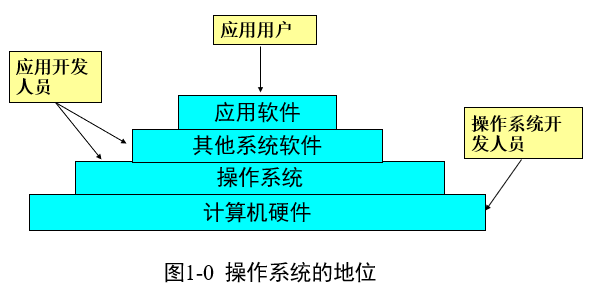

# 计算机操作系统

* 计算机系统 = 计算机硬件 + 计算机软件
     * 计算机硬件：CPU,内存，主板，硬盘，显示器等
     * 计算机软件：操作系统，驱动软件，应用软件等 
* 计算机系统的层次划分及地位
   
   

* [第一章、操作系统引论](./第一章、操作系统引论)
    * [1.1 操作系统的目标和作用](./第一章、操作系统引论/1.1操作系统的目标和作用.md)
    * [1.2 操作系统的发展过程](./第一章、操作系统引论/1.2操作系统的发展过程.md)
    * [1.3 操作系统的基本特性](./第一章、操作系统引论/1.3操作系统的基本特性.md)
    * [1.4 操作系统的主要功能](./第一章、操作系统引论/1.4操作系统的主要功能.md)
    * [1.5 OS结构设计](./第一章、操作系统引论/1.5OS结构设计.md)
    * [1.6 习题集](./第一章、操作系统引论/1.6习题集.md)
* [第二章、进程的描述与控制](./第二章、进程的描述与控制)
    * [2.1 前趋图和程序执行](./第二章、进程的描述与控制/2.1前趋图和程序执行.md)
    * [2.2 进程的描述](./第二章、进程的描述与控制/2.2进程的描述.md)
    * [2.3 进程控制](./第二章、进程的描述与控制/2.3进程控制.md)

