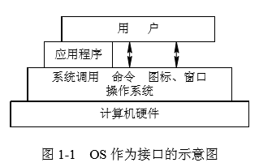
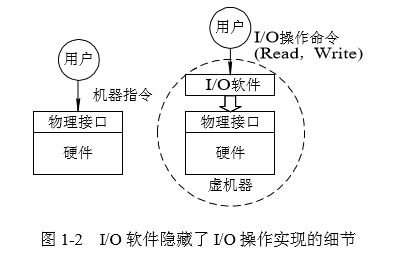

# 1.1操作系统的目标和作用

### 1.1.1 操作系统的目标

* 1、有效性

* 2、方便性

* 3、可扩充性

* 4、开放性

### 1.1.2 操作系统的作用

* 1、OS作为用户与计算机硬件系统之间的接口

    * 1>命令方式
    
    * 2>系统调用方式
    
    * 3>图形、窗口方式
    
    

* 2、OS作为计算机系统资源的管理者

* 3、OS实现了对计算机资源的抽象

    

### 1.1.3 推动操作系统发展的主要动力

* 1、不断提高计算机资源的利用率

* 2、方便用户

* 3、器件的不断更新换代

* 4、计算机体系结构的不断发展

* 5、不断提出新的应用需求。

