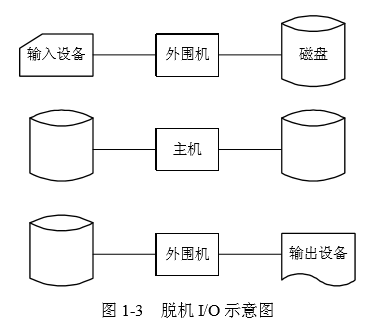
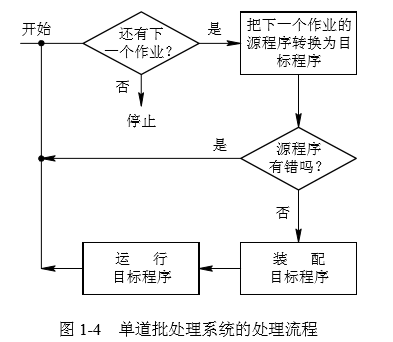

# 1.2操作系统的发展过程

### 1.2.1 无操作系统的计算机系统

* 1、人工操作方式

* 2、脱机输入/输出方式

    

### 1.2.2 单道批处理系统

* 1、单道批处理系统的处理过程

    

* 2、单道批处理系统的特征

    * 1>自动性
    
    * 2>顺序性
    
    * 3>单道性

### 1.2.3 多道批处理系统

* 1、多道程序设计技术带来的好处

    * (1) 提高 CPU 的利用率。

    

    * (2) 可提高内存和 I/O 设备利用率。
    
    * (3) 增加系统吞吐量。

* 2、多道批处理系统的优缺点 

    * (1) 资源利用率高。
    
    * (2) 系统吞吐量大。
    
    * (3) 平均周转时间长。
    
    * (4) 无交互能力。

* 3、多道批处理系统需要解决的问题 

