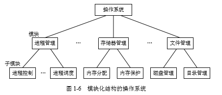

# 1.5 OS结构设计

### 1.5.1 传统的操作系统结构 

* 1、无结构操作系统 

* 2、模块化结构 OS 

    

    * 1)模块化程序设计技术的基本概念：该技术是基 于“分解”和“模块化”原则来控制大型软件的复杂度。
    
    * 2)模块的独立性：关键问题是模块的划分和规定好模块之间的接口。
    
      * (1) 内聚性，指模块内部各部分间联系的紧密程度。**内聚性越高**，模块的独立性越强。 
      * (2) 耦合度，指模块间相互联系和相互影响的程度。显然，**耦合度越低**，模块的独立性 越好。 

    * 3) 模块接口法的优缺点利用模块―接口法开发的 OS，
    
      较之无结构 OS 具有以下明显的优点： 
      * (1) 提高 OS 设计的正确性、可理解性和可维护性； 
      * (2) 增强 OS 的适应性； 
      * (3) 加速 OS 的开发过程。 
      
      模块化结构设计仍存在下述问题： 
      * (1) 在 OS 设计时，对各模块间的接口规定很难满足在模块完成后对接口的实际需求。 
      * (2) 在 OS 设计阶段，设计者必须做出一系列的决定(决策)，每一个决定必须建立在上 一个决定的基础上。但在模块化结构设计中，各模块的设计齐头并进，无法寻找到一个可 靠的决定顺序，造成各种决定的“无序性” ，这将使程序设计人员很难做到“设计中的每一 步决定都是建立在可靠的基础上”，因此模块―接口法又被称为“无序模块法”

* 3、分层式结构 OS 

  * 1)分层式结构的基本概念：每一层仅能使用其底层所提供的功能和服务。在用这种方法构成操作系统时，已将一个操作系统分为若干个层次，每层又由若干个模块组成， 各层之间只存在着单向的依赖关系，即高层仅依赖于紧邻它的低层。 
  
  * 2)分层结构的优缺点分层结构的主要优点有： 
  
    * (1) 易保证系统的正确性。自下而上的设计方式，使所有设计中的决定都是有序的，或 者说是建立在较为可靠的基础上的，这样比较容易保证整个系统的正确性。 
  
    * (2) 易扩充和易维护性。在系统中增加、修改或替换一个层次中的模块或整个层次，只要不改变相应层次间的接口，就不会影响其它层次，这必将使系统维护和扩充变得更加容易。 
    
    * 分层结构的主要缺点是：系统效率降低了。由于层次结构是分层单向依赖的，因此必 须在相邻层之间都要建立层次间的通信机制，OS 每执行一个功能，通常要自上而下地穿越 多个层次，这无疑会增加系统的通信开销，从而导致系统效率的降低。

### 1.5.2 客户/服务器模式 

### 1.5.3 面向对象的程序设计 

### 1.5.4 微内核OS 结构 

