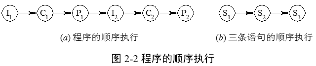
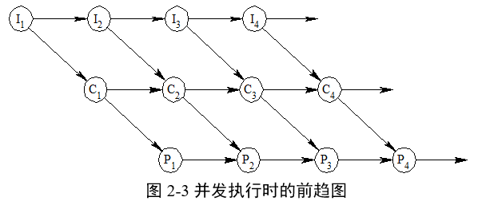
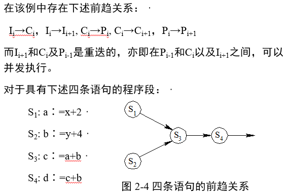

# 2.1进程的基本概念

### 2.1.1 前趋图 

* 1、前趋图(Precedence Graph)是一个有向无循环图，记为DAG(Directed Acyclic Graph)，用于描述进程之间执行的前后关系。图中的每个结点可用于描述一个程序段或进程，乃至一条语句；
* 2、结点间的有向边则用于表示两个结点之间存在的偏序(Partial Order)或前趋关系(Precedence Relation)“→”。
* 3、Pi→Pj，称Pi是Pj的**直接前趋**，而称Pj是Pi的**直接后继**。
* 4、在前趋图中，把没有前趋的结点称为**初始结点**(Initial Node)，把没有后继的结点称为**终止结点**(Final Node)。
* 5、每个结点还具有一个重量(Weight)，用于表示该结点所含有的程序量或结点的执行时间。 

  

* 对于图 2-1(a)所示的前趋图， 存在下述前趋关系： 
   * P1→P2, P1→P3, P1→P4, P2→P5, P3→P5, P4→P6, P4→P7, P5→P8, P6→P8, P7→P9, P8→P9

   >或表示为：
   
   * P={P1, P2, P3, P4, P5, P6, P7, P8, P9}→={ (P1, P2), (P1, P3), (P1, P4), (P2, P5), (P3, P5), (P4, P6), (P4, P7),(P5, P8), (P6, P8), (P7, P9), (P8, P9)} 

   * 注意:前趋图中必须不存在循环，但在图2-1(b)中却有着下述的前趋关系：`S2→S3, S3→S2`

### 2.1.2 程序的顺序执行及其特征 

* 1、程序的顺序执行
   * 程序是人们要计算机完成的一些指令序列，是一个按严格次序顺序执行的操作序列，是一个静态的概念。
   * 程序的顺序执行：一个具有独立功能的程序独占处理机，直到最后结束的过程。

    >例如，I->C->P
    
    >S1: a∶=x+y;· S2: b∶=a-5;· S3: c∶=b+1;

  

* 2、程序顺序执行时的特征 

   * 1）顺序性
   * 2）封闭性
   * 3）可再现性

### 2.1.3 程序的并发执行及其特征 

* 1、程序的并发执行 
  * 并发性指多道程序在同一时间间隔内同时发生，为了增强计算机系统的处理能力，提高资源的利用率所采取的一种同时操作技术。
  
  

  
  
  

    
  
  
* 2、程序并发执行时的特征 
  * 间断性 
  * 失去封闭性 
  * 不可再现性 

        循环程序A和B共享一个变量N。
        程序A：N∶=N+1；
        程序B：Print(N)；N=“0”。
        程序A和B以不同的速度运行。

        1) N∶=N+1在Print(N)和N∶=0之前，此时得到的N值分别为n+1, n+1, 0。
        2) N∶=N+1在Print(N)和N∶=0之后，此时得到的N值分别为n, 0, 1。
        3) N∶=N+1在Print(N)和N∶=0之间，此时得到的N值分别为n, n+1, 0。
