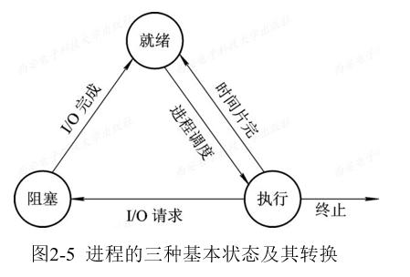
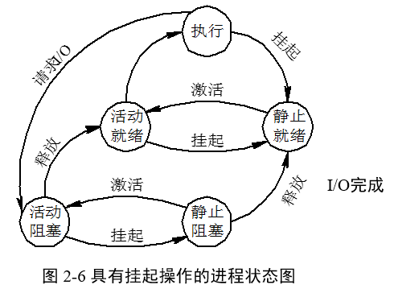
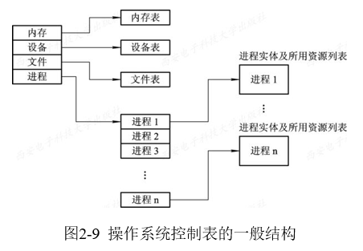
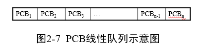
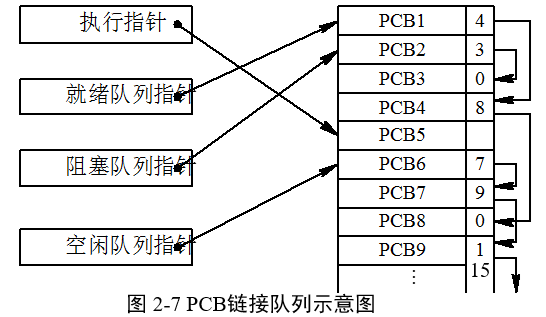
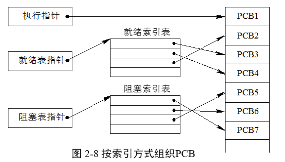

### 2.2.1 进程的特征与状态 

* 1、进程的定义

  * (1) 进程是程序的一次执行。 
  * (2) 进程是一个程序及其数据在处理机上顺序执行时所发生的活动。 
  * (3) 进程是程序在一个数据集合上运行的过程，它是系统进行资源分配和调度的一个独 立单位。 
  * **在引入了进程实体的概念后，我们可以把传统 OS 中的进程定义为：“进程是进程实体的运行过程，是系统进行资源分配和调度的一个独立单位”。**
 
* 2、进程的特征

  * 结构特征：**进程实体由程序段、数据和PCB组成**。在许多情况下所说的进程实际上是进程实体，创建进程即创建进程的PCB，撤消也如此。
  * 动态性：进程的实质是进程实体的一次执行过程。因此，动态性是进程的最基本特征。还表现在具有生命周期。
  * 并发性：指多个进程实体同存于内存中，且能在一段时间内同时运行。 
  * 独立性：进程实体是一个能独立运行、独立分配资源和独立接受调度的基本单位。
  * 异步性：指进程按各自独立的、不可预知的速度向前推进，或者说进程实体按异步方式运行。

* 3、进程和程序的比较

   * ①程序是有序代码的集合，是一个静态的概念。进程是程序的一次执行过程，是一个动态概念。进程不可以在计算机之间迁移，而程序通常对应着文件，可以复制。
   * ②进程是一个状态变化的过程，是有生命期的。而程序是永久的，可以长久保存。
   * ③进程与程序的组成不同。进程由程序段、数据段和进程控制块组成，而程序仅是代码的有序集合。
   * ④进程与程序是密切相关的。通过多次执行，一个程序可对应多个进程。但进程与它本身所运行的程序只能是一对一的关系。
   * ⑤进程更能真实地描述并发，而程序不能。
   * ⑥进程可创建其他进程，而程序并不能形成新的程序。

### 2.2.2 进程的三种基本状态及转换

* 1、进程的三种基本状态 
 
  * 1)就绪(Ready)状态：其他条件满足，仅差CPU
  * 2)执行状态：其他条件满足，也获得CPU
  * 3)阻塞状态：等待某种事件发生

* 2、三种基本状态的转换

  

* 3、创建状态和终止状态 

  * 1)创建状态
    
    >创建一个进程是个很复杂的过程，一般要通过多个步骤才能完成：
    * 首先由进程申请一个空白PCB，并向PCB中填写用于控制和管理进程的信息；
    * 然后为该进程分配运行时所必须的资源；
    * 最后，把该进程转入就绪状态并插入就绪队列之中。
    * 进程所需的资源尚不能得到满足，比如系统尚无足够的内存使进程无法装入其中，此时创建工作尚未完成，进程不能被调度运行，于是把此时进程所处的状态称为创建状态。

  * 2)终止状态
    
    >进程的终止也要通过两个步骤：
    * 首先，是等待操作系统进行善后处理，
    * 最后将其PCB清零，并将PCB空间返还系统。
    * 当一个进程到达了自然结束点，或是出现了无法克服的错误，或是被操作系统所终结，或是被其他有终止权的进程所终结，它将进入终止状态。

  

### 2.2.3  挂起操作和进程状态的转换

  >挂起操作引入静止状态，一个进程被挂起后，不管它是否在就绪状态，系统都不分配给它处理机。

* 1、引入挂起状态的原因 

    * (1)终端用户的请求:发现问题希望进程停止以修改。
    * (2)父进程请求:父进程挂起子进程为考察修改子进程。
    * (3)负荷调节的需要:当负荷较重时，系统实时任务受到影响时，将一些不重要的进程挂起。
    * (4)操作系统的需要:以便检查运行中的资源使用情况或进程统计。

* 2、引入挂起原语操作后三个进程状态的转换

   * ①活动就绪（就绪） →静止就绪（就绪挂起）  
   * ②活动阻塞（阻塞） →静止阻塞（阻塞挂起） 
   * ③静止就绪（挂起就绪） →活动就绪（就绪）  
   * ④静止阻塞（阻塞挂起） →活动阻塞（阻塞） 

  

  

    
* 3、引入挂起操作后五个进程状态的转换
   * (1)NULL→创建：新进程产生
   * (2)创建→活动就绪：分配必要资源
   * (3)创建→静止就绪：不给主存，安置在外存
   * (4)执行→终止：自然达到终点；或是出现无法克服的错误；或被OS或其他进程终结。

### 2.2.4  进程管理中的数据结构

* 1、操作系统中用于管理控制的数据结构
  
   >在计算机系统中，对于每个资源和每个进程都设置了一个数据结构，用于表征其实体，我们称之为资源信息表或进程信息表，其中包含了资源或进程的标识、描述、状态等信息以及一批指针。通过这些指针，可以将同类资源或进程的信息表，或者同一进程所占用的资源信息表分类链接成不同的队列，便于操作系统进行查找。

  

* 2、进程控制块（PCB）的作用 

  * （1）进程控制块是进程实体的一部分，是操作系统中最重要的记录型数据结构。        
  * （2）进程控制块的作用是使一个在多道程序环境下不能独立运行的程序(含数据)，成为一个能独立运行的基本单位，一个能与其它进程并发执行的进程。或者说，**OS是根据PCB来对并发执行的进程进行控制和管理的**。
  * （3）进程控制块PCB的作用
     * 1)作为独立运行基本单位的标志。
     * 2)能实现间断性运行方式。 
     * 3)提供进程管理所需要的信息。
     * 4)提供进程调度所需要的信息。
     * 5)实现与其它进程的同步与通信。

* 3、进程控制块中的信息 

  * 1)进程标识符
     
       >进程标识符用于惟一地标识一个进程。一个进程通常有两种标识符：
       * ①内部标识符。在所有的操作系统中，都为每一个进程赋予一个惟一的数字标识符，它通常是一个进程的序号。 设置内部标识符主要是为了方便系统使用。
       * ②外部标识符。它由创建者提供，通常是由字母、数字组成，往往是由用户(进程)在访问该进程时使用。为了描述进程的家族关系， 还应设置父进程标识及子进程标识。此外，还可设置用户标识，以指示拥有该进程的用户。 

  * 2)处理机状态
  * 3)进程调度信息 
  * 4)进程控制信息 

* 4、进程控制块的组织方式

  * 1)线性方式

  

  * 2)链接方式

  

  * 3)索引方式(可有多个阻塞表)

  

