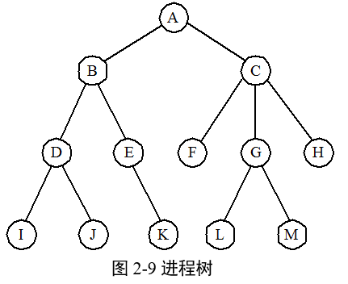
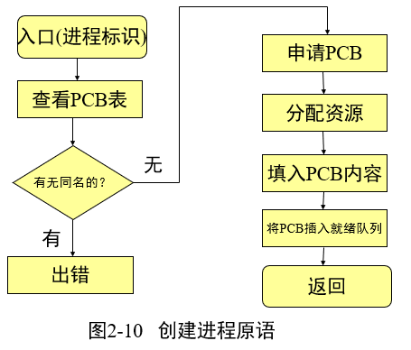
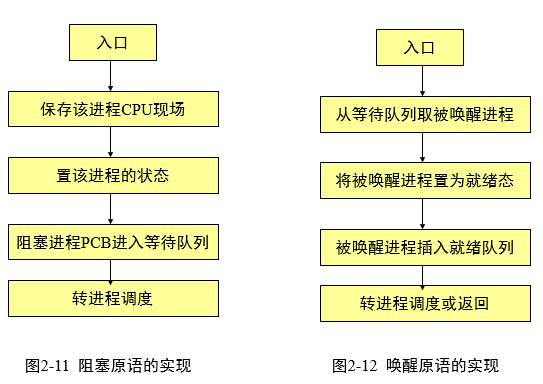

# 2.3进程控制

* 进程控制的任务是系统使用一个引起具有特定功能的程序段来创建，撤消进程以及完成进程各状态之间的转换，从而达到多进程高效率并发执行和协调，实现资源共享的目的。
* 把系统态下执行的某些具有特定功能的程序段称为**原语**。
* 原语是不可中断的，可被其他程序调用。
* 原语是机器指令级的，其特点是执行期间不允许中断，是一个不可分割的基本单位。
* 另外还是功能级的，其特点是作为原语的程序段不允许并发执行。

### 2.3.1  操作系统内核

   >现代操作系统一般将OS划分为若干层次，通常将一些与硬件相关及运行频率较高的模块（时钟管理、进程调度和公共操作），安排在仅靠硬件层次的软件层次中，将他们常驻内存，即通常被人们称作内核。

* 1、处理机的执行状态：
    * 系统态：管态，内核态，权限高；
    * 用户态：目态，较低特权

* 2、支撑功能
    * (1)中断处理。
    * (2)时钟管理。
    * (3)原语操作。

* 3、资源管理功能
    * (1)进程管理。
    * (2)存储器管理。
    * (3)设备管理。 

### 2.3.2  进程的创建

* 1、进程的层次结构
    * 在OS中，允许一个进程创建另一个进程，通常把创建进程的进程称为父进程，而把被创建的进程称为子进程。
    * 子进程可继续创建更多的孙进程，由此便形成了一个进程的层次结构。如在UNIX中，进程与其子孙进程共同组成一个进程家族(组)。

* 2、进程图(Process Graph)
    * 进程图是用于描述一个进程的家族关系的有向树。
    
  

* 3、引起创建进程的事件 

    >操作系统内核创建
    * 1)用户登录。 分时
    * 2)批处理系统中的作业调度。 
    * 3)由操作系统创建的系统服务。打印 
    
    >应用进程请求
    * 4)用户启动应用程序。 I-C-P

* 4、进程的创建(Creation of Process) 步骤

    * 1)申请空白PCB： 申请惟一的数字标识符。
    * 2)为新进程分配资源：主要是内存空间 
    * 3)初始化进程控制块：包含标识、处理机状态、处理机控制信息。 
    * 4)如果进程就绪队列能够接纳新进程， 便将新进程插入就绪队列。 

  

### 2.3.3 进程的撤销 

* 1、引起进程撤销(Termination of Process)的事件
    * 1)正常结束
    * 2)异常结束
    * 3)外界干预
         * ①操作员或操作系统干预。 由于某种原因，例如，发生了死锁， 由操作员或操作系统终止该进程；
         * ②父进程请求。 由于父进程具有终止自己的任何子孙进程的权利， 因而当父进程提出请求时，系统将终止该进程；
         * ③父进程终止。 当父进程终止时，OS也将他的所有子孙进程终止。 

* 2、进程的终止过程
   * 1)根据被终止进程的标识符，从PCB集合中检索出该进程的PCB，从中读出该进程的状态。
   * 2)若被终止进程正处于执行状态，应立即终止该进程的执行，并置调度标志为真，用于指示该进程被终止后应重新进行调度。
   * 3)若该进程还有子孙进程，还应将其所有子孙进程予以终止，以防他们成为不可控的进程。
   * 4)将被终止进程所拥有的全部资源，或者归还给其父进程， 或者归还给系统。
   * 5)将被终止进程(它的PCB)从所在队列(或链表)中移出， 等待其他程序来搜集信息。 

### 2.3.4 进程的阻塞与唤醒

* 1、引起进程阻塞的事件 
   * 1)向系统请求共享资源失败。打印服务
   * 2)等待某种操作的完成。  启动I/O设备后，本进程进入阻塞
   * 3)新数据尚未到达（等待信号）。   ICP问题
   * 4)等待新任务的到达。   发送进程

* 2、进程阻塞过程
   * 正在执行的进程，当发现上述某事件时，由于无法继续执行，于是进程便通过调用阻塞原语block把自己阻塞。可见，进程的阻塞是进程自身的**一种主动行为**。

  

* 3、进程唤醒过程

   * 当被阻塞进程所期待的事件出现时，如I/O完成或其所期待的数据已经到达，则由有关进程(比如，用完并释放了该I/O设备的进程)调用唤醒原语wakeup( )，将等待该事件的进程唤醒。唤醒原语执行的过程是：首先把被阻塞的进程从等待该事件的阻塞队列中移出，将其PCB中的现行状态由阻塞改为就绪，然后再将该PCB插入到就绪队列中。 
   * **注意**：Block原语和Wakeup原语是一对作用相反的原语，因此如果在某进程中调用了阻塞原语，则必须在与之相合作的另一个进程中或其它相关的进程中，安排唤醒原语，以能唤醒阻塞的进程；否则被阻塞的进程将会不能被唤醒而长久地处于阻塞状态，从而再无机会继续运行。

### 2.3.5 进程的挂起与激活 

* 1、进程的挂起
   * 挂起原语的执行过程是：首先检查被挂起进程的状态，若处于**活动就绪状态或执行状态，便将其改为静止就绪**；对于**活动阻塞状态的进程，则将之改为静止阻塞**。 为了方便用户或父进程考查该进程的运行情况而把该进程的PCB复制到某指定的外存区域。最后，若被挂起的进程正在执行，则转向调度程序重新调度。 

* 2、进程的激活过程

   * 激活原语先将进程从外存调入内存，检查该进程的现行状态，若是静止就绪，便将之改为活动就绪；若为静止阻塞便将之改为活动阻塞。假如采用的是抢占调度策略，则每当有新进程进入就绪队列时，应检查是否要进行重新调度，即由调度程序将被激活进程与当前进程进行优先级的比较，如果被激活进程的优先级更低，就不必重新调度；否则，立即剥夺当前进程的运行，把处理机分配给刚被激活的进程。 

