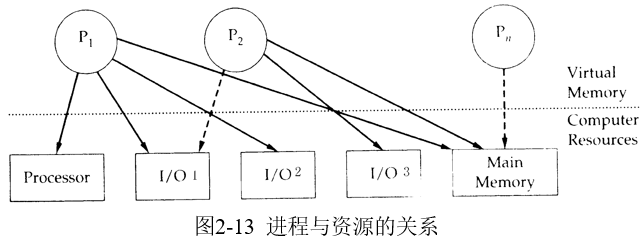
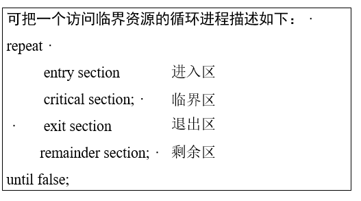

# 2.4 进程同步与互斥

* 进程同步的主要任务是使并发执行的诸进程之间能有效地共享资源和相互合作，从而使程序的执行**具有可再现性**。

### 2.4.1 进程与资源

* 1、资源的概念
    * 1>资源
        * 软件资源（程序和数据）
        * 硬件资源（CPU、内存、外设）

    * 2>资源
        * 共享资源（允许多个进程同时访问的资源。如内存和硬盘等。）
        * 临界资源（**在一段时间内仅允许一个进程使用资源。如打印机、输入机、磁带机、信号量和指针等**，也可能是一些共享变量、表格、链表等。**临界资源可以互斥共享**；生产者-消费者(producer-consumer)问题是一个著名的进程同步问题。另外一个飞机订票系统的两个终端也要进行同步。）

* 2、两种形式的制约关系 
    * 间接相互制约关系。（打印机）
    * 直接相互制约关系。 （ICP）

* 3、进程与资源的关系

  

    >可见，操作系统的任务是控制与管理进程和资源，必须提供一些机制来协调进程与进程之间、进程与资源之间的复杂关系。

* 4、临界资源
    * 生产者-消费者(producer-consumer)问题是一个著名的进程同步问题。
    
    >它描述的是：有一群生产者进程在生产产品，并将这些产品提供给消费者进程去消费。为使生产者进程与消费者进程能并发执行，在两者之间设置了一个具有n个缓冲区的缓冲池，生产者进程将它所生产的产品放入一个缓冲区中； 消费者进程可从一个缓冲区中取走产品去消费。尽管所有的生产者进程和消费者进程都是以异步方式运行的，但它们之间必须保持同步，即不允许消费者进程到一个空缓冲区去取产品；也不允许生产者进程向一个已装满产品且尚未被取走的缓冲区中投放产品。 

* 5、临界区(critical section) 
    * 每个进程中访问临界资源的那段代码称为临界区。
        * 进入区
        * 临界区
        * 退出区
        * 剩余区

  

* 6、进程的互斥与同步

   * 1>同步与互斥的概念
       * 进程**互斥**是指多个进程不能同时使用同一个临界资源，由于竞争同一个资源而相互制约就称为进程的互斥。
       * 进程的**同步**是指有协作关系的进程之间不断调整他们之间的相对速度或执行过程，以保证临界资源的合理利用和进程的顺利执行。
       * 实际上可以认为互斥是同步的一种特殊形式。
       * 实现进程同步的机制称为进程同步机制。一般包括信号量、加锁操作等。

   * 2>同步机制应遵循的准则 
       * 1)空闲让进
       * 2)忙则等待 
       * 3)有限等待 
       * 4)让权等待  

### 2.4.2  锁机制(* 硬件同步机制)

* 即提供一对上锁和开锁原语以及一个锁变量W或是锁位。当进程进入临界区之前，首先测试W的状态。当W=0表示上锁，该资源已被占用，W=1表示开锁，该资源空闲，未被占用。
* 这种方法安全可靠，但效率不高，因为上锁原语中W=0情况反复循环测试直到时间片耗完为止，因此浪费了处理机时间。

### 2.4.3 信号量机制 

* 1965年荷兰的Dijksta提出了一种广义锁机制或称为计数锁的同步机制，既能解决互斥，又能解决同步，是一种非常有效的同步工具。
* 申请和释放临界资源的两个原语为wait和signal操作,有时也称为P操作和V操作。
* 信号量(Semaphore)也叫信号灯，是在信号量同步机制中用于实现进程的同步和互斥的有效数据结构。

--------------

* 1、整型信号量
    
    * 最初由Dijkstra把信号量定义为一个整型量，除初始化整型信号量S外，仅能通过两个标准的原子操作(Atomic Operation) wait(S)和signal(S)来访问。 

         >整型信号量S的意义：
    
         * S > 0：表示系统中空闲的该类临界资源的个数。
         * S = 0：表示系统中该类临界资源刚好被全部占用，而且没有进程在等待该临界资源。

    * wait和signal操作可描述为：
    
           wait(S): while S≤0 do no-op；
                             S∶=S-1;
           signal(S):        S∶=S+1;
        
         * 它们是两个原子操作。故是不可中断的。即信号量同时只能被一个进程所修改。

* 2、记录型信号量（解决让权等待）
     * 在整型信号量机制中的wait操作，只要是信号量S≤0，就会不断地测试。因此，该机制并未遵循“**让权等待**”的准则， 而是使进程处于“忙等”的状态。
     * 记录型信号量机制是为解决“忙等”现象的进程同步机制。但在采取了“让权等待”的策略后，又会出现多个进程等待访问同一临界资源的情况。为此，在信号量机制中，除了需要一个用于代表资源数目的整型变量value外，还应增加一个进程链表L，用于链接上述的所有等待进程。记录型信号量是由于它采用了记录型的数据结构而得名的。

* 3、AND型信号量 （避免死锁）

     * 在两个进程中都要包含两个对Dmutex和Emutex的操作，

              process A:           process B:   
             wait(Dmutex);         wait(Emutex);  
             wait(Emutex);         wait(Dmutex);

     * 若进程A和B按下述次序交替执行wait操作：
     
            process A: wait(Dmutex); 于是Dmutex=0
            process B: wait(Emutex); 于是Emutex=0
            process A: wait(Emutex); 于是Emutex=-1  A阻塞
            process B: wait(Dmutex); 于是Dmutex=-1  B阻塞 

     * AND同步机制的基本思想是：将进程在整个运行过程中需要的所有资源，**一次性全部地分配给进程，待进程使用完后再一起释放**。只要尚有一个资源未能分配给进程，其它所有可能为之分配的资源，也不分配给他。亦即，对若干个临界资源的分配，采取原子操作方式：要么全部分配到进程，要么一个也不分配。 由死锁理论可知，这样就可避免上述死锁情况的发生。为此，在wait操作中，增加了一个“AND”条件，故称为AND同步，或称为同时wait操作， 即Swait(Simultaneous wait)。 

            Swait(S1, S2, …, Sn)
                if S1≥1 and … and Sn≥1 then
                    for i∶ =1 to n do
                    Si∶=Si-1;
                    endfor
                else
                 把进程放入第一个阻塞原因的资源等待队列
                endif
            Ssignal(S1, S2, …, Sn)
                  for i∶   =1 to n do
                  Si=Si+1;
                  从对应释放资源的等待队列中唤醒一个进程
              endfor; 

* 4、信号量集 （提高效率）———— 必须一起申请，可不一起释放。

   * 如果某进程一次需要N个某类资源时，就要进行N次wait操作，这使得系统效率较低，也可能造成死锁。
   * 信号量集机制的基本思想是在AND型信号量的基础上进行扩充，进程对信号量Si的测试值为ti(用于信号量的判断，即Si≥ ti表示资源数量低于ti时不予分配)，占用值为di(用于信号量的增减，即Si= Si-di和Si= Si+di)。

         Swait(S1, t1, d1, …, Sn, tn, dn)
             if S1≥t1 and … and Sn≥tn then
               for i∶=1 to n do
                 Si∶=Si-di;
             endfor
            else把当前进程放入第一个造成阻塞原因的资源等待队列中 endif
            Ssignal(S1, d1, …, Sn, dn)
            for i∶=1 to n do
              Si ∶=Si+di;
              从该释放资源的等待队列中去唤醒对应的阻塞进程
         endfor; 

   * 一般“信号量集”的几种特殊情况：
        * (1)Swait(S, d, d)。 此时在信号量集中只有一个信号量S， 但允许它每次申请d个资源，当现有资源数少于d时，不予分配。
        * (2)Swait(S, 1, 1)。 此时的信号量集已蜕化为一般的记录型信号量(S＞1时)或互斥信号量(S=1时)。
        * (3)Swait(S, 1, 0)。这是一种很特殊且很有用的信号量操作。当S≥1时，允许多个进程进入某特定区；当S变为0后，将阻止任何进程进入特定区。换言之，它相当于一个可控开关。 
        * (4)“信号量集”未必成对使用Swait和Ssignal，如可一起申请，但可以不一起释放。

   * 几个量
   
      * s：信号量
      * t：下限值
      * d：需求值

### 2.4.4  信号量的应用
* 1、利用信号量实现进程互斥
　　
   * 为使多个进程能互斥地访问某临界资源，只须为该资源设置一互斥信号量mutex，并设其初始值为1，然后将各进程访问该资源的临界区CS置于wait(mutex)和signal(mutex)操作之间即可。利用信号量实现进程互斥的进程可描述如下： 

         Var mutex: semaphore:=1；
           begin
           parbegin

          process 1: begin
                        repeat
                            wait(mutex)；
                            critical section
                            signal(mutex)；
                            remainder seetion
                        until false；
                      end 

         process 2: begin
                        repeat
                            wait(mutex)；
                            critical section
                            signal(mutex)；
                            remainder section
                        until false；
                    end
             parend 

    * 利用信号量实现前趋关系 
　　
      * 还可利用信号量来描述程序或语句之间的前趋关系。设有两个并发执行的进程P1和P2。在P1执行后再执行P2。
      
                                    P1：S1；     P2：S2。
                                    
      * 为实现这种前趋关系，我们只须使进程P1和P2共享一个公用信号量S，并赋予其初值为0，即
      
　　      * 在进程P1中，用S1；signal(S)；
           
　　      * 在进程P2中，用wait(S)；S2； 

  
