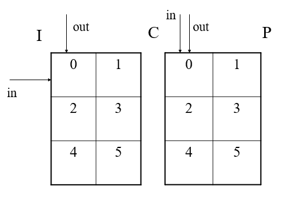
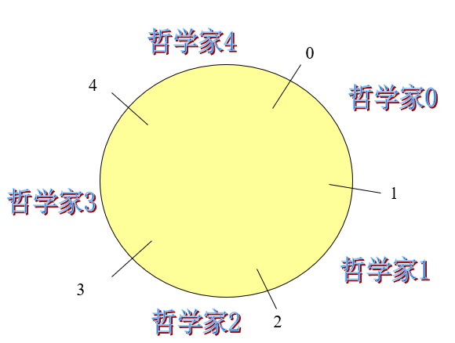

# 2.5 经典进程的同步问题

### 2.5.1 生产者—消费者问题

* 问题描述
    * 有一群生产者进程在生产产品，并将这些产品提供给消费者进程去消费，为方便生产者进程与消费者进程能并发执行，在两者之间设置一个具有n个缓冲区的缓冲池，生产者进程将它所生产的产品放入一个缓冲区中；消费者进程可从一个缓冲区中取走产品去消费。
    * 注意：应规定消费者进程不能到一个空缓冲区中去取产品；生产者进程不能将产品放入一个已装满产品且尚未被取走的缓冲区中。 

   

* 问题的分析
    * 考虑到此处的缓冲池构成了循环缓冲，故当输入或输出指针加1时表示为
    
                    in：=（in+1）mod  n；  
                    out =（out+1）mod n
          缓冲池满  （in+1）mod  n=out；
          缓冲池空   in=out。

     * 用整型变量counter表示缓冲池中满缓冲区的个数，等于0时表示缓冲池为空。

--------------------------

* 1、利用记录型信号量解决生产者—消费者问题
     
     * 1>假定在生产者和消费者之间的公用缓冲池中，具有n个缓冲区，这时可利用互斥信号量mutex实现诸进程对缓冲池的互斥使用；利用信号量empty和full分别表示缓冲池中空缓冲区和满缓冲区的数量。又假定这些生产者和消费者相互等效，只要缓冲池未满，生产者便可将消息送入缓冲池；只要缓冲池未空，消费者便可从缓冲池中取走一个消息。对生产者—消费者问题可描述如下： 

            Var mutex, empty,
            full:semaphore∶=1,n;0;
            buffer:array［0, …, n-1］ of item;
            in, out: integer∶=0, 0;
            begin
                 parbegin
                  producer:begin
                        repeat
                         …
                        producer an item nextp;
                         …
                        wait(empty);
                        wait(mutex);
                        buffer(in) ∶=nextp;
                        in∶= (in+1) mod n;
                        signal(mutex);
                        signal(full);
                        until false;
                        end

            consumer:begin
                repeat
                wait(full);
                wait(mutex);
                nextc∶=buffer(out);
                out∶= (out+1) mod n;
                signal(mutex);
                signal(empty);

            consumer the item in nextc;
            until false;
            end
                parend
              end 

    * 2>**注意**：
        * 1)在每个程序中用于实现互斥的wait(mutex)和signal(mutex)必须成对地出现； 
        * 2)对资源信号量empty和full的wait和signal操作，同样需要成对地出现，但它们分别处于不同的程序中。例如，wait(empty)在计算进程中，而signal(empty)则在打印进程中，计算进程若因执行wait(empty)而阻塞， 则以后将由打印进程将它唤醒；
        * 3)在每个程序中的多个wait操作顺序不能颠倒。应先执行对资源信号量的wait操作，然后再执行对互斥信号量的wait操作，否则可能引起进程死锁。

    * 3>思考：
        * 1)在生产者 - 消费者问题中，如果缺少了 signal(full) 或 signal(empty) ，对执行结果将会有何影响？
            * 如果缺少signal(full)，那么表明从第一个生产者进程开始就没有改变信号量full 值，即使缓冲池产品已满，但full 值还是0，这样消费者进程执行wait(full)时认为缓冲池是空,而取不到产品，消费者进程一直处于等待状态。
            * 如果缺少signal(empty)，在生产者进程向n个缓冲区投满产品后消费者进程才开始从中取产品，这时empty=0，full=n，那么每当消费者进程取走一个产品empty 值并不改变，直到缓冲池取空了，empty 值也是0，即使目前缓冲池有n 个空缓冲区，生产者进程要想再往缓冲池中投放产品也会因为申请不到空缓冲区被阻塞。
        * 2)每个进程中各个P操作的次序是重要的：先检查是否互斥，再检查资源数目是否可行？ 

            * 分析：
            
                  生产者进程：P（mutex）                消费者进程：P（mutex）
                             P（empty）                           P（full）
                         
            * 当进行了n次生产之后，缓冲区占满，empty=0。这时再执行生产者进程，p（mutex），mutex=0，可以执行，再执行p（empty），则empty=-1，生产者进程因为没有空的缓冲区而进入等待状态。如果此时有一个消费者进程来，首先执行p（mutex），则mutex=-1，消费者进程也进入等待，彼此都等待对方来唤醒自己，处于循环等待的状态，形成了死锁。

        * 3)在生产者—消费者问题中，如果将两个wait操作即wait(full)和wait(mutex)互换位置，或者将signal(mutex)和signal(full)互换位置，结果会如何？
            * signal(mutex)与signal(full)互换位置后，从逻辑上来说应该是一样的. 

* 2、利用AND信号量解决生产者—消费者问题 

      Var mutex, empty, full:semaphore∶ =1, n, 0;
      buffer:array［0, …, n-1］ of item;
      in out:integer∶=0, 0;
      begin
        parbegin
          producer:begin
                repeat
                 …
                produce an item in nextp;
                 …
                Swait(empty, mutex);
                buffer(in) ∶ =nextp;
                in∶= (in+1)mod n;
                Ssignal(mutex, full);
               until false;
      end

      consumer:begin
                  repeat
                   Swait(full, mutex);
                   nextc∶=buffer(out);
                   out∶= (out+1) mod n;
                   Ssignal(mutex, empty);
                   consumer the item in nextc;
                  until false;
               end
            parend
          end 

* 3、利用管程解决生产者-消费者问题 

    * 1>在利用管程方法来解决生产者-消费者问题时， 首先便是为它们建立一个管程，并命名为Producer-Consumer, 或简称为PC。其中包括两个过程：
        * 1)put(item)过程。 生产者利用该过程将自己生产的产品投放到缓冲池中， 并用整型变量count来表示在缓冲池中已有的产品数目，当count≥n时，表示缓冲池已满，生产者须等待。
        * 2)get(item)过程。消费者利用该过程从缓冲池中取出一个产品，当count≤0时，表示缓冲池中已无可取用的产品， 消费者应等待。 

    * 2>PC管程可描述如下：

          type producer-consumer=monitor
              Var in,out,count:integer;
               buffer:array［0,…,n-1］ of item;
               notfull, notempty:condition;
               procedure entry put(item)
                 begin
                    if count≥n then notfull.wait;
                     buffer(in) :=nextp;
                     in:= (in+1) mod n;
                     count:=count+1;
                     if notempty.queue then notempty.signal;
                  end

           procedure entry get(item)
                 begin
                  if count≤0 then notempty.wait;
                  nextc∶=buffer(out);
                  out∶= (out+1) mod n;
                  count∶ =count-1;
                  if notfull.quene then notfull.signal;
                 end
              begin in∶=0 ;  out∶=0; count∶=0 end 

     * 3> 在利用管程解决生产者-消费者问题时， 其中的生产者和消费者可描述为： 

            producer:begin
                      repeat
                       produce an item in nextp;
                       PC.put(item);
                      until false;
                     end
                consumer:begin
                      repeat
                       PC.get(item);
                       consume the item in nextc;
                      until false;
                     end 

### 2.5.2 哲学家进餐问题 

* 问题的描述
    * 有五个哲学家共用一张圆桌，分别坐在周围的五张椅子上，在圆桌上有五个碗和五支筷子，他们的生活方式都是交替地进行思考和进餐，平时一个哲学家进行思考，饥饿时便取其左右最靠近他的筷子，只有在他拿到两支筷子时才能进餐。进餐毕，放下筷子继续思考。

   

-----------------

* 1、利用记录型信号量解决哲学家进餐问题
    * 1>经分析可知，放在桌子上的筷子是临界资源，在一段时间内只允许一位哲学家使用。为了实现对筷子的互斥使用，可以用一个信号量表示一支筷子，由这五个信号量构成信号量数组。其描述如下：
        
         >Var chopstick: array［0, …, 4］ of semaphore;

    * 2>所有信号量均被初始化为1， 第i位哲学家的活动可描述为：     
     
           repeat
             wait(chopstick［i］);
              wait(chopstick［(i+1) mod 5］);
                  …   	 eat;   …
             signal(chopstick［i］);
             signal(chopstick［(i+1) mod 5］);
                            … 	 think;
          until false; 

    * 3> 可采取以下几种解决方法：
       * 1)至多只允许有四位哲学家同时去拿左边的筷子，最终能保证至少有一位哲学家能够进餐，并在用毕时能释放出他用过的两支筷子，从而使更多的哲学家能够进餐。
       * 2)仅当哲学家的左、右两支筷子均可用时，才允许他拿起筷子进餐。
       * 3)规定奇数号哲学家先拿他左边的筷子，然后再去拿右边的筷子；而偶数号哲学家则相反。按此规定，将是1、 2号哲学家竞争2号筷子；3、4号哲学家竞争4号筷子。即五位哲学家都先竞争偶数号筷子，获得后，再去竞争奇数号筷子，最后总会有一位哲学家能获得两支筷子而进餐。 

* 2、利用AND信号量机制解决哲学家进餐问题
        
     * 在哲学家进餐问题中，要求每个哲学家先获得两个临界资源(筷子)后方能进餐，这在本质上就是前面所介绍的AND同步问题，故用AND信号量机制可获得最简洁的解法。

            Var chopsiick array ［0, …, 4］ of semaphore ∶ = (1,1,1,1,1);
                processi
                    repeat
                    think;
                    Swait(chopstick［(i+1) mod 5］, chopstick ［i］);
                    eat;
                    Ssignal(chopstick ［(i+1) mod 5］, chopstick ［i］);
                  until false;

###  2.5.3 读者/写者问题

* 有两组并发进程: 
    * 读者(Reader)和写者(Writer),共享一组数据区或一个共享文件;
    * 要求：
      * 允许多个Reader同时执行读操作
      * 不允许Reader 、 Writer同时操作
      * 不允许多个Writer同时操作

------------------

* 1、采用记录型信号量集解决读者-写者问题
   * 1>如果读者来：
      * 1)无读者、写者，新读者可以读
      * 2)有写者等待，但有其它读者正在读，则新读者也可以读
      * 3)有写者写，新读者等待
   * 2>如果写者来：
      * 1)无读者，新写者可以写
      * 2)有读者，新写者等待
      * 3)有其它写者，新写者等待
   * 3>读者写者问题的解法
      * 设有两个信号量wmutex=1，rmutex=1
      * 另设一个全局变量readcount =0，表示正在读的读者数目
      * wmutex用于读者和写者、写者和写者之间的互斥
      * rmutex用于对readcount 这个临界资源的互斥访问
   * 4>读者写者问题可描述如下：

          Var rmutex,wmutext: semaphore :=1,1;
             Readcount: integer :=0;
             begin
             parbegin
             Reader：begin
                 repeat
                     wait(rmutex);  //等待无进程访问readcount
                     if (readcount=0) wait (wmutex); //等待无写者写
                     readcount := readcount+1;
                     signal(rmutex); //允许其它进程访问readcount
                     读
                     wait(rmutex); //等待无进程访问readcount
                     readcount := readcount-1;
                     if (readcount==0) signal(wmutex); //允许写者写
                     signal(rmutex); //允许其它进程访问readcount
                 until false
                 end

          Writer：begin
                    repeat
                       wait(wmutex); //等待无写者写,无读者读
                        写
                       signal(wmutex); //允许写者写,读者读
                     until false
                  end
              parend
              end

* 2、采用一般信号量集解决读者-写者问题

    * 增加一个限制条件：同时读的“读者”最多RN个
        * mx表示“允许写”，初值是1
        * L表示“允许读者数目”，初值为RN
    * 读者写者问题可描述如下：

          Var RN: integer;
                 L, mx: semaphore :=RN,1;
          begin
              parbegin
              Reader：begin
                      repeat
                         Swait(L, 1, 1); //控制读者数目  Swait(L, 1 //当有RN个读者进入读后,
                                                                    L减为0,进程阻塞, 
                                                                    第RN+1个读者再无法进入
                                                                , 1)
                         Swait(mx, 1, 0);//无写者时(mx=1)读者 
                         可读; 有写者时(mx=0), 读者不可读
                         …
                         读
                         …
                         Ssignal(L, 1); //L=L+1  读者增1;
                      until false
                      end

          Writer：begin
                   repeat
                     //If Mx>=1 and L>=RN then  
                     //mx=mx-1; L=L-0;
                     Swait(mx,1,1;  L,RN,0); //在既无写者写(mx=1) 又无读者读(L=RN)时，新写者可写
                      写
                     Ssignal(mx,1); //允许其他读者、写者操作(mx=1)
                   until false
                end
          parend
          end

