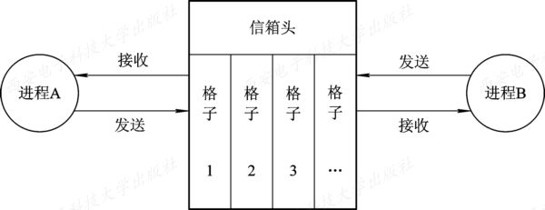

# 2.6 进程通信

* 进程通信是指进程之间的信息交换。由于进程的互斥与同步，需要在进程间交换一定的信息，故不少学者将它们也归为进程通信，但只能把它们称为低级进程通信。我们以信号量机制为例来说明，它们之所以低级的原因在于：
  * ①效率低，生产者每次只能向缓冲池投放一个产品(消息)，消费者每次只能从缓冲区中取得一个消息；
  * ②通信对用户不透明，OS只为进程之间的通信提供了共享存储器。
  
* 在进程之间要传送大量数据时，应当利用OS提供的高级通信工具，该工具最主要的特点是：
  * (1) 使用方便。OS隐藏了实现进程通信的具体细节，向用户提供了一组用于实现高级通信的命令(原语)，用户可方便地直接利用它实现进程之间的通信。或者说，通信过程对用户是透明的。这样就大大减少了通信程序编制上的复杂性。
  * (2) 高效地传送大量数据。用户可直接利用高级通信命令(原语)高效地传送大量的数据。

* 进程通信
  * 低级通信：进程间控制信息的交换,wait和signal为低级通信原语。
  
  * 高级通信：进程之间大量数据的交换，分为共享存储器系统、消息传递系统和管道通信系统(共享文件通信方式)。

### 2.6.1 进程通信的类型 

* 1、共享存储器系统(Shared-Memory System) 
  * 1）基于**共享数据结构**的通信方式。
       * 公用数据结构的设置及对进程间同步的处理，都是程序员的职责，OS仅提供共享存储器，因此效率低，仅适合相对少量数据。
  * 2）基于**共享存储区**的通信方式。 
       * 为了传输大量数据，在存储器中划出了一块共享存储区，诸进程可通过对共享存储区中数据的读或写来实现通信。

* 2、管道(Pipe)通信(共享文件通信方式)
  * 所谓“管道”，是指用于连接一个读进程和一个写进程以实现他们之间通信的一个共享文件，又名pipe文件。向管道(共享文件)提供输入的发送进程(即写进程)， 以字符流形式将大量的数据送入管道；而接受管道输出的接收进程(即读进程)，则从管道中接收(读)数据。由于发送进程和接收进程是利用管道进行通信的，故又称为管道通信。这种方式首创于UNIX系统，由于它能有效地传送大量数据，因而又被引入到许多其它操作系统中。 
  * 为了协调双方的通信，管道机制必须提供以下三方面的协调能力：
    * ①互斥，即当一个进程正在对pipe执行读/写操作时，其它(另一)进程必须等待。
    * ②同步，指当写(输入)进程把一定数量(如4 KB)的数据写入pipe，便去睡眠等待， 直到读(输出)进程取走数据后，再把他唤醒。当读进程读一空pipe时，也应睡眠等待，直至写进程将数据写入管道后，才将之唤醒。
    * ③确定对方是否存在，只有确定了对方已存在时，才能进行通信。 

* 3、消息传递系统(Message passing system)
  * 不论是单机系统、多机系统，还是计算机网络，消息传递机制都是用得最广泛的一种进程间通信的机制。在消息传递系统中，进程间的数据交换，是以格式化的消息(message)为单位的；在计算机网络中，又把message称为报文。程序员直接利用系统提供的一组通信命令(原语)进行通信。操作系统隐藏了通信的实现细节，大大减化了通信程序编制的复杂性，而获得广泛的应用。消息传递系统的通信方式属于高级通信方式。
  * 又因其实现方式的不同而进一步分成**直接通信方式**和**间接通信方式**两种。 

* 4、客户机-服务器系统(Client-Server system)
  * 其主要实现方法分为三类：**套接字**、**远程过程调用**和**远程方法调用**

### 2.6.2 消息传递通信的实现方式

* 1、直接消息传递系统
    
    >这是指发送进程利用OS所提供的发送命令，直接把消息发送给目标进程。此时，要求发送进程和接收进程都以显式方式提供对方的标识符。
    
  * 1）直接通信原语
  
       * (1) 对称寻址方式。
        
                   Send(Receiver, message); 发送一个消息给接收进程；
                   Receive(Sender, message); 接收Sender发来的消息；
             例如，原语Send(P2, m1)表示将消息m1发送给接收进程P2; 
                而原语Receive(P1，m1)则表示接收由P1发来的消息m1。 

       * (2) 非对称寻址方式

             Send(P,message)   //发送一个消息给进程 P     
             Receive (id, message); 接收来自任何进程的消息 

  * 2）消息的格式 
  * 3）进程的同步方式
      *  进程同步的三种方式 ：
          * 发送进程阻塞、 接收进程阻塞。
          * 发送进程不阻塞、 接收进程阻塞。 
          * 发送进程和接收进程均不阻塞。
  * 4）通信链路(communication link)
     * 有两种方式建立通信链路。
        * 第一种方式是：由发送进程在通信之前，用显式的“建立连接”命令(原语)请求系统为之建立一条通信链路；在链路使用完后，也用显式方式拆除链路。 这种方式主要用于计算机网络中。
        * 第二种方式是发送进程无须明确提出建立链路的请求，只须利用系统提供的发送命令(原语)，系统会自动地为之建立一条链路。这种方式主要用于单机系统中。 
      * 根据通信方式的不同，则又可把链路分成两种：
        * ①单向通信链路，只允许发送进程向接收进程发送消息； 
        * ②双向链路，既允许由进程A向进程B发送消息，也允许进程B同时向进程A发送消息。 

* 2、信箱通信（间接通信方式) 

  * 1)信箱的结构：信箱定义为一种数据结构。在逻辑上，可以将其分为两个部分：
    * (1) 信箱头, 用以存放有关信箱的描述信息，如信箱标识、信箱的拥有者、信箱口令、信箱的空格数等。
    * (2) 信箱体   由若干个可以存放消息（或消息头）组成，信箱格的数目以及每格的大小是在创建信箱时确定的。
    * 信箱可以是单向传递也可以是双向传递。
    
    

  * 2)信箱通信原语
    * (1)信箱的创建和撤消。进程可利用信箱创建原语来建立一个新信箱。创建者进程应给出信箱名字、信箱属性(公用、私用或共享)；对于共享信箱， 还应给出共享者的名字。当进程不再需要读信箱时，可用信箱撤消原语将之撤消。
    * (2)消息的发送和接收。当进程之间要利用信箱进行通信时，必须使用共享信箱，并利用系统提供的下述通信原语进行通信。
         
           Send(mailbox, message); 将一个消息发送到指定信箱；
           Receive(mailbox, message); 从指定信箱中接收一个消息； 

  * 3)信箱的类型
    * (1)私用信箱
    * (2)公用信箱
    * (3)共享信箱

    * 在利用信箱通信时，在发送进程和接收进程之间，存在以下四种关系：
       * 一对一关系。专用的通信链路
       * 多对一关系。也称为客户/服务器交互(client/server interaction)。
       * 一对多关系。广播方式，向接收者(多个)发送消息。
       * 多对多关系。建立一个公用信箱

### 2.6.3  直接消息传递系统实例

* 1、消息缓冲队列通信机制中的数据结构
   * 1)消息缓冲区。在消息缓冲队列通信方式中，主要利用的数据结构是消息缓冲区。它可描述如下：
   
         type struct message_buffer{
              int  sender;                 //发送者进程标识符
              int size;                    //消息长度
              char *text;                  //消息正文
              struct message_buffer *next; //指向下一个消息缓冲区的指针
         }

  * 2)PCB中有关通信的数据项。在利用消息缓冲队列通信机制时，还应增加用于对消息队列进行操作和实现同步的信号量，并将它们置入进程的PCB中。在PCB中应增加的数据项可描述如下：
  
         type struct processcontrol_block {
               …
               struct message_buffer   *mq;  //消息队列队首指针
               semaphore mutex;              //消息队列互斥信号量
               semaphore sm;                 //消息队列资源信号量
               …
          }

* 2、发送原语

* 3、接收原语 

