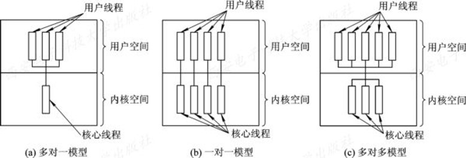
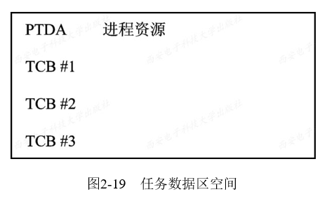
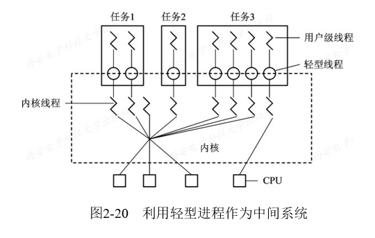

# 2.8  线程的实现

### 2.8.1  线程的实现方式

* 1、内核支持线程KST(Kernel Supported Threads)
    
    * 内核支持线程KST同样也是在内核的支持下运行的，它们的创建、阻塞、撤消和切换等，也都是在内核空间实现的。为了对内核线程进行控制和管理，在内核空间也为每一个内核线程设置了一个线程控制块，内核根据该控制块而感知某线程的存在，并对其加以控制。当前大多数OS都支持内核支持线程。
    
    * 这种线程实现方式主要有四个主要优点：
        
        * (1)在多处理器系统中，内核能够同时调度同一进程中的多个线程并行执行；
        
        * (2)如果进程中的一个线程被阻塞了，内核可以调度该进程中的其它线程占有处理器运行，也可以运行其它进程中的线程；
        
        * (3)内核支持线程具有很小的数据结构和堆栈，线程的切换比较快，切换开销小；
        
        * (4)内核本身也可以采用多线程技术，可以提高系统的执行速度和效率。

* 2、用户级线程ULT(User Level Threads)

    * 用户级线程是在用户空间中实现的。**对线程的创建、 撤消、同步与通信等功能，都无需内核的支持，即用户级线程是与内核无关的**。在一个系统中的用户级线程的数目可以达到数百个至数千个。由于这些线程的任务控制块都是设置在用户空间，而线程所执行的操作也无需内核的帮助，因而内核完全不知道用户级线程的存在。
    
    * 使用用户级线程方式有许多优点：
        
        * (1)线程切换不需要转换到内核空间。
        
        * (2)调度算法可以是进程专用的。不同的进程可以根据自身需要选择不同的调度算法，对自己的线程进行管理和调度，而与OS的低级调度算法无关。
        
        * (3)用户级线程的实现与OS平台无关，因为对于线程管理的代码是属于用户程序的一部分，所有的应用程序都可以对之进行共享。 

    * 而用户级线程方式的主要缺点则在于：
        
        * (1)系统调用的阻塞问题。在基于进程机制的OS中，大多数系统调用将使进程阻塞，因此，当线程执行一个系统调用时，不仅该线程被阻塞，而且，进程内的所有线程会被阻塞。而在内核支持线程方式中，则进程中的其它线程仍然可以运行。
        
        * (2)在单纯的用户级线程实现方式中，多线程应用不能利用多处理机进行多重处理的优点，内核每次分配给一个进程的仅有一个CPU，因此，进程中仅有一个线程能执行，在该线程放弃CPU之前，其它线程只能等待。

* 3、组合方式

    * 有些OS把用户级线程和内核支持线程两种方式进行组合，提供了组合方式ULT/KST 线程。在组合方式线程系统中，内核支持多个内核支持线程的建立、调度和管理，同时，也允许用户应用程序建立、调度和管理用户级线程。

    * 组合线程控制机制中，同一个应用程序中的多个线程可以在多处理机上并行执行，某个线程阻塞不会影响整体运行，由于同时提供内核线程控制机制和用户线程库，所以可以很好的集合用户级线程与内核级线程的优点。
    
    * 由于用户级线程和内核级线程的连接方式不同，从而形成了三种不同的模型：
    
    

### 2.8.2  线程的实现

* 1、内核支持线程的实现
    
    * 在仅设置了内核支持线程的OS中，一种可能的线程控制方法是，系统在创建一个新进程时，便为它分配一个任务数据区PTDA(Per Task Data Area)，其中包括若干个线程控制块TCB空间，如图2-19所示。 

    

* 2、用户级线程的实现

    * 1)运行时系统(Runtime System)
        
        * 所谓“运行时系统”，实质上是用于管理和控制线程的函数(过程)的集合，其中包括用于创建和撤消线程的函数、线程同步和通信的函数，以及实现线程调度的函数等。正因为有这些函数，才能使用户级线程与内核无关。运行时系统中的所有函数都驻留在用户空间，并作为用户级线程与内核之间的接口。

    * 2)内核控制线程
    
        * 这种线程又称为轻型进程LWP(Light Weight Process)。每一个进程都可拥有多个LWP，同用户级线程一样，每个LWP都有自己的数据结构(如TCB)，其中包括线程标识符、优先级、状态，另外还有栈和局部存储区等。LWP也可以共享进程所拥有的资源。LWP可通过系统调用来获得内核提供的服务，这样，当一个用户级线程运行时，只须将它连接到一个LWP上，此时它便具有了内核支持线程的所有属性。这种线程实现方式就是组合方式。

    

### 2.8.3  线程的创建和终止

* 1、线程的创建

    * 应用程序在启动时，通常仅有一个线程在执行，人们把线程称为“初始化线程”，它的主要功能是用于创建新线程。在创建新线程时，需要利用一个线程创建函数(或系统调用)，并提供相应的参数，如指向线程主程序的入口指针、堆栈的大小，以及用于调度的优先级等。在线程的创建函数执行完后，将返回一个线程标识符供以后使用。

* 2、线程的终止

    * 当一个线程完成了自己的任务(工作)后，或是线程在运行中出现异常情况而须被强行终止时，由终止线程通过调用相应的函数(或系统调用)对它执行终止操作。但有些线程(主要是系统线程)，它们一旦被建立起来之后，便一直运行下去而不被终止。在大多数的OS中，线程被中止后并不立即释放它所占有的资源，只有当进程中的其它线程执行了分离函数后，被终止的线程才与资源分离，此时的资源才能被其它线程利用。

