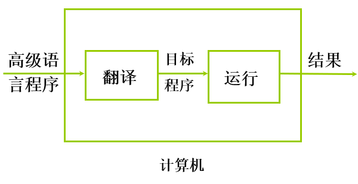
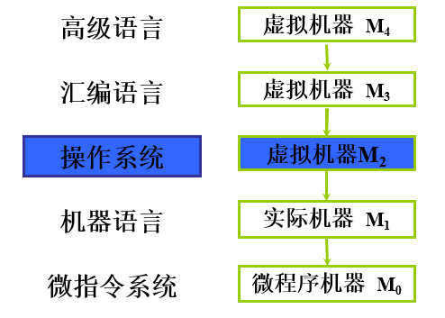
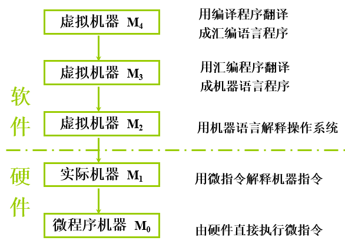

### 1.1.1 计算机的软硬件概念

* 1、计算机系统
    * 硬件系统：计算机的实体，如主机、外设等
    * 软件系统：由具有各类特殊功能的信息（程序）组成

* 2、软件
    * 系统软件：用来管理整个计算机系统
    
        * 语言处理程序
        * 操作系统
        * 服务性程序
        * 数据库管理系统
        * 网络软件

    * 应用软件：按任务需要编制成的各种程序

* 3、计算机的解题过程

     

### 1.1.2  计算机系统的层次结构

  

  

### 1.1.3 计算机体系结构和计算机组成

* 1、计算机体系结构（有无乘法指令）
   * 程序员所见到的计算机系统的属性是**概念性的结构**与**功能特性**
   * （指令系统、数据类型、寻址技术、I/O机理）
   
* 2、计算机组成（如何实现乘法指令）
   * 实现计算机体系结构所体现的属性
   * （具体指令的实现）

