### 1.2.1 冯·诺依曼计算机的特点

* 1.计算机由五大部件组成（运算器、存储器、控制器、输入设备、输出设备）；
* 2.指令和数据以同等地位存于存储器，可按地址寻访；
* 3.指令和数据用二进制表示；
* 4.指令由操作码和地址码组成（操作码用来表示操作的性质，地址码用来表示操作数在存储器中的位置）；
* 5.存储程序；
* 6.以运算器为中心（原始冯•诺依曼机）

  
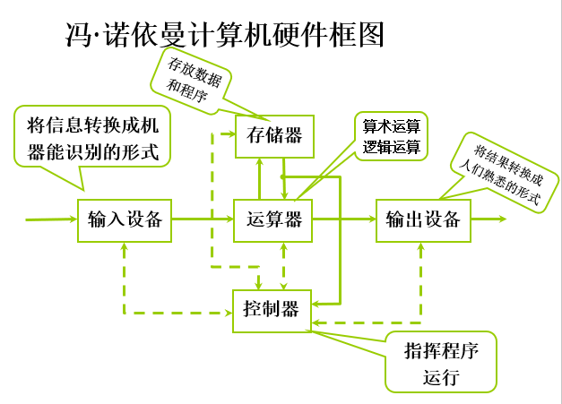

### 1.2.2 计算机硬件框图

* 1、以存储器为中心的计算机硬件框图

  
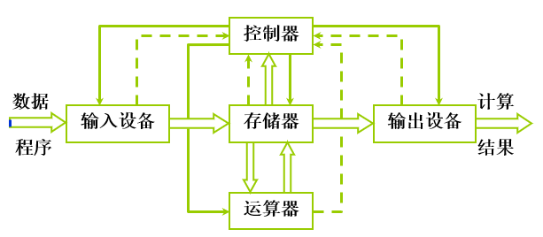

* 2、现代计算机硬件框图

  
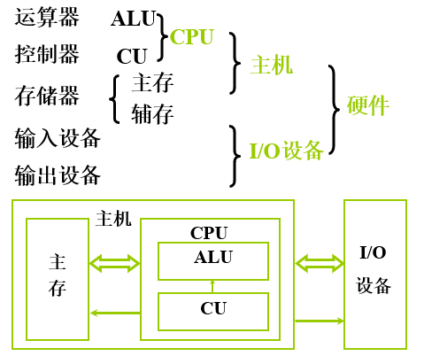

### 1.2.3 计算机的工作步骤

* 1、上机前的准备
    * 建立数学模型
    * 确定计算方法
    
      
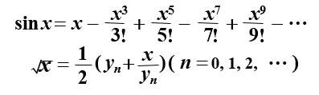

    
    * 编制解题程序
        * 程序 —— 运算的 全部步骤
        * 指令 —— 每 一个步骤

    --------------------------------------
    
    * 编程举例
        * 计算 ax² + bx + c = (ax + b)x + c
        * ①ax² + bx + c
            * 取x   至运算器中
            * 乘以x 在运算器中
            * 乘以a 在运算器中
            * 存ax2    在存储器中
            * 取b   至运算器中
            * 乘以x 在运算器中
            * 加ax2  在运算器中
            * 加c   在运算器中
        
        * ②(ax + b)x + c
            * 取x   至运算器中
            * 乘以a 在运算器中
            * 加b   在运算器中
            * 乘以x 在运算器中
            * 加c   在运算器中
    
    * 指令格式举例(假设)
    
      
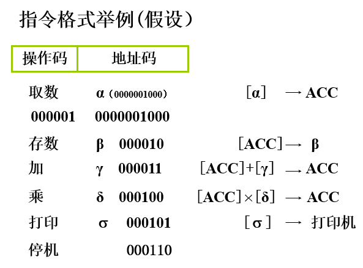

    * 计算 ax2 + bx + c  程序清单
    
      
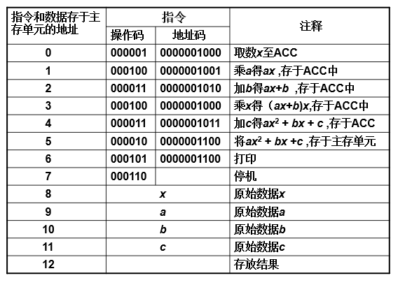
    
    
    
* 2、计算机的解题过程

    * (1)存储器的基本组成

      
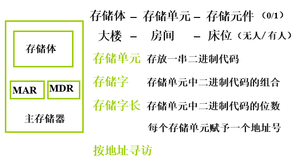
   
      
      ----------------

      
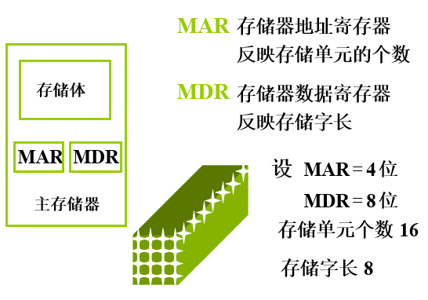
   

    * (2)运算器的基本组成及操作过程

      
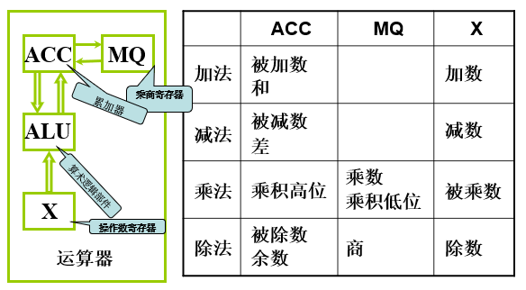
   

        * ①加法操作过程
   
            
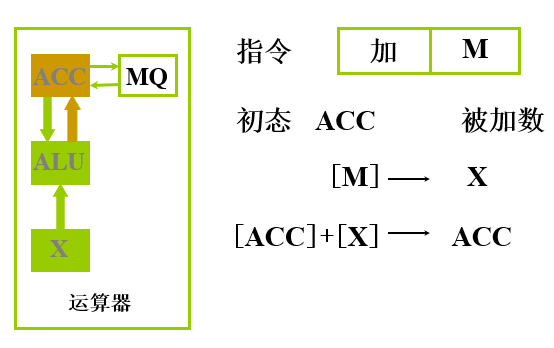
      
        
        * ②减法操作过程
        
            
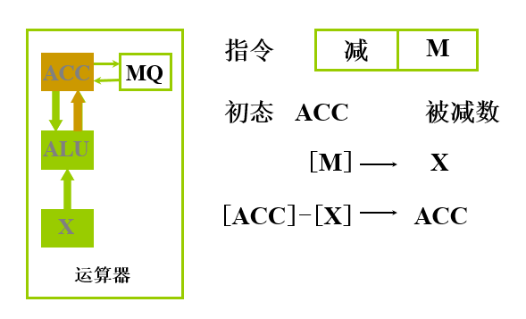
 
            
        * ③乘法操作过程

            
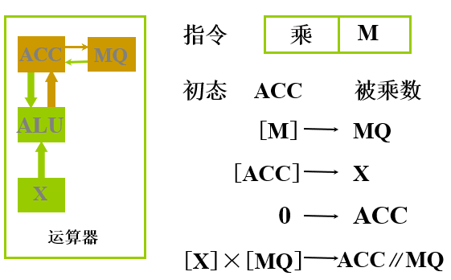
 
        
        * ④除法操作过程

            
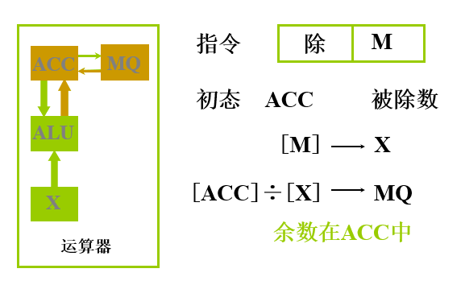

            
     * (3)控制器的基本组成
     
         
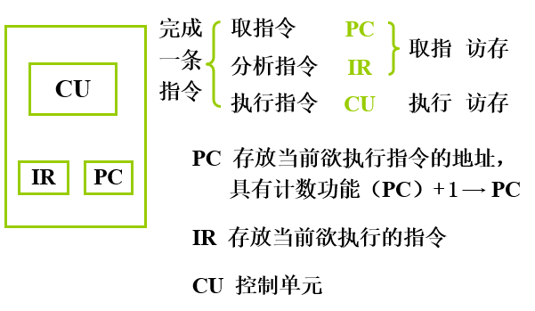
         

     * (4)主机完成一条指令的过程
         
         
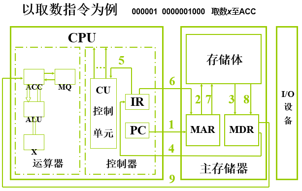
 

          ------------------------
          
         
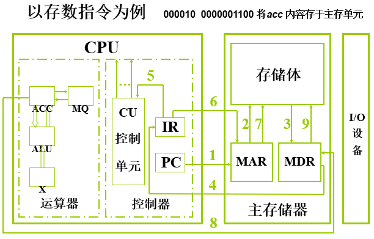
 

     * (5)ax² + bx + c 程序的运行过程
         
         
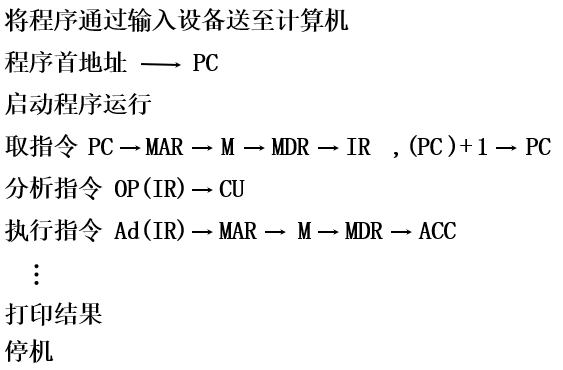
 

