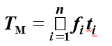
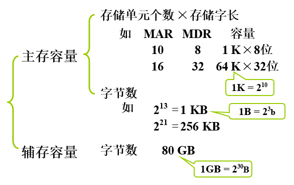

### 1.3.1 机器字长

* 机器字长：CPU 一次能处理数据的位数,与 CPU 中的 **寄存器位数** 有关

### 1.3.2 运算速度

* 主频
* 吉普森法 

  

  
     * fi:第i种指令占全部操作的百分比数
     * ti:第i种指令的执行时间

* MIPS:每秒执行百万条指令
* CPI:执行一条指令所需时钟周期数
* FLOPS:每秒浮点运算次数

    >消费物价指数英文缩写为CPI，是根据与居民生活有关的产品及劳务价格统计出来的物价变动指标，通常作为观察通货膨胀水平的重要指标。 

### 1.3.3 存储容量（存放二进制信息的总位数）

  

