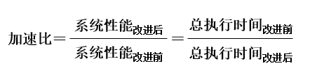
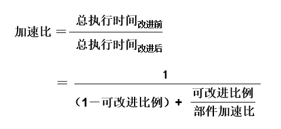
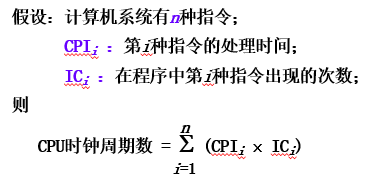
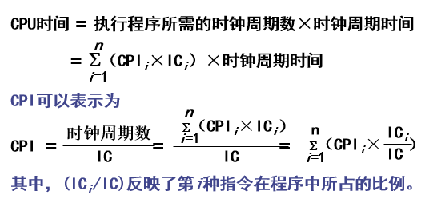
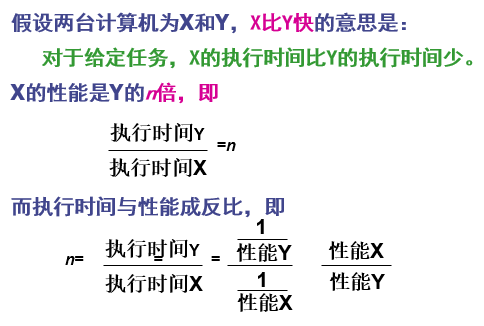

### 1.4.1 计算机系统设计的定量原理

* 1、以经常性事件为重点
    * 对经常发生的情况采用优化方法的原则进行选择，以得到更多的总体上的改进。
    * 优化是指分配更多的资源、达到更高的性能或者分配更多的电能等。 

* 2、Amdahl定律（加速比应该大于 1）
      
    * 加快某部件执行速度所能获得的系统性能加速比，受限于该部件的执行时间占系统中总执行时间的百分比。

    * 系统性能加速比：
      
         

      
      * 加速比依赖于两个因素
          * 可改进比例：在改进前的系统中，可改进部分的执行时间在总的执行时间中所占的比例。它总是小于等于1。
          
              >例如：一个需运行60秒的程序中有20秒的运算可以加速，那么这个比例就是20/60。

          * 部件加速比：可改进部分改进以后性能提高的倍数。它是改进前所需的执行时间与改进后执行时间的比。一般情况下部件加速比是大于1的。
          
              >例如：若系统改进后，可改进部分的执行时间是2秒，而改进前其执行时间为5秒，则部件加速比为5/2。
* 3、改进后程序的总执行时间

     

* 4、系统加速比为改进前与改进后总执行时间之比

     

* 5、Amdahl定律：一种性能改进的递减规则
    * 如果仅仅对计算任务中的一部分做性能改进，则改进得越多，所得到的总体性能的提升就越有限。
    * **重要推论**：如果只针对整个任务的一部分进行改进和优化，那么所获得的加速比不超过1/（1－可改进比例） 

* 6、CPU性能公式
    * 执行一个程序所需的CPU时间
      
         >CPU时间 = 执行程序所需的时钟周期数×时钟周期时间
      
         * 其中，时钟周期时间是系统时钟频率的倒数。
          
    * 每条指令执行的平均时钟周期数CPI（Cycles Per Instruction）
    
         >CPI = 执行程序所需的时钟周期数／IC
  
         * IC：所执行的指令条数
  
    * 程序执行的CPU时间可以写成
    
        * `CPU时间 = IC ×CPI ×时钟周期时间` 

    * CPU的性能取决于3个参数
        * 时钟周期时间：取决于硬件实现技术和计算机组成。
        * CPI：取决于计算机组成和指令集结构。
        * IC：取决于指令集结构和编译技术。
        
    * 对CPU性能公式进行进一步细化 

      

      
      --------------
      
      

* 7、程序的局部性原理

    >程序执行时所访问的存储器地址分布不是随机的，而是相对地簇聚。
       
    * 常用的一个经验规则
        * 程序执行时间的90%都是在执行程序中10%的代码。
    * 程序的时间局部性
        * 程序即将用到的信息很可能就是目前正在使用的信息。
    * 程序的空间局部性
        * 程序即将用到的信息很可能与目前正在使用的信息在空间上相邻或者临近。

### 1.4.2 计算机系统的性能评测

* 1、执行时间和吞吐率 
    >如何评测一台计算机的性能，与测试者看问题的角度有关。
    * 用户关心的是：单个程序的执行时间（执行单个程序所花的时间很少）
    * 数据处理中心的管理员关心的是：吞吐率（在单位时间里能够完成的任务很多 ）

      

    * 执行时间可以有多种定义：
      * 计算机完成某一任务所花费的全部时间，包括磁盘访问、存储器访问、输入/输出、操作系统开销等。
      * CPU时间：CPU执行所给定的程序所花费的时间，不包含I/O等待时间以及运行其他程序的时间。
          * 用户CPU时间：用户程序所耗费的CPU时间。
          * 系统CPU时间：用户程序运行期间操作系统耗费的CPU时间。

* 2、基准测试程序 

    * 用于测试和比较性能的基准测试程序的最佳选择是真实应用程序。
     
         >（例如编译器） 

    * 以前常采用简化了的程序，例如： 
      * 核心测试程序：从真实程序中选出的关键代码段构成的小程序。
      * 小测试程序：简单的只有几十行的小程序。
      * 合成的测试程序：人工合成出来的程序。
      * Whetstone与Dhrystone是最流行的合成测试程序。 
     
      >从测试性能的角度来看，上述测试程序就不可信了。 

