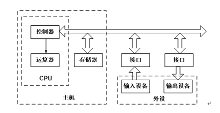
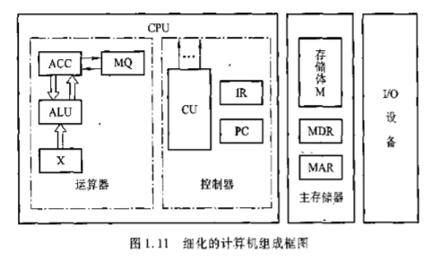

# 1.5  习题

### 一、课后习题

* 1、什么是计算机系统、计算机硬件和计算机软件？硬件和软件哪个更重要？
    >解：
    * 计算机系统：由计算机硬件系统和软件系统组成的综合体。
    * 计算机硬件：指计算机中的电子线路和物理装置。
    * 计算机软件：计算机运行所需的程序及相关资料。
    * 硬件和软件在计算机系统中相互依存，缺一不可，因此同样重要。
* 2、如何理解计算机的层次结构？
    >答：计算机硬件、系统软件和应用软件构成了计算机系统的三个层次结构。
    * (1)硬件系统是最内层的，它是整个计算机系统的基础和核心。
    * (2)系统软件在硬件之外，为用户提供一个基本操作界面。
    * (3)应用软件在最外层，为用户提供解决具体问题的应用系统界面。
    * 通常将硬件系统之外的其余层称为虚拟机。各层次之间关系密切，上层是下层的**扩展**，下层是上层的**基础**，各层次的划分不是绝对的。
* 3、说明高级语言、汇编语言和机器语言的差别及其联系。
    >答：机器语言是计算机硬件能够直接识别的语言，汇编语言是机器语言的符号表示，高级语言是面向算法的语言。高级语言编写的程序（源程序）处于最高层，必须翻译成汇编语言，再由汇编程序汇编成机器语言（目标程序）之后才能被执行。
* 4、如何理解计算机组成和计算机体系结构？
    >答：计算机体系结构是指那些能够被程序员所见到的计算机系统的属性，如指令系统、数据类型、寻址技术组成及I/O机理等。计算机组成是指如何实现计算机体系结构所体现的属性，包含对程序员透明的硬件细节，如组成计算机系统的各个功能部件的结构和功能，及相互连接方法等。
* 5、冯•诺依曼计算机的特点是什么？
    >解：冯•诺依曼计算机的特点是：
	* 计算机由运算器、控制器、存储器、输入设备、输出设备五大部件组成；
	* 指令和数据以同同等地位存放于存储器内，并可以按地址访问；
	* 指令和数据均用二进制表示；
	* 指令由操作码、地址码两大部分组成，操作码用来表示操作的性质，地址码用来表示操作数在存储器中的位置；
	* 指令在存储器中顺序存放，通常自动顺序取出执行；
	* 机器以运算器为中心（原始冯•诺依曼机）。
* 6、画出计算机硬件组成框图，说明各部件的作用及计算机系统的主要技术指标。
    >答：（1）计算机硬件组成框图如下：
        
     

        
    >（2）各部件的作用如下：
    * 控制器：整机的指挥中心，它使计算机的各个部件自动协调工作。
    * 运算器：对数据信息进行处理的部件，用来进行算术运算和逻辑运算。
    * 存储器：存放程序和数据，是计算机实现“存储程序控制”的基础。
    * 输入设备：将人们熟悉的信息形式转换成计算机可以接受并识别的信息形式的设备。
    * 输出设备：将计算机处理的结果（二进制信息）转换成人类或其它设备可以接收和识别的信息形式的设备。
    >（3）计算机系统的主要技术指标有：
    * 机器字长：指CPU一次能处理的数据的位数。通常与CPU的寄存器的位数有关，字长越长，数的表示范围越大，精度也越高。机器字长也会影响计算机的运算速度。
    * 数据通路宽度：数据总线一次能并行传送的数据位数。
    * 存储容量：指能存储信息的最大容量，通常以字节来衡量。一般包含主存容量和辅存容量。
    * 运算速度：通常用MIPS（每秒百万条指令）、MFLOPS（每秒百万次浮点运算）或CPI（执行一条指令所需的时钟周期数）来衡量。CPU执行时间是指CPU对特定程序的执行时间。
    * 主频：机器内部主时钟的运行频率，是衡量机器速度的重要参数。
    * 吞吐量：指流入、处理和流出系统的信息速率。它主要取决于主存的存取周期。
    * 响应时间：计算机系统对特定事件的响应时间，如实时响应外部中断的时间等。
* 7、解释下列概念：主机、CPU、主存、存储单元、存储元件、存储基元、存储元、存储字、存储字长、存储容量、机器字长、指令字长。
    >解：
    * 主机：是计算机硬件的主体部分，由CPU和主存储器MM合成为主机。
    * CPU：中央处理器，是计算机硬件的核心部件，由运算器和控制器组成；（早期的运算器和控制器不在同一芯片上，现在的CPU内除含有运算器和控制器外还集成了CACHE）。
    * 主存：计算机中存放正在运行的程序和数据的存储器，为计算机的主要工作存储器，可随机存取；由存储体、各种逻辑部件及控制电路组成。
    * 存储单元：可存放一个机器字并具有特定存储地址的存储单位。
    * 存储元件：存储一位二进制信息的物理元件，是存储器中最小的存储单位，又叫存储基元或存储元，不能单独存取。
    * 存储字：一个存储单元所存二进制代码的逻辑单位。
    * 存储字长：一个存储单元所存储的二进制代码的总位数。
    * 存储容量：存储器中可存二进制代码的总量；（通常主、辅存容量分开描述）。
    * 机器字长：指CPU一次能处理的二进制数据的位数，通常与CPU的寄存器位数有关。
    * 指令字长：机器指令中二进制代码的总位数。
* 8、解释下列英文缩写的中文含义：CPU、PC、IR、CU、ALU、ACC、MQ、X、MAR、MDR、I/O、MIPS、CPI、FLOPS
    >解：全面的回答应分英文全称、中文名、功能三部分。
    * CPU：Central Processing Unit，中央处理机（器），是计算机硬件的核心部件，主要由运算器和控制器组成。
    * PC：Program Counter，程序计数器，其功能是存放当前欲执行指令的地址，并可自动计数形成下一条指令地址。
    * IR：Instruction Register，指令寄存器，其功能是存放当前正在执行的指令。
    * CU：Control Unit，控制单元（部件），为控制器的核心部件，其功能是产生微操作命令序列。
    * ALU：Arithmetic Logic Unit，算术逻辑运算单元，为运算器的核心部件，其功能是进行算术、逻辑运算。
    * ACC：Accumulator，累加器，是运算器中既能存放运算前的操作数，又能存放运算结果的寄存器。
    * MQ：Multiplier-Quotient Register，乘商寄存器，乘法运算时存放乘数、除法时存放商的寄存器。
    * X：此字母没有专指的缩写含义，可以用作任一部件名，在此表示操作数寄存器，即运算器中工作寄存器之一，用来存放操作数；
    * MAR：Memory Address Register，存储器地址寄存器，在主存中用来存放欲访问的存储单元的地址。
    * MDR：Memory Data Register，存储器数据缓冲寄存器，在主存中用来存放从某单元读出、或要写入某存储单元的数据。
    * I/O：Input/Output equipment，输入/输出设备，为输入设备和输出设备的总称，用于计算机内部和外界信息的转换与传送。
    * MIPS：Million Instruction Per Second，每秒执行百万条指令数，为计算机运算速度指标的一种计量单位。
* 9、画出主机框图，分别以存数指令“`STA M`”和加法指令“`ADD M`”（M均为主存地址）为例，在图中按序标出完成该指令（包括取指令阶段）的信息流程（如`→①`）。假设主存容量为`256M*32`位，在指令字长、存储字长、机器字长相等的条件下，指出图中各寄存器的位数。
    >解：主机框图如下所示。
    
     

   
     
    * （1）`STA M`指令： PC→MAR，MAR→MM，MM→MDR，MDR→IR，OP(IR)→CU，Ad(IR)→MAR，ACC→MDR，MAR→MM，WR
    * （2）`ADD M`指令： PC→MAR，MAR→MM，MM→MDR，MDR→IR，OP(IR)→CU，Ad(IR)→MAR，RD，MM→MDR，MDR→X，ADD，ALU→ACC，ACC→MDR，WR
    * 假设主存容量`256M*32`位，在指令字长、存储字长、机器字长相等的条件下，ACC、X、IR、MDR寄存器均为32位，PC和MAR寄存器均为28位。
* 10、指令和数据都存于存储器中，计算机如何区分它们？
    >解：计算机区分指令和数据有以下2种方法：
	* 通过不同的时间段来区分指令和数据，即在取指令阶段（或取指微程序）取出的为指令，在执行指令阶段（或相应微程序）取出的即为数据。
	* 通过地址来源区分，由PC提供存储单元地址的取出的是指令，由指令地址码部分提供存储单元地址的取出的是操作数。
* 11、什么是指令？什么是程序？
    * 指令是计算机能实现的基本操作，指令均为二进制数形式，指令由操作码和地址码组成，操作码告诉计算机执行什么操作，地址码告诉计算机到哪个存储单元地址中读取参与操作的数据。
    * 程序是若干指令或命令的集合。 

### 二、课外习题

* 1、系统总线由**地址总线、数据总线、控制总线**三类传输线组成。
* 2、一个完整的微机系统应包括**硬件系统** 和 **软件系统**两大功能部分。
* 3、计算机唯一能直接执行的语言是**机器语言**。
* 4、在计算机层次结构中，下层是上层的**基础**，上层是下层的**扩展**。
* 5、计算机软件通常分为系统软件和应用软件两种类型。操作系统和杀毒软件分别属于**系统软件** 和 **应用软件**。
* 6、在计算机中，一般CPU主要包括**运算器（ALU）、控制器（CU）、寄存器**。
* 7、系统总线中控制总线的功能是**提供主存、I/O接口设备的控制信号、响应信号、时序信号**。
* 8、计算机的主要性能指标**存储容量、字长、主频**。
* 9、假定基准程序A在某计算机上的运行时间为100秒，其中90秒为CPU时间，其余为I/O时间。若CPU速度提高50%，I/O速度不变，则运行基准程序A所耗费的时间是**70秒**。

    >基准程序A的运行时间为100秒，90秒为CPU时间，10秒为I/O时间。由于CPU速度提高50%，则原来要执行90秒的任务，现在缩短为90/(1+50%)=60秒。由于I/0速度不变，则运行基准程序A所耗费的时间为10秒+60秒=70秒。
    
* 10、什么是指令周期？什么是机器周期？什么是时钟周期？三者之间关系如何？
    * 指令周期 :取出并执行一条指令的时间。 
    * 机器周期 :又称CPU周期，CPU访问一次内存所花的时间较长，因此用从内存读取一条指令字的最短时间来定义(也就是计算机完成一个基本操作所花费的时间) 。
    * 时钟周期: 通常称为节拍脉冲或T周期。处理操作的最基本单位，即CPU主频。
    * 三者的关系：指令周期通常用若干个机器周期表示，而机器周期又包含若干个时钟周期。
* 11、冯·诺依曼原理的基本思想是什么？
    * （1）计算机硬件组成应为五大部分：控制器、运算器、存储器、输入和输出；
    * （2）存储程序，让程序来指挥计算机自动完成各种工作；
    * （3）计算机运算基础采用二进制； 
* 12、简述电子计算机及其主要特点。
    * 电子计算机
        * 电子计算机（electronic computer），通称电脑，是计算机（computer）用途和数量都较广的一种，是现代的一种利用电子技术和相关原理根据一系列指令来对数据进行处理的机器。电脑可以分为两部分：软件系统和硬件系统。第一台电脑是1946年2月15日在美国宾夕法尼亚大学诞生的ENIAC通用电子计算机。
    * 计算机具有以下特点:
        * 快速的运算能力
        * 足够高的计算精度
        * 超强的记忆能力
        * 复杂的逻辑判断能力
        * 按程序自动工作的能力
        * 电子计算机是一种能自动、高速、精确地完成各式各样的数据存储，数值计算，逻辑推理，过程控制和数据处理功能的电子机器。计算机的主要特点有四个方面，即：高速性，准确性，逻辑性，通用性。

