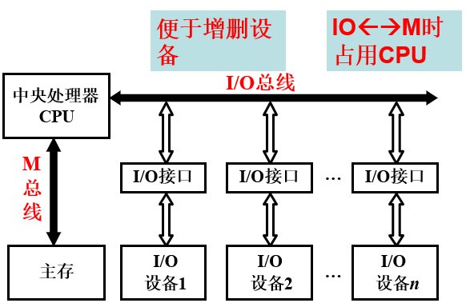
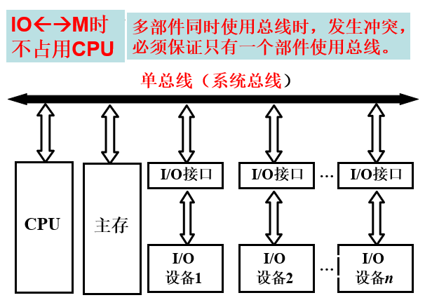
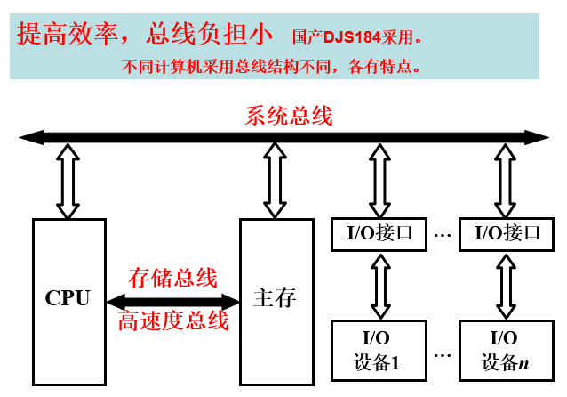

### 一、什么是总线

* 总线是连接各个部件的信息传输线，是各个部件共享的传输介质

### 二、为什么要用总线

### 三、总线上信息的传送

* 串行  
  
      ▃ ▃ ▃ ▃ ▃ ▃ ▃ ▃

* 并行  
       
      ▃ ▃ ▃ ▃ ▃ ▃ ▃ ▃
      ▃ ▃ ▃ ▃ ▃ ▃ ▃ ▃
      ▃ ▃ ▃ ▃ ▃ ▃ ▃ ▃
      ▃ ▃ ▃ ▃ ▃ ▃ ▃ ▃
      ▃ ▃ ▃ ▃ ▃ ▃ ▃ ▃
      ▃ ▃ ▃ ▃ ▃ ▃ ▃ ▃

### 四、总线结构的计算机举例

* 1、面向 CPU 的双总线结构框图

     

* 2、单总线结构框图

     

* 3、以存储器为中心的双总线结构   

     

