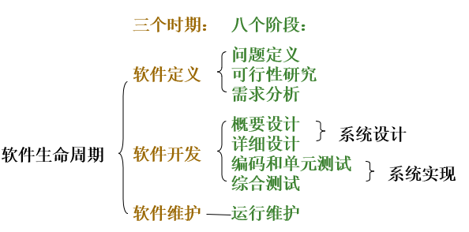

# 软件工程导论

* [第一章、软件工程学概述](./第一章、软件工程学概述/第一章软件工程学概述.md)
  * 1.1 软件危机
    * 1.1.1 软件危机的介绍
    * 1.1.2 产生软件危机的原因
    * 1.1.3 消除软件危机的途径
  * 1.2 软件工程
    * 1.2.1 软件工程的介绍
    * 1.2.2 软件工程的基本原理（审查很重要）
    * 1.2.3 软件工程方法学
  * 1.3 软件生命周期
    * 1.3.1 软件生命周期
    * 1.3.2 每个时期每个阶段的基本任务及文档
  * 1.4 软件过程
    * 1.4.1 瀑布模型
    * 1.4.2 快速原型模型
    * 1.4.3 增量模型
    * 1.4.4 螺旋模型
    * 1.4.5 喷泉模型
    * 1.4.6 Rational统一过程（适合于： 大型软件团队开发大型项目）
    * 1.4.7 敏捷过程与极限编程
    * 1.4.8 微软过程
  * [习题](./第一章、软件工程学概述/习题.md)
  
* [第二章、可行性研究](./第二章、可行性研究/第二章可行性研究.md)

	>主要文档：可行性论证报告（立即进行/推迟进行/不能或不值得进行）：主要包含有 现有系统的物理模型（系统流程图）、目标系统的高层逻辑模型（数据流图）、成本效益分析等

  * 2.1 可行性研究的任务
  * 2.2 可行性研究过程
    * 2.2.1 可行性研究过程
    * 2.2.2 可行性研究报告的编写
  * 2.3 数据流图（DFD，Data Flow Diagram）
    * 2.3.1 符号
    * 2.3.2 数据流图的绘制方法
    * 2.3.3 数据流图
    * 2.3.4 用途
  * 2.4 数据字典(DD Data Dictionary)
    * 2.4.1 数据字典
    * 2.4.2 IPO图(INPUT PROCESS OUTPUT 了解格式)
    * 2.4.3 数据字典的用途
  * 2.5 成本/效益分析
    * 2.5.1 成本估计
    * 2.5.2 成本/效益分析的方法
* [第三章、需求分析](./第三章、需求分析/第三章需求分析.md)

	>主要文档：软件需求规格说明书:以书面形式准确地描述软件需求。(含有逻辑模型：数据流图、数据字典、E-R图、状态转换图等）

  * 3.1 需求分析的任务及过程
    * 3.2 与用户沟通获取需求的方法
    * 3.2.1 访谈
    * 3.2.2 面向数据流自顶向下求精
    * 3.2.3 简易的应用规格说明技术
    * 3.2.4 快速建立软件原型
  * 3.3  分析建模与规格说明
    * 3.3.1 分析建模
  * 3.4 状态转换图
    * 3.4.1 状态
    * 3.4.2 事件
    * 3.4.3 符号
  * 3.5 验证软件需求
* [第四章、总体设计](./第四章、总体设计/第四章总体设计.md)
  * 4.1 总体设计过程
  * 4.2 设计原理
    * 4.2.1 模块化
    * 4.2.2 抽象与逐步求精
    * 4.2.3 信息隐藏和局部化
  * 4.3 模块独立
    * 4.3.1 耦合(程度的度量)
    * 4.3.2 内聚
  * 4.4 启发规则（深度、宽度、扇出和扇入）
  * 4.5 描绘软件结构的图形工具
    * 4.5.1 层次图和HIPO图
    * 4.5.2 结构图
  * 4.6 面向数据流的设计方法
    * 4.6.1 信息流的分类（变换流、事务流）
    * 4.6.2 变换分析
    * 4.6.3 事务分析
      * 将数据流图用变换流/事物流转换为结构图总结
      * 概要设计规格说明
    * 4.6.4 设计优化(理解，实践)
* [第五章、详细设计](./第五章、详细设计/第五章详细设计.md)
  * 5.1 过程设计的工具
    * 5.1.1 PAD图
    * 5.1.2 判定表
    * 5.1.3 判定树
    * 5.1.4 过程设计语言
* [第六章、编码](./第六章、编码/第六章编码.md)
  * 6.1 编码
    * 6.1.1 选择程序设计语言
    * 6.1.2 编码风格
* [第七章、测试](./第七章、测试/第七章测试.md)
  * 7.1 软件测试基础
    * 7.1.1 软件测试的目标
    * 7.1.2 测试方法
    * 7.1.3 测试准则
    * 7.1.4 测试方案
  * 7.2 白盒测试技术
    * 7.2.1 各种覆盖测试用例
    * 7.2.2 各种覆盖测试用例总结
    * 7.2.3 流图（控制流图；McCabe方法）
    * 7.2.4 控制结构测试
  * 7.3 黑盒测试技术
    * 7.3.1 等价类法
    * 7.3.2 边界值分析法
    * 7.3.3 黑盒测试的完善性及总结
  * 7.4 测试策略
    * 7.4.1 单元测试(模块测试)
    * 7.4.2 集成测试(也叫组装测试或联合测试)
    * 7.4.3 自顶向下集成（集成测试）
    * 7.4.4 自底向上集成（集成测试）
    * 7.4.5 回归测试
    * 7.4.6 确认测试（系统测试）
    * 7.4.7 验收测试
* [第八章、维护](./第八章、维护/第八章维护.md)
  * 8.1 软件维护的定义及种类
    * 8.1.1 改正性维护
    * 8.1.2 适应性维护
    * 8.1.3 完善性维护
    * 8.1.4 预防性维护
    * 8.1.5 各类维护总结
  * 8.2 维护的特点
* [第九章、面向对象分析](./第九章、面向对象分析/第九章面向对象分析.md)
  * 9.1 UML概述
  * 9.2 需求获取概述
  * 9.3 用例图中的符号及含义
    * 9.3.1 参与者泛化
    * 9.3.2 用例泛化
    * 9.3.3 用例间关系
  * 9.4 用例模型建模
    * 9.4.1 确定系统的参与者
    * 9.4.2 确定场景
    * 9.4.3 确定系统用例
    * 9.4.4 确定用例之间的关系
    * 9.4.5 编写用例描述文档
    * 9.4.6 用例的粒度
* [第十章、面向对象需求分析](./第十章、面向对象需求分析/第十章面向对象需求分析.md)
  * 10.1 分析概述（面向对象需求分析阶段-从业务模型到概念模型）
  * 10.2 类图的基本符号
    * 10.2.1 类图的组成元素
    * 10.2.2 类图中的关系
  * 10.3 类图中类关系的画法
    * 10.3.1 关联
    * 10.3.2 聚集
    * 10.3.3 泛化(Generalization)
    * 10.3.4 实现(Realization)
    * 10.3.5 依赖(Dependency)
  * 10.4 顺序图含义及画法
    * 10.4.1 顺序图
    * 10.4.2 顺序图组成元素
    * 10.4.3 顺序图查看
    * 10.4.4 举例(顺序图画法)
  * 10.5 分析需求建立对象模型和动态模型（从业务模型到概念模型）
    * 10.5.1 名词分析法
    * 10.5.2 识别实体类及类图的方法——CRC分析法
