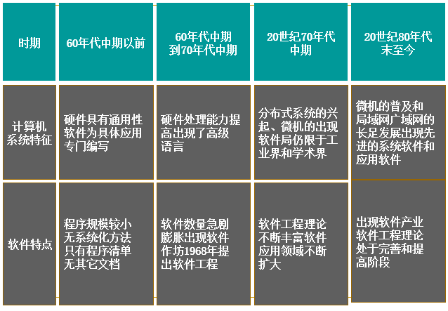
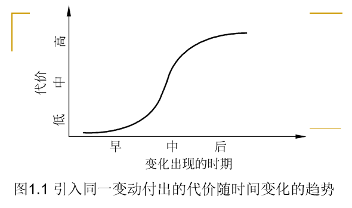

# 1.1软件危机

* 对软件的认识：
    * 1950：程序
    * 1960：程序+文档（不包括管理文档）
    * 1970：程序+文档+数据
    * 1986：CMM1.0软件能力成熟度模型（cmm文档） (p331-332 )
    * 1996：UML统一建模语言

* 必须牢记，软件过程的改善不可能在一夜之间完成，CMM是以增量方式逐步引入变化的。CMM明确地定义了**5个不同的“成熟度”等级**，一个组织可按一系列小的改良性步骤向更高的成熟度等级前进。

### 1.1.1  软件危机的介绍

* 1、软件危机(软件萧条、软件困扰)：是指在计算机软件的开发和维护过程中所遇到的**一系列严重问题**。实际上，几乎所有软件都不同程度地存在这些问题。

   

* 2、软件危机的典型表现：
    * （1）对软件开发成本和进度的估计常常很不准确；
    * （2）用户对“已完成的”软件系统不满意的现象经常发生；
    * （3）软件产品的质量往往靠不住；
    * （4）软件常常是不可维护的；
    * （5）软件通常没有适当的文档资料；计算机软件不仅仅是程序，还应该有一整套文档资料。
    * （6）软件成本在计算机系统总成本中所占的比例逐年上升；
    * （7）软件开发生产率提高的速度，远远跟不上计算机应用迅速普及深入的趋势 。

### 1.1.2  产生软件危机的原因 

* 1、与软件本身的特点有关
    * 软件不同于硬件(主频,字长，内存容量，存取周期，运算速度），它是计算机系统中的逻辑部件而不是物理部件。

* 2、与软件开发和维护的方法不正确有关。

   

### 1.1.3  消除软件危机的途径 

* 对计算机软件有正确的认识。
* 认识到软件开发是一种组织良好、管理严密、各类人员协同配合、共同完成的工程项目。
* 应该推广使用在实践中总结出来的开发软件的成功技术和方法，并继续研究探索。
* 应该开发和使用更好的软件工具。
     
     >总之，为了解决软件危机，既要有技术措施(方法和工具、过程)，又要有必要的组织管理措施。 

