<h1 align="center">第一章  软件工程学概述</h1>

* [1.1 软件危机](#11-软件危机)
	* [1.1.1 软件危机的介绍](#111-软件危机的介绍)
	* [1.1.2 产生软件危机的原因](#112-产生软件危机的原因)
	* [1.1.3 消除软件危机的途径](#113-消除软件危机的途径 )
* [1.2 软件工程](#12-软件工程)
	* [1.2.1 软件工程的介绍](#121-软件工程的介绍)
	* [1.2.2 软件工程的基本原理（审查很重要）](#122-软件工程的基本原理审查很重要)
	* [1.2.3 软件工程方法学](#123-软件工程方法学)
* [1.3 软件生命周期](#13-软件生命周期)
	* [1.3.1 软件生命周期](#131-软件生命周期)
	* [1.3.2 每个时期每个阶段的基本任务及文档](#132-每个时期每个阶段的基本任务及文档)
* [1.4 软件过程](#14-软件过程)
	* [1.4.1 瀑布模型](#141-瀑布模型)
	* [1.4.2 快速原型模型](#142-快速原型模型)
	* [1.4.3 增量模型](#143-增量模型)
	* [1.4.4 螺旋模型](#144-螺旋模型)
	* [1.4.5 喷泉模型](#145-喷泉模型)
	* [1.4.6 Rational统一过程（适合于： 大型软件团队开发大型项目）](#146-Rational统一过程（适合于： 大型软件团队开发大型项目）)
	* [1.4.7 敏捷过程与极限编程](#147-敏捷过程与极限编程)
	* [1.4.8 微软过程](#148-微软过程)

# 1.1 软件危机

* 对软件的认识：
    * 1950：程序
    * 1960：程序+文档（不包括管理文档）
    * 1970：程序+文档+数据
    * 1986：CMM1.0软件能力成熟度模型（cmm文档） (p331-332 )
    * 1996：UML统一建模语言

* 必须牢记，软件过程的改善不可能在一夜之间完成，CMM是以增量方式逐步引入变化的。CMM明确地定义了**5个不同的“成熟度”等级**，一个组织可按一系列小的改良性步骤向更高的成熟度等级前进。

### 1.1.1 软件危机的介绍

* 1、软件危机(软件萧条、软件困扰)：是指在计算机软件的开发和维护过程中所遇到的**一系列严重问题**。实际上，几乎所有软件都不同程度地存在这些问题。

   

* 2、软件危机的典型表现：
    * （1）对软件开发成本和进度的估计常常很不准确；
    * （2）用户对“已完成的”软件系统不满意的现象经常发生；
    * （3）软件产品的质量往往靠不住；
    * （4）软件常常是不可维护的；
    * （5）软件通常没有适当的文档资料；计算机软件不仅仅是程序，还应该有一整套文档资料。
    * （6）软件成本在计算机系统总成本中所占的比例逐年上升；
    * （7）软件开发生产率提高的速度，远远跟不上计算机应用迅速普及深入的趋势 。

### 1.1.2 产生软件危机的原因

* 1、与软件本身的特点有关
    * 软件不同于硬件(主频,字长，内存容量，存取周期，运算速度），它是计算机系统中的逻辑部件而不是物理部件。

* 2、与软件开发和维护的方法不正确有关。

   

### 1.1.3 消除软件危机的途径

* 对计算机软件有正确的认识。
* 认识到软件开发是一种组织良好、管理严密、各类人员协同配合、共同完成的工程项目。
* 应该推广使用在实践中总结出来的开发软件的成功技术和方法，并继续研究探索。
* 应该开发和使用更好的软件工具。
     
     >总之，为了解决软件危机，既要有技术措施(方法和工具、过程)，又要有必要的组织管理措施。 

# 1.2 软件工程

### 1.2.1 软件工程的介绍

* 1、软件工程：是指导计算机软件开发和维护的一门工程学科。
* 2、采用工程的概念、原理、技术和方法来开发与维护软件.
* 3、软件工程的代表性定义：
    * Fritz Bauer：软件工程是为了经济地获得可靠的和能在实际机器上高效运行的软件而建立和使用的好的工程原则。
    * IEEE：软件工程是（1）将系统化的、规范的、可度量的途径应用于软件的开发、运行和维护的过程，即将工程化应用于软件中；（2）研究（1）中提到的途径。（美国电气与电子工程师协会）
    * 计算机科学技术百科全书：软件工程是应用计算机科学、数学及管理科学等原理，以工程化的原则和方法制作软件的过程。
   
### 1.2.2 软件工程的基本原理（审查很重要）

* 用分阶段的生命周期计划严格管理
* 坚持进行阶段评审
* 实行严格的产品控制
* 采用现代程序设计技术
* 结果应能清楚地审查
* 开发小组的人员应该少而精
* 承认不断改进软件工程实践的必要性

### 1.2.3 软件工程方法学

* 1、软件工程包括技术和管理两方面的内容。
* 2、管理：通过计划、组织和控制等一系列活动，合理地配置和使用各种资源，以达到既定目标的过程。（估算代码规模，工作量估算，进度计划，人员组织，配置管理等）
* 3、技术(软件工程方法学)：通常把在软件生命周期全过程中使用的一整套技术方法的集合称为方法学(methodology)，也称为范型(paradigm)。
* 4、软件工程方法学3要素：
    * 方法：是完成软件开发的各项任务的技术方法，回答“怎样做”的问题；
    * 工具：是为运用方法而提供的自动的或半自动的软件工程支撑环境；如，CASE(Computer-Aided Software Engineering )工具
    * 过程：需要完成的一系列任务的框架，它规定了完成各项任务的工作步骤。
* 5、用户接触到的case工具
    * 图形工具：绘制结构图、系统专用图。
    * 屏幕显示和报告生成的各种专用系统：可支持生成一个原型。
    * 专用检测工具：用以检测错误或不一致的专用工具及其生成的信息。
    * 代码生成器：从原型系统的工具中自动产生可执行代码。
    * 文件生成器：产生结构化方法和其他方法所需要的用户系统文件。
        * visio。Rational Rose（代码自动生成）
        * Virsual Source Safe 版本控制系统
        * SourceNavigator：源码显示和编辑工具

# 1.3 软件生命周期

### 1.3.1 软件生命周期

* 软件生命周期：软件产品从形成概念开始，经过开发、使用和维护，直到最后退役的全过程（记）。
* 分为三个时期：软件定义、软件开发和运行维护(也称为软件维护）。每个时期又进一步划分成若干个阶段。

   
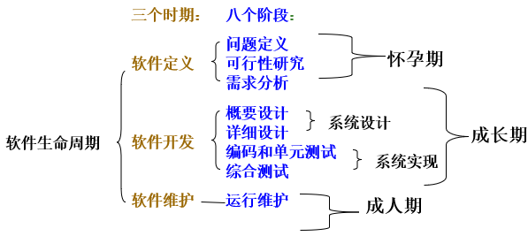

### 1.3.2 每个时期每个阶段的基本任务及文档

   >软件定义时期分为问题定义、可行性分析、需求分析三个阶段
   
* 1、 问题定义
    * 任务：问题是什么
      * 通过对客户的访问调查，系统分析员扼要地写出关于问题性质、工程目标和工程规模的书面报告。
      * 经过讨论和必要的修改之后这份报告应该得到客户的确认。
    * 结果：
        * 关于系统规模和目标的报告书 

    -------------------
    
    >例：《教材销售系统》
         
     学生购买学校教材的手续可能是：学生自己写一个希望买什么书的列表，先找系办公室开购书申请（用于确定学生可购买的书，希望用软件实现，完全由教材科控制），凭申请找教材科开购书证明（确定是否卖完，希望用计算机实现），向出纳员交付书款获得领书单，然后到书库找保管员领书。

    
    * 关于系统规模和目标的报告书
                    
       * 1.项目名称：教材销售系统
       * 2.问题：人工发售教材手续繁杂，且易出错。
       * 3.项目目标：建立一个高效率、无差错的微机教材销售系统。
       * 4.项目规模：利用现有微型计算机，软件开发费用不超过5000元。
       * 5.初步想法：验证学生可买什么书建议在系统中增加对缺书的统计与采购功能。
       * 6.可行性研究：建议进行大约10天的可行性研究，研究费用不超过500元。

* 2、可行性研究
    * 任务：有可行的解吗
      * 系统分析员需要进行一次大大压缩和简化了的系统分析和设计过程。
      * 研究问题的范围，探索这个问题是否值得去解，是否有可行的解决办法。
    * 结果：
      * 系统的高层逻辑模型（数据流图、成本效益分析）
      * 可行性论证报告（立即进行/推迟进行/不能或不值得进行）

* 3、需求分析
    * 任务：必须做什么（从用户的角度）
      * 主要是确定目标系统必须具备哪些功能。
      * 系统分析员必须和用户密切配合，充分交流信息，以得出经过用户确认的系统逻辑模型。
    * 结果：
      * 系统的逻辑模型（数据流图、数据字典、简要的算法描述）
      * 用规格说明书准确地记录对目标系统的需求

   
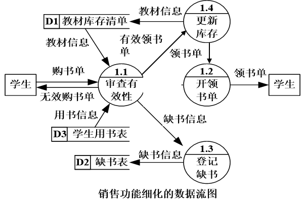

   
   -----------
   
   
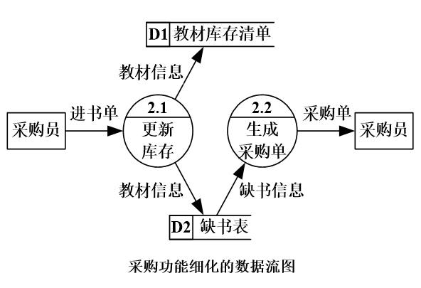

* 4、总体设计
    * 任务：这个阶段的关键问题是：“概括地说，应该怎样实现目标系统?”
      * 简单的说：划分模块及设计模块间关联。
      * 又称：生成软件体系结构
        * 设计出实现目标系统的几种可能的方案（低、中、高成本）。
        * 用适当的表达工具描述每种方案，分析优缺点，推荐一个最佳方案，制定出实现最佳方案的详细计划。设计程序的体系结构。
    * 结果：
      * 可能的解法（系统流程图、成本效益分析）
      * 推荐的系统体系结构（层次图或结构图）

   
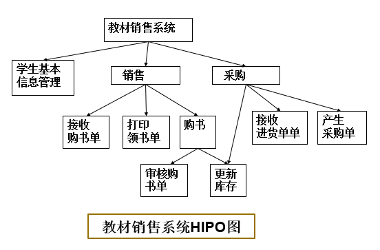

* 5、详细设计
    * 任务：怎样具体实现该系统
      * 详细地设计每个模块，确定实现模块功能所需要的算法和数据结构。
    * 结果：
      * 每个模块的算法和数据结构(程序流程图、PAD图、N-S图等)。

* 6、编码和单元测试
    * 任务：得到正确的程序模块
      * 选取一种适当的高级程序设计语言(必要时用汇编语言)，把详细设计的结果翻译成用选定的语言书写的程序；
      * 并且仔细测试编写出的每一个模块。
    * 结果：
      * 代码和测试报告

* 7、综合测试
    * 任务：得到符合要求的软件
      * 通过集成测试、验收测试、现场测试、平行运行等方法对目标系统进一步测试检验。
      * 通过对软件测试结果的分析可以预测软件的可靠性；反之，根据对软件可靠性的要求，也可以决定测试和调试过程什么时候可以结束。
    * 结果：
      * 测试计划、详细测试方案以及实际测试结果
      * 完整一致的软件配置 

* 8、软件维护
    * 任务：使系统持久地满足用户的需要
      * 改正性维护，诊断和改正在使用过程中发现的软件错误；
      * 适应性维护，修改软件以适应环境的变化；
      * 完善性维护，根据用户的要求改进或扩充软件；
      * 预防性维护，修改软件为将来的维护活动做准备。
      >每一项维护活动实质上是经历了一次压缩和简化了的软件定义和开发的全过程。
    * 结果：
      * 完整准确的维护记录 

   
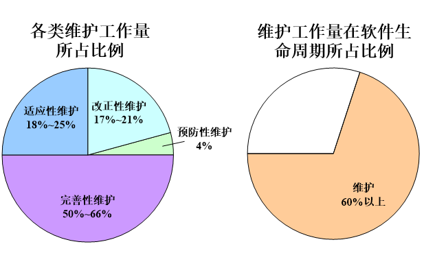

   
   -------------
   
   
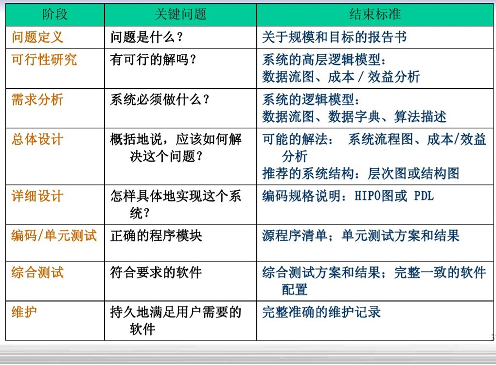

# 1.4 软件过程

* （重）软件过程：是为了获得高质量软件所需要完成的一系列任务的框架，它规定了完成各项任务的工作步骤。
* 习惯各个阶段及其先后顺序来描述过程
* 修建——盖房
  >先打地基，再盖楼的框架，布线，最后再美化
* 软件生命周期章节中描述的是基础过程模型
* 注意：每种模型的思想、过程、适用范围

### 1.4.1 瀑布模型

   
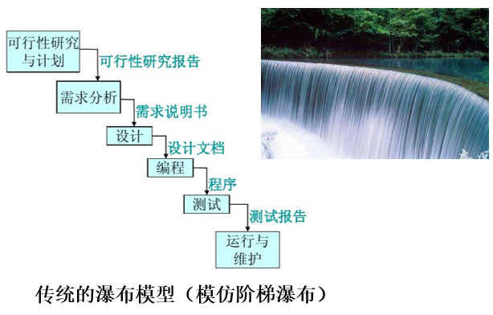

   
   ----------
   
   
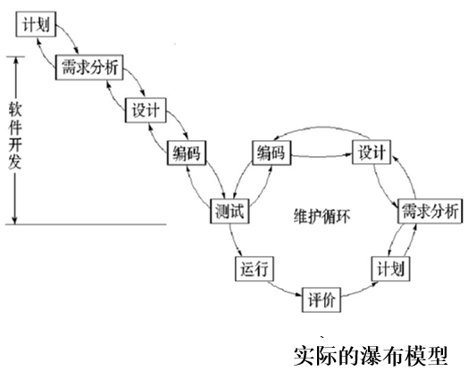

* 1、瀑布模型的特点：
    * 1>阶段间具有顺序性和依赖性
      * 前一阶段的工作完成之后，才能开始后一阶段的工作； 
      * 前一阶段的输出文档就是后一阶段的输入文档。
    * 2>推迟实现的观点
      * 对于规模较大的软件项目来说，往往编码开始得越早最终完成开发工作所需要的时间反而越长。
    * 3>质量保证的观点
      * 每个阶段都必须完成规定的文档，是“文档驱动”的模型；
      * 每个阶段结束前都要对所完成的文档进行评审，尽早发现问题，改正错误。
 
* 2、瀑布模型的优点：
    * 可强迫开发人员采用规范的方法；
    * 严格地规定了每个阶段必须提交的文档；
    * 要求每个阶段交出的所有产品都必须经过质量保证小组的仔细验证。

* 3、瀑布模型的缺点（重）：
    * 用户只能通过文档了解产品，不经过实践的需求是不切实际的。

* 4、瀑布模型适用于（重）：   
    * 需求是预知的； 
    * 软件实现方法是成熟的；   
    * 项目周期较短。   

### 1.4.2 快速原型模型

  
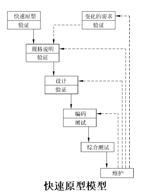

  >认识事物是一个反复的过程。
* 思想:第一步是快速的建立一个能反应用户主要需求的原型系统，让用户在计算机上试用它，通过实践来了解目标系统的概貌。通常，用户试用原型系统之后会提出许多修改意见，开发人员按照用户的意见快速地修改原型系统，然后再次请用户试用……，一旦用户认为这个原型系统确实能够做他们所需要的工作，开发人员便根据此书写规格说明文档。
* 步骤：
    * (1)获取用户需求（使用快速原型法），描述规格说明书
      >使用原型（样本）思想获取用户需求。
      * 原型也可能是公司现有的一个类似软件，或只是界面，或只是文档。可能是最终产品能完成的功能的一个子集。
      * 一旦原型完全符合用户需求，开发人员根据其写说明书。
    * (2)根据规格说明书开发维护软件
    
-----------------

* 1、快速原型模型的特点：
    * 软件产品的开发基本上是线性顺序进行的。
    * 快速原型的本质是“快速”。应该尽可能快地建造出原型系统，以加速软件开发过程，节约成本。
    * 在整个开发过程中，用户能看到实物 。

* 2、快速原型模型适用于：   
    * 已有产品或产品的原型
    * 简单而熟悉的行业或领域
    * 有快速原型开发工具
    * 进行产品移植或升级

### 1.4.3 增量模型

* 增量模型把软件产品作为一系列的增量构件来设计、编码、集成和测试。
* 特点：完成第一个增量构件后，再完成第二个增量构件，并与第一个增量构件组合。以此类推。 
    * 比如，使用增量模型开发字处理软件时，
      * 第一个增量构件往往提供软件的基本需求，提供最核心本的文件管理、编辑和文档生成功能。 例输入、插入、新建、存储 。
      * 第二个增量构件提供更完善的编辑和文档生成功能，比如菜单，复制、粘贴、另存为等；
      * 第三个增量构件实现拼写和语法检查功能；第四个增量构件完成高级的页面排版功能。

* 构件（component）是可复用的软件组成成份，可被用来构造其他软件。
* 构件是系统中实际存在的可更换部分，它实现特定的功能，符合一套接口标准并实现一组接口。构件代表系统中的一部分物理实施，包括软件代码（源代码、二进制代码或可执行代码）或其等价物（如脚本或命令文件）。在图中，构件表示为一个带有标签的矩形。 

     
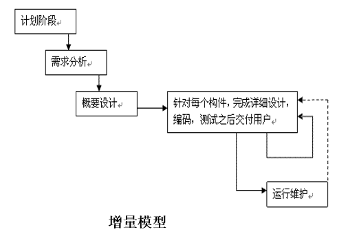

* 风险更大的增量模型

     
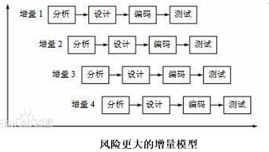

    *  一旦需求确定后，就着手对第一个构件的需求进行分析。稍后，在未完成第一个构件前，已开始第二个构件的分析

    ---------------
    
* 1、增量模型的优点：
    * 人员分配灵活，刚开始不用投入大量人力资源。 
    * 当配备的人员不能在设定的期限内完成产品时，它提供了一种先推出核心产品的途径。 
    * 逐步增加产品功能可以使用户有较充裕的时间学习和适应新产品。
* 2、增量模型的难点：
    * 软件体系结构必须是开放的。
    * 不同的构件并行地构建有可能加快工程进度，但是冒无法集成到一起的风险。
* 3、增量模型适用于：
    * （1）进行已有产品升级或新版本开发，增量模型是非常适合的；
    * （2）对完成期限严格要求的产品，可以使用增量模型；
    * （3）对所开发的领域比较熟悉而且已有原型系统，增量模型也是非常适合的

### 1.4.4 螺旋模型

   >风险分析是对工程建设项目投资决策或企业生产经营决策可能造成的**失误**和带来的经济损失所进行的**估计**。

* 螺旋模型的基本思想：增加了**风险分析过程**的瀑布模型和快速原型模型混合。
* 它的一大特点是：每完成一项任务，都要先进行风险识别，然后风险分析，对存在的风险尽力进行风险控制。若风险很大，无法解决，甚至可以停止工作的进行。

     
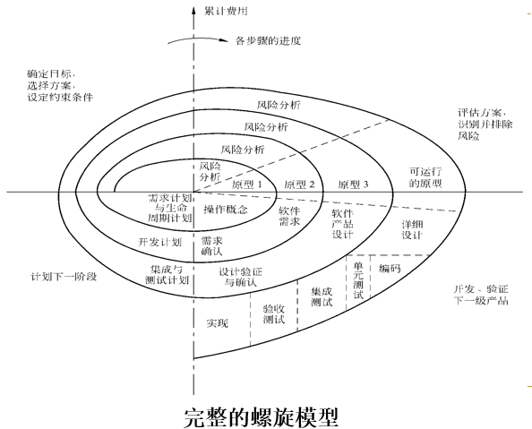

* 四种象限
    * （1）制定计划：确定软件目标，选定实施方案，弄清项目开发的限制条件；（左上） 
    * （2）风险分析：分析评估所选方案，考虑如何识别和消除风险；（右上） 
    * （3）实施工程：实施软件开发和验证（右下）
    * （4）客户评估：评价开发工作，提出修正建议，制定下一步计划。 （左下） 
    
    ------------

* 1、螺旋模型的优点：
    * 主要优势在于它是风险驱动的。
    * 对可选方案和约束条件的强调有利于已有软件的重用，也有助于把软件质量作为软件开发的一个重要目标；
    * 减少了过多测试或测试不足所带来的风险；
    * 维护只是模型的另一个周期，维护和开发之间没有本质区别。
* 2、螺旋模型的缺点：
    * 采用螺旋模型需要具有相当丰富的风险评估经验和专门知识，在风险较大的项目开发中，如果未能够及时标识风险，势必造成重大损失。 
    * 过多的迭代次数会增加开发成本，延迟提交时间。 
* 3、螺旋模型适用于：
    * 特别适用于庞大、复杂并具有高风险的系统。

### 1.4.5 喷泉模型

   

  > 喷泉的水，落下，可落到中间，也可落到底部。

* 特点：主要用于支持面向对象开发过程，体现了软件创建所固有的迭代特征

### 1.4.6 Rational统一过程（适合于： 大型软件团队开发大型项目）

* 是由Rational公司的Booch、Jacobson、  Rumbaugh提出的软件过程模型，也称RUP（Rational Unified Process)。
* RUP划分为**初始**、**细化**、**构造**和**移交**四个阶段。
* 每个阶段围绕着六个核心工作流（**建模、需求、分析、设计、实现、测试**）分别迭代。
* RUP软件开发生命周期

     
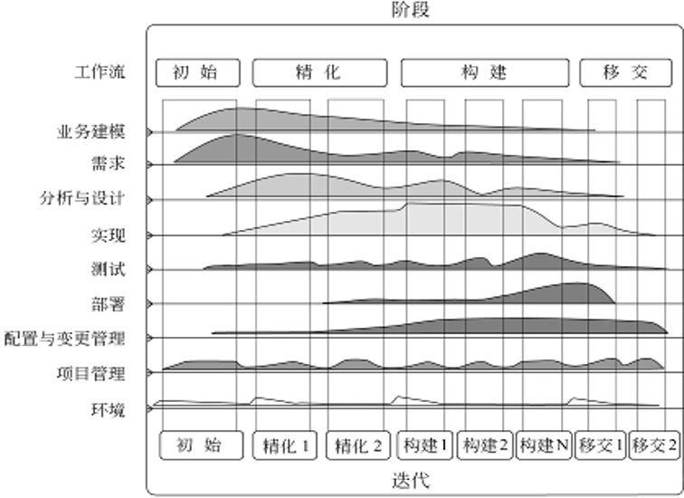

    * 业务建模：产生五个工作产品。即商业逻辑建模（USE CASE）、业务需求说明书、专业词汇表（英汉对照）、风险说明、复审说明书
    * 需求工作流：导出支持目标组织所需的系统需求，建立系统需求模型：用例图（表示系统的功能）
    * 分析和设计：分析需求，设计系统

* 软件过程模型RUP

    * 初始阶段：建立业务模型用例，明确项目的范围。
    
    * 细化阶段： 分析问题域，建立一个健全的、合理的体系结构基础，明确项目中高风险元素，制定一个合理的项目开发计划。
    
    * 构建阶段：开发一个完整的软件系统，准备给用户使用。
    
    * 交付阶段为用户安装部署软件。
 
* 在每个阶段的每次迭代的最后，用例模型、分析模型、设计模型、实现模型都会增量，每个阶段结束的里程碑处，管理层做出是否继续、进度、预算、是否给下一阶段提供资助等决定。
* 不同阶段工作流的侧重点不同，前两阶段大部分工作集中在需求、分析和架构设计上；在构造阶段，重点转移到详细设计、实现和测试上。
* RUP是一种迭代的、以架构为中心 的、用例驱动的软件开发方法；RUP是一种具有明确定义和结构的软件工程过程，它明确规定了人员的职责、如何完成各项工作以及何时完成各项工作，以及软件 开发生命周期的结构，定义了主要里程碑和决策的关系；RUP也是一个过程产品，提供了可定制的软件工程的过程框架，支持过程定制、过程创作和多种类型的开 发过程，可通过装配过程产品得到过程配置。RUP配置可以用于不同规模的开发团队和规范程度不同的开发方法，RUP产品包含过程配置和过程视图，以指导项 目经理、开发人员、测试人员等角协作开发软件。

### 1.4.7 敏捷过程与极限编程

* 敏捷软件开发宣言(价值观声明)：
    * 个体和交互胜过过程和工具
    * 可以工作的软件胜过面面俱到的文档
    * 客户合作胜过合同谈判
    * 响应变化胜过遵循计划

        >根据上述价值观声明提出的软件过程统称为敏捷过程。

* 极限编程(eXtreme Programming, XP)：
    * 敏捷过程中最富盛名的一个
    * 广泛适用于需求模糊且经常改变的场合
    * 使得敏捷过程能够较好地适应商业竞争环境下对小型项目提出的有限资源和有限开发时间的约束
    * XP项目的整体开发过程
    
     
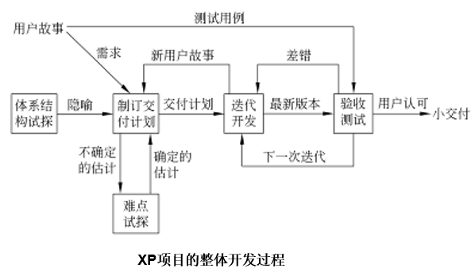

    
    * XP迭代开发过程 
    
     
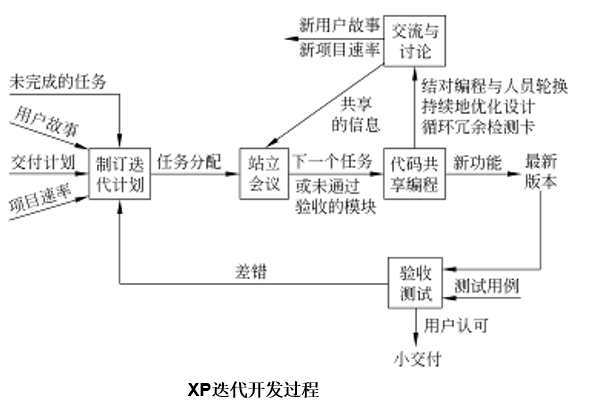

### 1.4.8 微软过程

* 微软过程准则
* 微软软件生命周期 

     
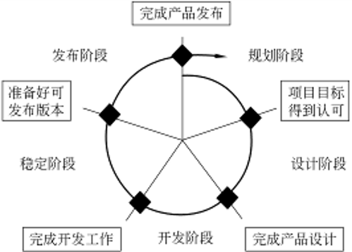

* 微软过程模型
* 每一个生命周期发布一个递进的版本，各生命周期持续快速地迭代循环
* **优点**： 综合了Rational统一过程和敏捷过程的优点
* **缺点**：对方法、工具和产品等方面不够全面

     
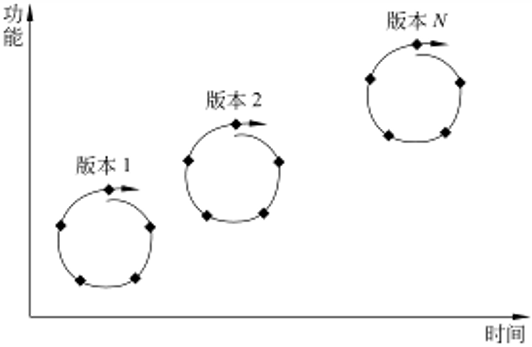

