<h1 align="center">第七章  测试</h1>

* [7.1 软件测试基础](#71-软件测试基础)
	* [7.1.1 软件测试的目标](#711-软件测试的目标)
	* [7.1.2 测试方法](#712-测试方法)
	* [7.1.3 测试准则](#713-测试准则)
	* [7.1.4 测试方案](#714-测试方案)
* [7.2 白盒测试技术](#72-白盒测试技术)
	* [7.2.1 各种覆盖测试用例](#721-各种覆盖测试用例)
	* [7.2.2 各种覆盖测试用例总结](#722-各种覆盖测试用例总结)
	* [7.2.3 流图（控制流图；McCabe方法）](#723-流图McCabe方法)
	* [7.2.4 控制结构测试](#724-控制结构测试)
* [7.3 黑盒测试技术](#73-黑盒测试技术)
	* [7.3.1 等价类法](#731-等价类法)
	* [7.3.2 边界值分析法](#732-边界值分析法)
	* [7.3.3 黑盒测试的完善性及总结](#733-黑盒测试的完善性及总结)
* [7.4 测试策略](#74-测试策略)
	* [7.4.1 单元测试(模块测试)](#741-单元测试模块测试)
	* [7.4.2 集成测试(也叫组装测试或联合测试)](#742-集成测试也叫组装测试或联合测试)
	* [7.4.3 自顶向下集成（集成测试）](#743-自顶向下集成)
	* [7.4.4 自底向上集成（集成测试）](#744-自底向上集成)
	* [7.4.5 回归测试](#745-回归测试)
	* [7.4.6 确认测试（系统测试）](#746-确认测试系统测试)
	* [7.4.7 验收测试](#747-验收测试)


# 7.1 软件测试基础
### 7.1.1 软件测试的目标
* 测试是为了发现程序中的错误而执行程序的过程；
* 好的测试方案是极可能发现迄今为止尚未发现的错误的测试方案；
* 成功的测试是发现了至今为止尚未发现的错误的测试。 

### 7.1.2 测试方法
* 测试：静态测试和动态测试
* 静态测试：
	* 静态方法是指不运行被测程序本身，仅通过分析或检查源程序的语法、结构、过程、接口等来检查程序的正确性。
	* PMD：是一个代码检查工具，它用于分析 Java 源代码，找出潜在的 问题：(在Eclipse中 安装 PMD插件)
		* 1)潜在的bug：空的try/catch/finally/switch语句
		* 2)未使用的代码：未使用的局部变量、参数、私有方法等
		* 3)可选的代码：String/StringBuffer的滥用
		* 4)复杂的表达式：不必须的if语句、可以使用while循环完成的for循环
		* 5)重复的代码：拷贝/粘贴代码意味着拷贝/粘贴bugs

* 动态测试：通过机器运行程序来发现错误。
	* **黑盒测试**(功能测试)：把程序看作一个黑盒子；
		* 完全不考虑程序的内部结构和处理过程；
		* 是在程序接口进行的测试。
		* 主要测试功能和接口。

		* 黑盒测试不可能实现穷尽测试：
		
		  >eg:                                                                                                                                                                                                                                                                                                                                                                                                                                                                             
		  >* 假设有程序P，输入量微A和B，输出量为C。</br>
		  >* 如果计算机的字长为32位，A和B的数据类型都是整数类型。将A和B的可能取值进行排列组合，输入数据的可能性有：232×232＝264种。</br>
		  >* 假设这个程序执行一次需要1毫秒，要完成所有的测试，计算机需要连续工作5亿年。
	
			<div align="center"></div>

	* **白盒测试**(结构测试)：把程序看成装在一个透明的盒子里；
		* 测试者完全知道程序的结构和处理算法；
		* 按照程序内部的逻辑测试程序，检测程序中的主要执行通路是否都能按预定要求正确工作。
		* 白盒测试不能实现穷尽测试：

		  >eg: 
		  >* 图中所示的一个小程序的控制流程。曲线代表执行次数不超过20的循环，循环体中共有5条通路。</br>
		  >* 可能执行的路径有520条，近似为1014条可能的路径。</br>
		  >* 如果完成一个路径的测试需要1毫秒，那么整个测试过程需要3170年。

			<div align="center">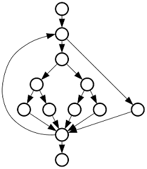</div>

### 7.1.3 测试准则
* 所有测试都应该能追溯到用户需求；（测试用例设计依据）
* 应该远在测试开始之前就制定出测试计划；
* 把Pareto原理应用到软件测试中；（二八定律）
* 应该从“小规模”测试开始，并逐步进行“大规模”测试；
* 穷举测试是不可能的；
* 为了达到最佳的测试效果，可以找独立的第三方公司进行测试工作。
* 对发现错误较多的程序段,应进行更深入的测试。
 
### 7.1.4 测试方案
* **所谓测试方案包括具体的测试目的（例如，预定要测试的具体功能），应该输入的测试数据和预期的结果。通常又把测试数据和预期的输出结果称为测试用例。**

	<div align="center"></div>

# 7.2 白盒测试技术

>对模块进行单元测试，根据**算法描述**和**白盒测试法**设计测试用例(**逻辑覆盖**和**基本路径测试**)

### 7.2.1 各种覆盖测试用例

* 1.语句覆盖
	* 含义：选择足够的测试数据，使被测程序中每个语句至少执行一次。
	* 分析：执行语句sacbed
	* 测试用例：A＝2，B＝0，X＝4 覆盖sacbed
	* 例：
		
	  >1、模块输入数据：A,B,X。均为int</br>
	  >2、模块输出数据：X

		<div align="center">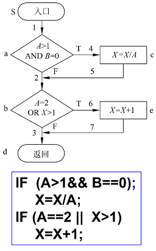</div>
	* **语句覆盖特点**：
		* 语句覆盖对程序的逻辑覆盖很少。
		* 语句覆盖不能走过所有支路。
		* 语句覆盖是很弱的逻辑覆盖标准。 

* 2.判定覆盖（分支覆盖）
	* 含义：不仅每个语句必须至少执行一次，而且每个判定的每种可能的结果都应该至少执行一次。
	* 所有判定分支：
	    * (1)a点判定为T  
	    * (2)a点判定为F
	    * (3)b点判定为T  
	    * (4)b点判定为F
	* 测试用例1：
    	* Ⅰ.满足(aTbF）：A＝3，B＝0，X＝3  覆盖sacbd 
    	* Ⅱ.满足（aFbT）：A＝2，B＝1，X＝2   覆盖sabed
	* 测试用例2
    	* Ⅰ.满足(aTbT) ：A＝2，B＝0，X＝1  覆盖sacbed     结果： x=3
    	* Ⅱ.满足(aFbF)：A＝3，B＝1，X＝1    覆盖sabd   结果： x=1

		<div align="center">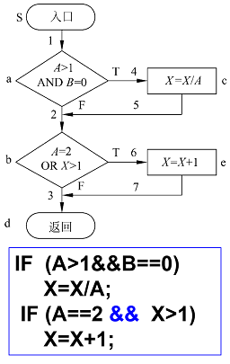</div>

		* **判定覆盖的特点：比语句覆盖强，但对程序逻辑的覆盖程度仍不高;未考虑表达式中各条件的各种取值
**。 
* 3.条件覆盖
	* 含义：选择足够的测试用例，使判定表达式中的每个条件都取到各种可能的结果。
	* 所有条件：
	    * (1)A＞1&nbsp;&nbsp;&nbsp;&nbsp;&nbsp;&nbsp;&nbsp;&nbsp;(2)A≤1  
	    * (3)B＝0&nbsp;&nbsp;&nbsp;&nbsp;&nbsp;&nbsp;&nbsp;&nbsp;(4)B≠0
	    * (5)A＝2&nbsp;&nbsp;&nbsp;&nbsp;&nbsp;&nbsp;&nbsp;&nbsp;(6)A≠2  
	    * (7)X＞1&nbsp;&nbsp;&nbsp;&nbsp;&nbsp;&nbsp;&nbsp;&nbsp;(8)X≤1

	* 测试用例1：
		* Ⅰ.满足(1)(3)(5)(7):A＝2，B＝0，X＝4    覆盖sacbed    
		* Ⅱ.满足(2)(4)(6)(8)：A＝1，B＝1，X＝1   覆盖sabd    
		* 如果语言具备短路特性，本测试用例，需要增加，测试B !=0   和 X>1的用例 A=3，B=1，X=6 
	* 测试用例2：
		* Ⅰ.满足(1)(3)(5)(8)：A＝2，B＝0，X＝1    覆盖sacbed    
		* Ⅱ.满足(2)(4)(6)(7)：A＝1，B＝1，X＝2    覆盖sabed

		<div align="center">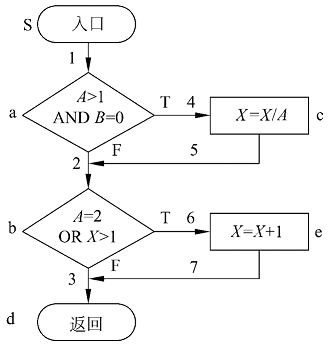</div>
	* **条件覆盖特点**：
		* 条件覆盖通常比判定覆盖强，因为它使每个条件都取到了两个不同的结果，判定覆盖却只关心整个判定表达式的值。但也有反例，如第二组测试用例。
		* 判定覆盖不一定包含条件覆盖，条件覆盖也不一定包含判定覆盖。

* 4.判定/条件覆盖
	* 含义：使得判定表达式中的每个条件都取到各种可能的值，每个判定表达式也都取到各种可能的结果。
	* 测试用例：所有判定,`a真   a假   b真  b假`
	* 所有条件：
	    * (1)A＞1&nbsp;&nbsp;&nbsp;&nbsp;&nbsp;&nbsp;&nbsp;&nbsp;(2)A≤1  
	    * (3)B＝0&nbsp;&nbsp;&nbsp;&nbsp;&nbsp;&nbsp;&nbsp;&nbsp;(4)B≠0
	    * (5)A＝2&nbsp;&nbsp;&nbsp;&nbsp;&nbsp;&nbsp;&nbsp;&nbsp;(6)A≠2  
	    * (7)X＞1&nbsp;&nbsp;&nbsp;&nbsp;&nbsp;&nbsp;&nbsp;&nbsp;(8)X≤1
	* 测试用例：
		* Ⅰ.满足条件(1)(3)(5)(7)和判定(a真，b真)：A＝2，B＝0，X＝4；结果:A＝2,B＝0,X＝3 
		* Ⅱ.满足条件(2)(4)(6)(8)和判定(a假，b假)：A＝1，B＝1，X＝1；结果: A＝1，B＝1，X＝1
	* 如果语言具备短路特性，本测试用例增加，测试B !=0   和 X>1的用例    A=3，B=1，X=6 

		<div align="center">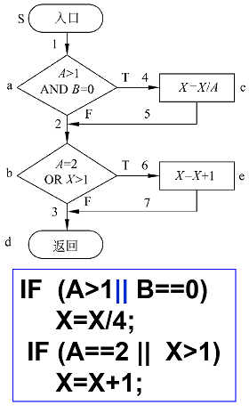</div>

* 5.条件组合覆盖
	* 含义：要求选取足够多的测试数据，使得每个判定表达式中条件的各种可能组合都至少出现一次。
	* 条件组合：
		<div align="center">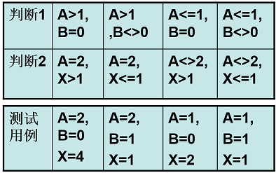</div>
		<div align="center"></div>

	* **条件组合覆盖特点**：
	* 条件组合覆盖是前述几种覆盖标准中最强的。满足条件组合覆盖标准的测试数据，也一定满足判定覆盖、条件覆盖和判定/条件覆盖标准。
	* 但是，条件组合覆盖标准的测试数据并不一定能使程序中的每条路径都执行到。（测试数据都没有测试到1453 ） 

### 7.2.2 各种覆盖测试用例总结
* 各种覆盖测试用例的设计方法：
	* 语句覆盖：对流程图中的语句进行编号。设计足够用例覆盖。
	* 判断覆盖：对流程图中的所有判定，罗列出真假两种情况，对不矛盾的判定进行组合并设计测试用例。
	* 条件覆盖：对流程图中的所有条件，罗列出真假两种情况，对不矛盾的条件进行组合并设计测试用例。

* 总结：
	* **语句覆盖**发现错误能力最弱。
	* **判定覆盖**包含了语句覆盖，但它可能会使一些条件得不到测试。
	* **条件覆盖**对每一条件进行单独检查，一般情况它的检错能力较判定覆盖强，但有时达不到判定覆盖的要求。（**在有的书中是不需要每条语句都走到**）
	* **判定/条件覆盖**包含了判定覆盖和条件覆盖的要求，但由于计算机系统软件实现方式的限制，实际上不一定达到条件覆盖的标准。
	* **条件组合覆盖**发现错误能力较强，凡满足其标准的测试用例，也必然满足前 4 种覆盖标准。
	* 以上五种覆盖方法,基本上是依次增强的(除少数如:条件覆盖和判定覆盖) 。
	* 随覆盖级别的提高，所需设计的测试用例数量也急剧增加，开销数量级的加大。
* 各种逻辑覆盖关系之间的关系

	<div align="center">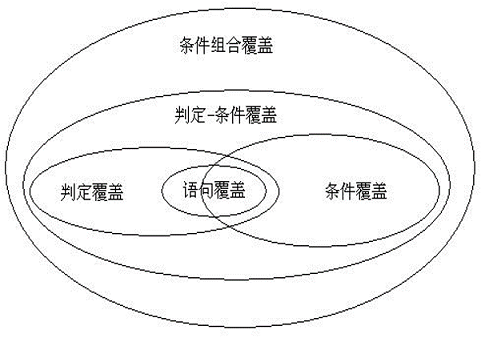</div>

### 7.2.3 流图(McCabe方法)
* 1.流图(控制流图)
	* 所谓流图实质上是“退化了的”程序流程图，它仅仅描绘程序的控制流程，完全不表现对数据的具体操作以及分支或循环的具体条件。 
	* McCabe方法根据程序控制流的复杂程度定量度量程序的复杂程度，这样度量出的结果称为程序的环形复杂度。
	* eg:

	<div align="center">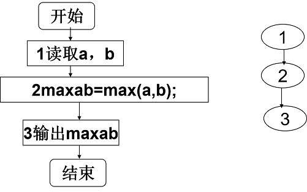</div>

* 流图的表示：
	* 结点：用圆表示，一个圆代表一条或多条语句或零条语句。
	* 边：箭头线称为边，代表控制流。在流图中一条边必须终止于一个结点，即使这个结点并不代表任何语句。
	* 区域：由边和结点围成的面积称为区域，包括图外部未被围起来的区域。 

	<div align="center">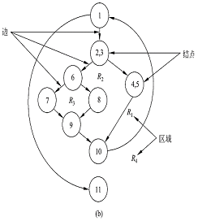</div>

* 映射方法：
	* 任何方法表示的过程设计结果，都可以翻译成流图。
	* 对于顺序结构，一个顺序处理序列和下一个选择的开始语句，可以映射成流图中的一个结点。

	<div align="center">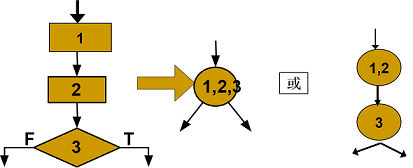</div>

	* 对于选择结构，开始语句映射成一个结点；两条分支至少各映射成一个结点；结束映射成一个结点,表示选择结构的结束。

	<div align="center">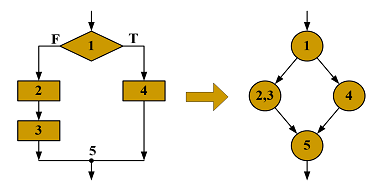</div>

	* 对于循环结构，开始和结束语句各映射成一个结点。

	<div align="center">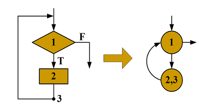</div>

	* 在不影响程序流程的情况下，结束结点可以和别的结点合并
	* 总：选择和循环结构入口和出口分别映射为一个结点。
	* eg:

	<div align="center">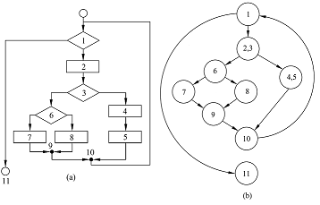</div>

	* 当过程设计中包含复合条件时，应该把复合条件分解为若干个简单条件，每个简单条件对应流图中一个结点。
	* 所谓复合条件，就是在条件中包含了一个或多个布尔运算符(逻辑OR，AND等)。

	  ```c
	  if a and b  
	  then 。。。
	  else。。。
	  ```
	  >eg:or
	  
		<div align="center">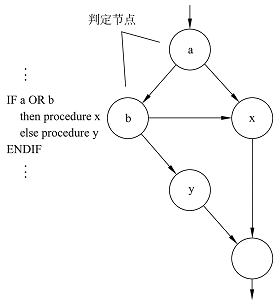</div>

	  >eg:and
	
		<div align="center">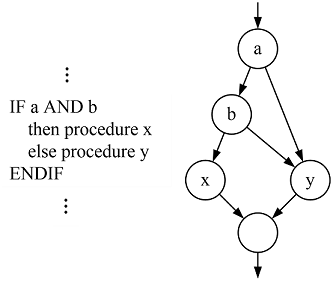</div>

* 计算环形复杂度的方法
	* 环形复杂度定量度量程序的逻辑复杂度。有了描绘程序控制流的流图之后，可以用下述3种方法中的任何一种来计算环形复杂度V(G)。
	* （1）V(G)=流图中的区域数
		* 边和结点圈定的区域叫做区域，当对区域计数时，图形外的区域也应记为一个区域 
	* （2）V(G)=E-N+2
		* 其中E是流图中的边数，N是结点数
	* （3）V(G)=P+1
		* 其中P是流图中判定结点的数目 
	* eg:

		<div align="center">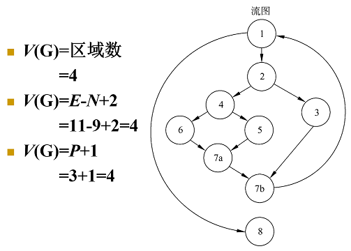</div>

### 7.2.4 控制结构测试
* 1.基本路径测试( 根据控制结构设计测试数据)<**满足语句覆盖、条件覆盖**>
	* 基本路径测试是Tom McCabe提出的一种白盒测试技术。
	* 思想：使用这种技术设计测试用例时，首先计算程序的环形复杂度，并用该复杂度为指南定义执行路径的基本集合，从该基本集合导出的测试用例可以保证**程序中的每条语句至少执行一次，而且每个条件在执行时都将分别取真、假两种值**。
	* 使用基本路径测试技术设计测试用例的步骤如下：
		* 第一步，根据过程设计结果画出相应的流图。
		  >基本路径测试举例   ：计算x的值

			<div align="center">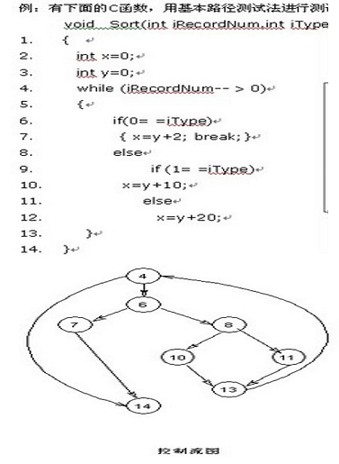</div>

		* 第二步，计算流图的环形复杂度。
			* 根据环形复杂度计算方法，计算环形复杂度。 所示流图的环形复杂度为4。
			* 环形复杂度标识至少需要几条独立路径实现基本路径测试。
		* 第三步，确定线性独立路径的基本集合。
			* 所谓独立路径是指至少引入程序的一个新处理语句集合或一个新条件的路径，用流图术语描述，独立路径至少包含一条在定义该路径之前不曾用过的边。

		  >基本路径

		  ```
		  4-14
		  4-6-7-14
		  4-6-8-10-13-4…..-14
		  4-6-8-11-13-4…..-14
		  ```

		* 第四步，设计可强制执行基本集合中每条路径的测试用例。
			* 应该选取测试数据使得在测试每条路径时都适当地设置好了各个判定结点的条件。
		  
		  >测试用例

			<div align="center">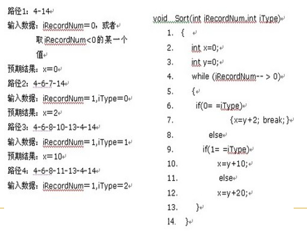</div>
 
			* 在测试过程中，执行每个测试用例并把实际输出结果与预期结果相比较。一旦执行完所有测试用例，就可以确保程序中所有语句都至少被执行了一次，而且每个条件都分别取过true值和false值。
			* 应该注意，某些独立路径不能以独立的方式测试，也就是说，程序的正常流程不能形成独立执行该路径所需要的数据组合。在这种情况下，这些路径必须作为另一个路径的一部分来测试。（例如：下例中用例1:1-2-10-11-13。）


# 7.3 黑盒测试技术

* 黑盒测试(功能测试)：设计测试用例的另一种方法
* 黑盒法特点：
	* 完全不考虑程序的内部结构和处理过程；
	* 根据程序的功能说明来设计测试用例；
	* 设计测试用例依据：需求规格说明书、系统设计说明书。
* 分类：**等价类法**、**边界值分析法**、**因果图法**、**错误推测法**
* 希望发现的错误 ：
	* 功能不正确或遗漏了功能
	* 界面错误
	* 数据结构错误或外部数据库访问错误
	* 性能错误
	* 初始化和终止错误

### 7.3.1 等价类法
* 等价划分 ：在输入数据中选择一些有代表性的数据进行测试。使其可能较多的发现错误。
* 如何选择代表性的数据？   ——多段函数的测试
* 思想：
	* 将输入的数据，分成若干个等价类。
	* 假定：每类中每个值在测试中的作用等价于其它值。
	* 从每个等价类中选一个代表值。这些代表值形成要选择的子集。
  
* **等价类：等价类就是功能相同或作用相同的一类数据**。
* 如何划分等价类
	* 根据程序功能提到的条件，划分多个等价类。

      >例如输入大学生年龄，范围16－30
	* 等价类有：有效的等价类，无效的等价类。
	* 用表的形式描述。

	<div align="center">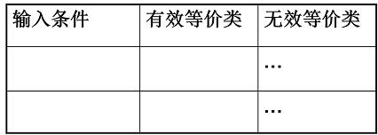</div>

*  划分等价类启发式规则
	* (1)输入数据范围划分

		>如输入模特年龄，年龄要求16~25岁。</br>
		>一个有效的等价类;两个无效的等价类</br>
		>典型用例： 20岁、15岁、45岁
	* (2) 输入数据的个数划分.

		>如要求输入N=10个数据.</br>
		>一个有效的等价类;两个无效的等价类</br>
		>典型用例： N=10、N=8、N=12
	*  (3)规定了输入数据的一组值,且对每个值处理方式不同。则根据这一组值进行划分出多个有效类，一个无效类. 

		>如:输入必须为” 教授，副教授，讲师，助教”中一种.</br>
		>四个有效的等价类;一个无效的等价类</br>
		>典型用例：副教授、助教、助课

	* (4)以输入数据必须遵循的规则进行划分

		>如:输入标示符：以字母开头字母数字组合串</br>
		>一个有效的等价类;二个无效的等价类</br>
		>典型用例：`Stu1  1K`（也可用 _25）、k&5（这只是一个简单划分）
	* (5)若处理对象是表格，应该使用空表、含一条记录表、含多条记录表，表满四类。
	* (6)若无法按数据类型划分，则可按结果类型划分。

		>例如：有一个程序是分析一个三角形的类型（等边、等腰、直角、非三角形）。</br>
		>输入数据：</br>
		>有效类1|有效类2|有效类3|有效类4</br>
		>等边|等腰|直角|非三角</br>
		>等边：{a,b,c相同，且符合形成三角形规则}</br>
		>等腰：{a，b，c中有两个值相同，且与第三个值不同，且符合形成三角形规则}</br>
		>（5,5,5）；（5,5,9）；（ 3,4,5) ；（0,5,8)

* 设计测试方案时两个步骤：
	* 设计一个新的测试方案以尽可能多地覆盖尚未被覆盖的有效等价类，重复这一步骤直到所有有效等价类都被覆盖为止；
	* 设计一个新的测试方案，使它覆盖一个而且只覆盖一个尚未被覆盖的无效等价类，重复这一步骤直到所有无效等价类都被覆盖为止。
	
	  >比如：招服务员 ，看是否给面试资格。</br>
      >要求：  女     20-50   大专以上毕业。</br>
      >比如：招服务员 ，看是否给面试资格。</br>
      >要求：  女     20-50   大专以上毕业{0小学，1代表初中，2代表高中，3及以上代表大专以上。</br>
      >模块结构：
      
	  ```c
	  int judge（sex，age，gradu）
	  {
	  	......
	  }
	  ```
		* 合理的测试方案

		<div align="center">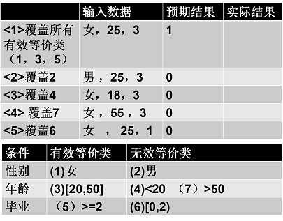</div>

		* 不合理的测试方案

		<div align="center">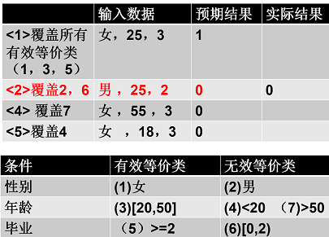</div>
 
* 等价类法和边界值法，都属于典型的基于输入域的方法，是功能测试的最主要手段。


### 7.3.2 边界值分析法
* 边界值：指输入等价类和输出等价类边界上的数据
* 思想：设计边界值测试方案进行分析
* 例如，如要求输入最少1到最多10个数值.
	* 划分等价类：
	
	  ```
	  一个有效的等价类          两个无效的等价类
              1－10            >10      <1
	  等价用例： n=8            n=20     n=0
	  边界值 ：  n=1,10         n=11     n=0
	  ```   

* 边界值分析法步骤
	* 边界法步骤：(1)划分等价类  (2) 找等价类的边界      
	* 一个用例尽量覆盖多的有效边界
	* 一个用例只能覆盖一个无效等价类

* 选择边界值的一些原则（**选值：选择边界及边界附近的值**。）
	* 1.如果输入条件规定了值的范围，可以选择正好等于边界值的数据作为有效的测试用例，同时还要选择刚好越过边界值的数据作为无效的测试用例。
	
	  >如输入值的范围是［1，100］， 可取0，1，100，101等值作为测试数据。

	* 2.如果输入条件指出了输入数据的个数， 则按最大个数、 最小个数、比最小个数少 1 及比最大个数多1等情况分别设计测试用例。 

	  >如一个输入文件可包括1~255个记录， 则分别设计有1个记录、255个记录，以及0个记录和256个记录的输入文件的测试用例。       

	* 3.规定了输出数值范围情况。根据输出值设定边界。
如商品打折抛售，有一个计算折扣量程序并规定最低折扣量0元，最高折扣量为1000元。
	  
	  >程序输入折扣率（我们平时说的衣服打几折），计算折扣量,且  折扣量=商品原售价*（1－折扣率）。
	  
	  ```c
	  count（value  ，rate）
	  {
	  	endvalue=value*(1-rate)
	  	if  endvalue is in  0  to 1000 
	  	then
	  	{ 
	  		output“ right”； 
	  		return  endvalue
	  	}
	  	else 
	  	{ 
	  		output “wrong”；  
	  		return endvalue
	  	}
	  }
	  ```

		<div align="center">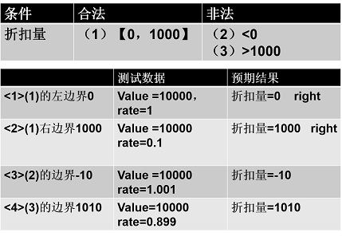</div>

	* 4.若输出规格规定了输出数值个数，根据输出个数设定测试用例。

	  >例：一个情报检索系统，根据用户输入的命令显示有关文献的摘要，但每页最多显示4篇“摘要”。最多显示32篇。</br>
	  >则可以设计输出0篇，4篇和5篇,32篇，33篇的测试用例，检查是否报错。

	* 5.如果程序中使用了一个内部数据结构，则应当选择这个内部数据结构的边界上的值作为测试用例。

	  >例如：

	  ```
	  比如，输入/输出是线性表，线性表用栈处理。

	  若模块功能是进栈操作。参数（栈，数据）。
	  设计栈满时测试用例。看是否能进栈操作。
	
	  若模块功能是出栈操作。参数（栈）。
	  设计栈空测试用例。是否能出栈操作。
	
	  例如，如果程序中定义了一个数组，其元素下标的下界是0，上界是100，
	  	 那么应选择达到这个下标边界的值，如0与100作为测试用例。
	  ```

### 7.3.3 黑盒测试的完善性及总结

* **黑盒测试，通常以等价类法为主，辅助以边界类法（用边界类时，并不需要面面俱到）**。

* 黑盒测试的完善性
	* 黑盒测试主要根据软件的外部特性进行，为了发现：
		* 是否有不正确或遗漏了的功能
		* 在接口上输入能否正确的接受
		* 能否输出正确的结果
		* 是否有数据结构或外部信息访问错误
		* 性能上是否能够满足要求
		* 是否有初始化或终止性错误
		* 等等

# 7.4 测试策略

### 7.4.1 单元测试(模块测试)

* 保证每个模块作为一个单元能正确运行；
* 发现的往往是编码和详细设计的错误。
* 主要基于文档：详细设计说明书
* 单元测试集中检测模块；
* 单元测试和编码属于软件过程的同一个阶段；
* 测试过程：
	* 用详细设计模块为说明指南， 主要使用白盒测试技术，对多个模块的测试可以并行地进行。 
* 测试重点
	* 模块接口
	* 局部数据结构
	* 重要的执行通路
	* 出错处理通路
	* 边界条件
* 单元测试基本测试方法：模块本身不是一个程序，不能直接运行，需要靠其它模块来驱动和调用，因此需要为其设计驱动程序（模拟其功能）。同时，一个模块运行中又调用到它的下属模块，则需为其设计多个存根程序（支持模块）。
  
  >例如：测试B模块，设计一个A功能的驱动模块，设计一个D,E的支持模块。

	<div align="center">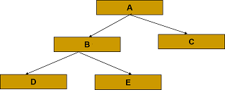</div>

* **驱动程序**
	* 必须为每个单元测试开发驱动程序和(或)存根程序。
		* **驱动程序是一个“主程序”，它接收测试数据，传送给被测试的模块，并且印出有关的结果**。

		<div align="center">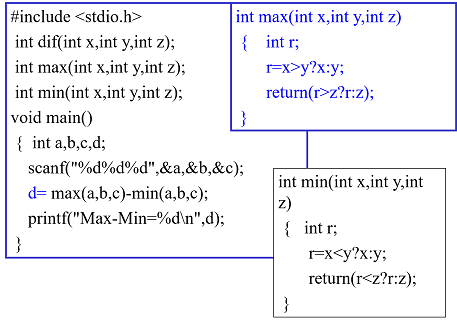</div>
		<div align="center">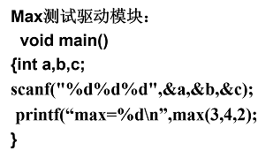</div>

* **存根程序**
	* 必须为每个单元测试开发驱动程序和(或)存根程序。
		* **存根程序代替被测试的模块所调用的模块。它使用被它代替的模块的接口，可能做最少量的数据操作，印出对入口的检验或操作结果，并且把控制归还给调用它的模块**。
	* 驱动程序和存根程序代表开销，通常并不把它们作为软件产品的一部分交给用户。

	>写一个函数，判断某一个四位数是不是玫瑰花数（所谓玫瑰花数即该四位数各位数字的四次方和恰好等于该数本身，如：1634=14+64+34+44）。 在主函数中调用该函数，输出所有玫瑰花数。

	<div align="center">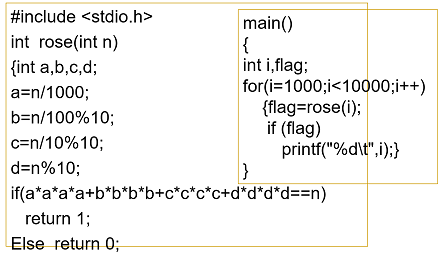</div>
	<div align="center">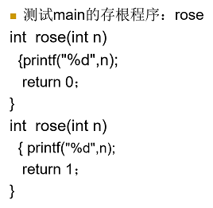</div>
	<div align="center">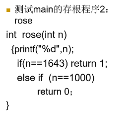</div>

* 驱动程序和(或)存根程序
	* 驱动程序和存根程序代表开销，通常并不把它们作为软件产品的一部分交给用户。

### 7.4.2 集成测试(也叫组装测试或联合测试)
* 集成测试是测试和组装软件的系统化技术，主要目标是发现与接口有关的问题。
* 在单元测试的基础上，将所有模块按照设计要求（如根据**结构图**）组装成为子系统或系统，进行集成测试。
* 1）功能性测试。使用黑盒测试技术针对被测模块的接口规格说明进行测试。
* 2）非功能性测试。对模块的性能或可靠性进行测试。
* 基于文档：概要设计说明书
* 由模块组装成程序时有两种方法：
	* 非渐增式测试方法
	* 渐增式测试方法
* 非渐增式测试方法：
	* 先分别测试每个模块，再把所有模块按设计要求放在一起结合成所要的程序；

	<div align="center"></div>

	* 非渐增式测试一下子把所有模块放在一起，并把庞大的程序作为一个整体来测试，测试者面对的情况十分复杂。

* 渐增式测试方法：
	* 把下一个要测试的模块同已经测试好的那些模块结合起来进行测试；
	* 测试完以后再把下一个应该测试的模块结合进来测试，每次增加一个模块；

	<div align="center"></div>

	* 把程序划分成小段来构造和测试，在这个过程中比较容易定位和改正错误；
	* 渐增方式有两种集成策略：
		* 自顶向下
		* 自底向上

* **不同集成测试策略的比较**

	<div align="center"></div>
	<div align="center">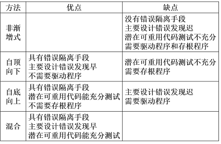</div>

* 混合策略
	* 改进的自顶向下测试方法
		* 基本上使用自顶向下的测试方法，但是在早期使用自底向上的方法测试软件中的少数关键模块。
		* 能在测试的早期发现关键模块中的错误；测试关键模块时需要驱动程序。
	* 混合法
		* 对软件结构中较上层使用的自顶向下方法与对软件结构中较下层使用的自底向上方法相结合。
		* 兼有两种方法的优缺点，当被测试的软件中关键模块比较多时，这种混合法可能是最好的折衷方法。


### 7.4.3 自顶向下集成
* 从主控制模块（重要）开始，沿着程序的控制层次向下移动，逐渐把各个模块结合起来。

  >例：首先测试主控模块A,然后把B加进来测试A,B。之后把C加进来测试……

	<div align="center">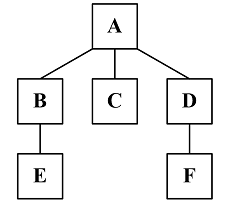</div>

* 在把附属于主控制模块的那些模块组装到程序结构中去时，或者使用深度优先的策略，或者使用宽度优先的策略。
	* 深度优先：先组装在软件结构的一条主控制通路上的所有模块(先深后宽)。

		<div align="center">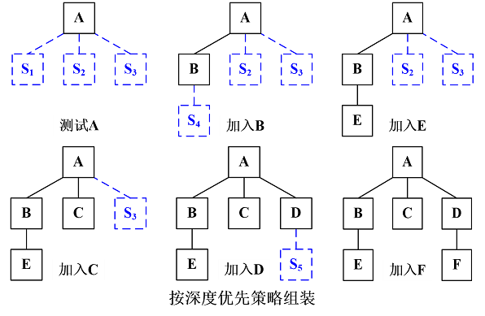</div>

	* 宽度优先：沿软件结构水平地移动，把处于同一个控制层次上的所有模块组装起来(先宽后深) 。

		<div align="center"></div>

* 把模块结合进软件结构的过程由下述4个步骤完成：
	* 第一步，对主控制模块进行测试，测试时用存根程序代替所有直接附属于主控制模块的模块；
	* 第二步，根据选定的结合策略(深度优先或宽度优先)，每次用一个实际模块代换一个存根程序(新* 结合进来的模块往往又需要新的存根程序)；
	* 第三步，在结合进一个模块的同时进行测试；
	* 第四步，为了保证加入模块没有引进新的错误，可能需要进行回归测试(即，全部或部分地重复以前做过的测试)。
	* 从第二步开始不断地重复进行上述过程，直到构造起完整的软件结构为止。 

* **优点**：
	* 能够在测试的早期对主要的控制或关键的抉择进行检验。
	* 如果选择深度优先的结合方法，可以在早期实现软件的一个完整的功能并且验证这个功能。
* **缺点**：
	* 存根程序代替了低层次的模块，在软件结构中没有重要的数据自下往上流。

### 7.4.4 自底向上集成
* 用下述步骤可以实现自底向上的结合策略：
	* 第0步 先测试底层模块。
	* 第一步，把低层模块组合成实现某个特定的软件子功能的族；
	* 第二步，写一个驱动程序(用于测试的控制程序)，协调测试数据的输入和输出；
	* 第三步，对由模块组成的子功能族进行测试；
	* 第四步，去掉驱动程序，沿软件结构自下向上移动，把子功能族组合起来形成更大的子功能族。
	* 上述第二步到第四步实质上构成了一个循环。 

  >eg:“考务处理系统”结构图的整体改进

	<div align="center">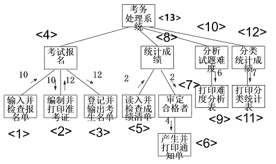</div>

	```
	自底向上测试参考过程：
	<1>
	<2>
	<3>
	<1><2><3><4>
	…….
	<5>
	<6>
	<6><7>
	<5><6><7><8>
	<9>
	<9><10>
	<11>
	<11><12>
	……………….
	<1>…….<13>
	```

### 7.4.5 回归测试
* 在软件生命周期的任何一个阶段，只要软件发生了改变，就可能给软件带来问题。
* 软件的改变：
	* （1）可能源于发现了错误并做了修改。
	* （2）也可能是因为在集成或维护阶段加入了新的模块。
* **回归测试：重新执行已经做过的测试的某个子集**。
	* 以保证上述这些变化没有带来非预期的副作用。(已测过的一部分黑盒和白盒)


### 7.4.6 确认测试（系统测试）
* 确认测试应检查软件能否按合同要求进行工作，即是否满足软件需求说明书中的确认标准。
* 把软件系统作为单一的实体进行测试；
* 基于文档：需求规格说明书

### 7.4.7 验收测试
* 它产品发布之前所进行的软件测试活动，是技术测试的最后一个阶段，也称为交付测试。 
* 分为Alpha测试和Beta测试。
	* Alpha测试： Alpha测试是由用户在开发环境下进行的测试，也可以是开发机构内部的用户在模拟实际操作环境下进行的测试。
	* Beta测试： Beta测试是由软件的多个用户在一个或多个用户的实际使用环境下进行的测试。
* 基于文档：需求规格说明书


