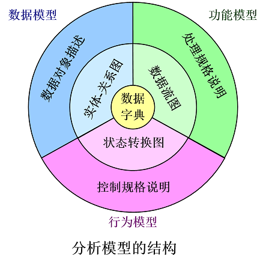
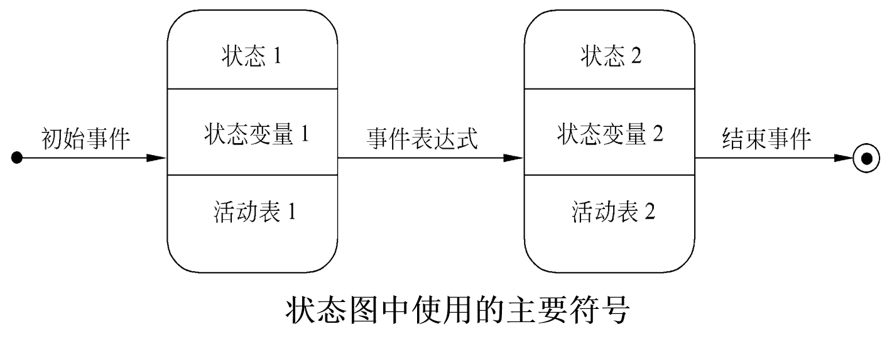
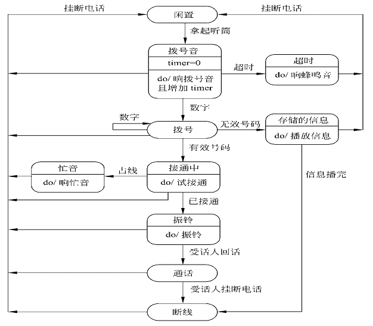
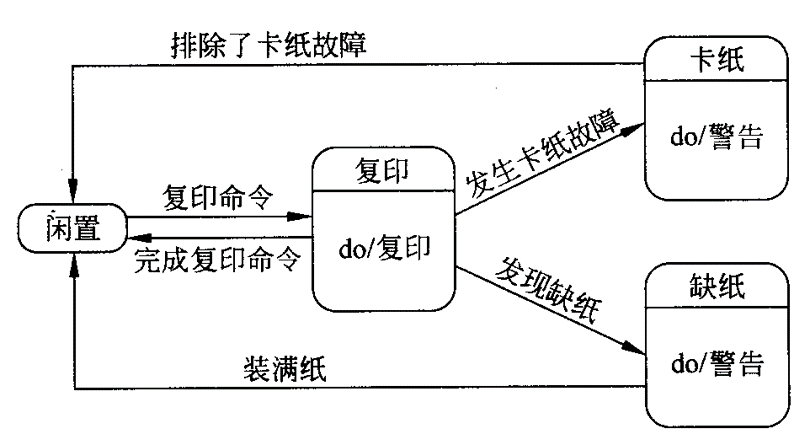

<h1 align="center">第三章  需求分析</h1>

* [3.1  需求分析的任务及过程](#31需求分析的任务及过程)
* [3.2  与用户沟通获取需求的方法](#3.2与用户沟通获取需求的方法)
* [3.3  分析建模与规格说明](#3.3分析建模与规格说明)
* [3.4  实体-联系图](#)
* [3.5  数据规范化](#)
* [3.6  状态转换图](#3.6状态转换图)
* [3.7  其他图形工具](#)
* [3.8  验证软件需求](#3.8验证软件需求)


-----------------------

* 需求分析的任务：系统必须做什么?
	* 获取用户需求，从用户角度考虑，用户需要系统必须完成哪些工作，也就是对目标系统提出完整、准确、清晰、具体的要求。
	* 提交的主要文档：
    	* 软件需求规格说明书：以书面形式准确地描述软件需求。(含有逻辑模型：数据流图、数据字典、E-R图、状态转换图等）

	>对这些文档使用及修正覆盖整个软件生命周期中 

# 3.1需求分析的任务及过程
* 怎么做需求分析？
	* 步骤：发现（获取需求）、求精、建模、规格说明和复审的过程。

### 一、确定对系统的综合要求（了解  ） 

* 1.功能需求   
* 2.性能需求 
	* “更新试题得分清单” ：要求，不能超过3s
	* 交互的时间不能超过10s
* 3.可靠性和可用性需求  。系统的稳定性。比如平均3月不出问题。
* 4.出错处理需求
* 5.接口需求
	* 外部接口需求 

  >例如：把商品从货源地运送到目的地所需要的成本，应该一直显示在‘成本’正文框中。
    向运输公司传送‘需运送的商品’信息格式是`exp<string>`,其中string是从商品目录中选取的字符串。
* 6.约束
  设计约束或实现约束描述在设计或实现应用系统时应遵守的限制条件。常见的约束有：精度；工具和语言约束；设计约束；应该使用的标准；应该使用的硬件平台。
* 7.逆向需求
   逆向需求说明软件系统不应该做什么。
* 8.将来可能提出的要求
应该明确地列出那些虽然不属于当前系统开发范畴，但是据分析将来很可能会提出来的要求。目的是，在设计过程中对系统将来可能的扩充和修改预做准备。

### 二、需求规格说明格式
* 我国定义了GB856D-1988国家标准，给出了需求规格说明的内容框架：
  ```
  1 引言
    1.1 编写目的
    1.2 项目背景（单位和其他系统的关系）
    1.3 定义（专门术语和缩写词）
  2 任务概述
    2.1 目标
    2.2 运行环境
    2.3 条件限制
  3 数据描述
    3.1 静态数据
    3.2 动态数据
    3.3 数据库描述
    3.4 数据字典
    3.5 数据采集
  4 功能需求
    4.1 功能划分
    4.2 功能描述
  5 性能需求
    5.1 数据精确度
    5.2 时间特性
    5.3 适应性
  6 运行需求
    6.1 用户界面
    6.2 硬件接口
    6.3 软件接口
    6.4 故障处理
  7 其他需求
  （检测或验收标准、可用性、可维护性、可移植性、安全保密性）
  ```

# 3.2  与用户沟通获取需求的方法
* 访谈 
* 面向数据流自顶向下求精
* 简易的应用规格说明技术 
* 快速建立软件原型 

### 3.2.1  访谈
* 1.正式访谈   
  系统分析员将提出一些事先准备好的具体问题。
* 2.非正式访谈
  分析员将提出一些用户可以自由回答的开放性问题，以鼓励被访问人员说出自己的想法。
* 3.调查表(注意对客户分类)
  经过仔细考虑写出的书面回答可能比被访者对问题的口头回答更准确。
* 4.情景分析技术
	* 对用户将来使用目标系统解决某个具体问题的方法和结果进行分析。
	* 情景分析技术的用处：
		* 能在某种程度上演示目标系统的行为，从而便于用户理解，而且还可能进一步揭示出一些分析员目前还不知道的需求。
		* 能保证用户在需求分析过程中始终扮演一个积极主动的角色。让用户起积极主动的作用对需求分析工作获得成功是至关重要的。

### 3.2.2  面向数据流自顶向下求精
* 1.分析追踪数据流图
	* 沿数据流图回溯  :数据流图的输出端是系统的最终目的。回溯确定每个数据元素的来源，可加细数据流图及数据字典，并将相关算法记录到IPO图中。
* 2.用户复查
	* 必须请用户对上述分析过程中得出的结果仔细地复查。复查过程验证了已知的元素，补充了未知的元素，填补了文档中的空白。
	* 随着分析过程的进展，经过问题和解答的反复循环，分析员越来越深入具体地定义了目标系统，最终得到对系统数据和功能要求的满意了解。 


### 3.2.3  简易的应用规格说明技术
* 传统访谈技术->用户往往会区分我们和他们
* 面向团队的需求收集法    
	* 这种方法提倡用户与开发者密切合作，共同标识问题，提出解决方案要素，商讨不同方案并指定基本需求。 
* 分析需求的典型过程如下：
	* 初步访谈。
	* 开发者和用户分别写出“产品需求”。
	* 开会讨论，各自展示需求列表
	* 得出一致意见，共同创建一张组合列表。
	* 分组制定小型规格说明。与会者分成更小的小组，为每张列表中的项目制定小型规格说明。
	* 开会讨论各组说明书，起草完整的软件需求规格说明书。
* 简易的应用规格说明技术的优点：
	* 开发者与用户不分彼此，齐心协力，密切合作；
	* 即时讨论并求精；
	* 有能导出规格说明的具体步骤。 

### 3.2.4  快速建立软件原型 
* 快速建立软件原型是最准确、最有效、最强大的需求分析技术。
* 快速原型就是快速建立起来的旨在演示目标系统主要功能的可运行的程序。
* 构建原型的要点是，它应该实现用户看得见的功能，省略目标系统的“隐含”功能。


# 3.3  分析建模与规格说明

### 3.3.1  分析建模

* 需求分析过程应该建立3种模型，分别是(重要)
	* 数据模型
	* 功能模型
	* 行为模型
     
   <div align="center"></div>


# 3.6  状态转换图

* 状态转换图：通过描绘系统的状态及引起系统状态转换的事件，来表示系统的行为。
* 描述在什么状态下，有什么事情发生，导致了什么后果。

### 3.6.1  状态 

* 状态：是任何可以被观察到的系统行为模式，一个状态代表系统的一种行为模式。状态规定了系统对事件的响应方式。
* 状态主要有：
	* 初态(即初始状态)，只能有1个
	* 终态(即最终状态)，可以有0至多个
	* 中间状态
* 状态图分类：
	* 表示系统循环运行过程，通常不关心循环是怎样启动的。
	* 表示系统单程生命期，需要标明初始状态和最终状态。


### 3.6.2  事件
* 事件：是在某个特定时刻发生的事情，它是对引起系统做动作或(和)从一个状态转换到另一个状态的外界事件的抽象。

### 3.6.3  符号

* 初态：用实心圆表示；
* 终态：用一对同心圆(内圆为实心圆)表示；
* 中间状态：用圆角矩形表示，分成上、中、下3部分。
	* 上面部分-----为状态的名称；
	* 中间部分-----为状态下关键变量的名字和值；可无
	* 下面部分-----是活动表：当前状态下需要做的一些事情，不会改变状态。 可无
* 带箭头的连线：称为状态转换，箭头指明了转换方向。 

* 状态图中使用的主要符号

   <div align="center"></div>

* 活动表的语法格式：
  ```
  事件名(参数表)/动作表达式
  ```

	* “事件名”可以是任何事件的名称。
	* 常用的3种标准事件：
		* entry事件指定进入该状态的动作；
		* exit事件指定退出该状态的动作；
		* do事件则指定在该状态下的动作。
	* 需要时可以为事件指定参数表。
	* 活动表中的动作表达式描述应做的具体动作。 

* 事件表达式的语法：
  ```
  事件说明［守卫条件］／动作表达式
  ```
	* 事件说明的语法为：事件名(参数表)。
	*守卫条件是一个布尔表达式。如果同时使用事件说明和守卫条件，则当且仅当事件发生且布尔表达式为真时，状态转换才发生。如果只有守卫条件没有事件说明，则只要守卫条件为真状态转换就发生。
	* 动作表达式是一个过程表达式，当状态转换开始时执行该表达式。 

>例1：电话系统

   <div align="center"></div>

>例2：复印机的工作过程大致如下：未接到复印命令时处于闲置状态，一旦接到复印命令则进入复印状态，完成一个复印命令规定的工作后又回到闲置状态，等待下一个复印命令；如果执行复印命令时发现没纸，则进入缺纸状态，发出警告，等待装纸，装满纸后进入闲置状态，准备接收复印命令；如果复印时发生卡纸故障，则进入卡纸状态，发出警告等待维修人员来排除故障，故障排除后回到闲置状态。
请用状态转换图描绘复印机的行为。

   <div align="center"></div>

# 3.8 验证软件需求
