<h1 align="center">第九章  面向对象分析</h1>

* [9.1 UML概述](#91-UML概述)
* [9.2 需求获取概述](#92-需求获取概述)
* [9.3 用例图中的符号及含义](#93-用例图中的符号及含义)
	* [9.3.1 参与者泛化](#931-参与者泛化)
	* [9.3.2 用例泛化](#932-用例泛化)
	* [9.3.3 用例间关系](#933-用例间关系)
* [9.4 用例模型建模](#94-用例模型建模)
	* [9.4.1 确定系统的参与者](#941-确定系统的参与者)
	* [9.4.2 确定场景](#942-确定场景)
	* [9.4.3 确定系统用例](#943-确定系统用例)
	* [9.4.4 确定用例之间的关系](#944-确定用例之间的关系)
	* [9.4.5 编写用例描述文档](#945-编写用例描述文档)
	* [9.4.6 用例的粒度](#946-用例的粒度)

# 9.1 UML概述
* UML (Unified Modeling Language)为面向对象软件设计提供统一的、标准的、可视化的建模语言。
	* 适用于描述以用例为驱动的软件设计的全过程。
* UML图形分类（建模）

	
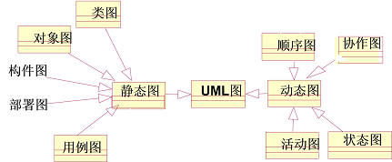

# 9.2 需求获取概述
* 面向对象需求分析：
	* 分析模型
		* 现实-业务（需求获取）
		* 业务-概念（需求分析）
  
* 需求获取：从用户角度考虑，系统应该完成什么功能。
* 模型：用例模型（ 用例图， 用例文档）    （现实-业务）
* 用例图是外部参与者所能观察到的系统功能的模型图。
* 用例图还是软件测试人员进行测试的指导

	
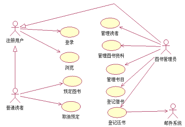

# 9.3 用例图中的符号及含义
*  用例图的组成
	* 参与者（活动者，Actor）

	

	* 用例（Use Case）

	
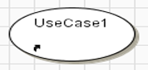

	* 关系（Relationship）

* 用例图 示例

  
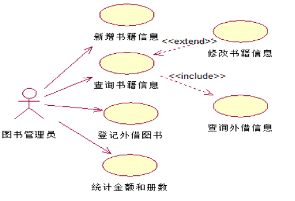

* 用例图是指由参与者（Actor）、用例（Use Case）以及它们之间的关系构成的用于描述系统功能的静态视图

  
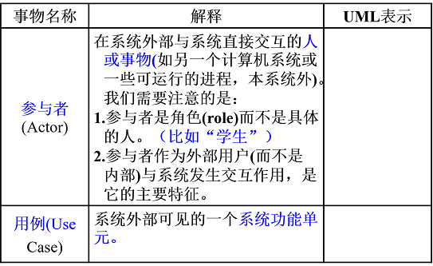

* 参与者、用例间的关系类型

  
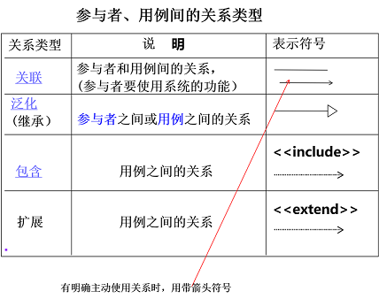

### 9.3.1 参与者泛化

* 学籍管理系统

  
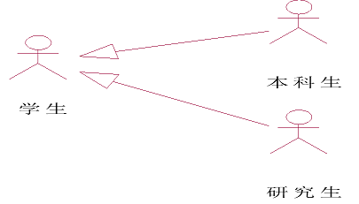

	* 学生户的基本行为：比如登录 查询成绩，本科生查询奖学金。
	* 研究生也可有自己的行为，比如申请课题基金，报销费用。

### 9.3.2 用例泛化
* 一个用例和其几种情形的用例间构成泛化关系。
* 往往父用例表示为抽象用例。
* 泛化侧重表示子用例间的互斥性。

  
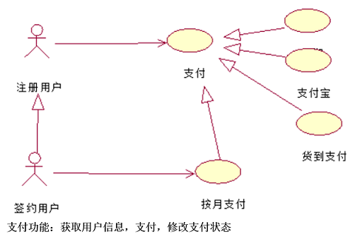

  
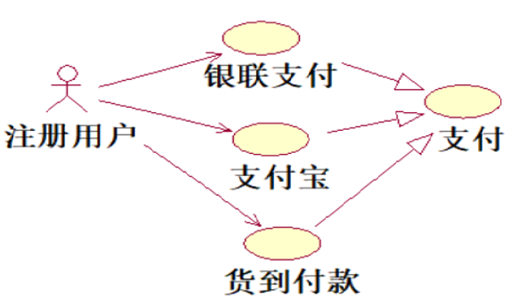

### 9.3.3 用例间关系
* 包含（Include）
	* 【箭头指向】：指向分解出来的功能用例
	* 箭头出发的用例为基用例。包含用例是必选的，如果缺少包含用例，基用例就不完整。 
* 扩展《extend》 ：
	* 【箭头指向】：指向基础用例
	* 扩展用例是可选的，如果缺少扩展用例，不会影响到基用例的完整性；扩展用例在一定条件下才会执行，并且其执行会改变基用例的行为。

  
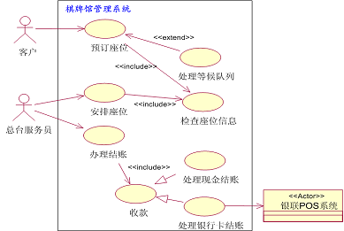

# 9.4 用例模型建模
* 任务：获取需求，建立需求模型（用例模型：绘制用例图和编写用例文档）。
* 步骤：(2和3之间没有明确先后顺序)
	* 1、确定系统的参与者
	* 2、确定场景
	* 3、确定系统用例     
	* 4、确定用例之间的关系
	* 5、编写用例描述文档

### 9.4.1 确定系统的参与者
* 参与者是指直接和系统交互的一类事物，参与者主要有如下三类：
	* (1)直接使用系统的人，如 图书管理员，普通读者等（角色）；
	* (2)与该系统相关的其他系统，如邮件系统；
	* (3)自动发生的事件，如时间、温度等自动事件，如果库存管理系统要求每晚零点执行一个数据汇总操作，此时时间就成为该操作的执行者。
* 怎样识别参与者
	* 在定义用例之前要先确定系统的参与者，下面的问题有助于我们找出系统的参与者：
		* 谁向系统提供信息？
		* 谁从系统获取信息？
		* 谁操作系统？
		* 谁维护系统？
		* 系统使用哪些外部资源？
		* 系统是否和已经存在的系统交互？
		* 由于系统对时间进行响应，“时间”是否也是一个参与者？

### 9.4.2 确定场景
* 考虑参与者用系统做什么？进一步描述场景。
	* 在系统中，按照某个顺序执行了一系列相关的动作后，即可实现某种功能，把完成这一功能操作的集合称为场景。
	* 场景的获取方法：开发者与用户、客户进行交流来获取。面向过程的方法在这里仍适用。
	* 从个体角度考虑
	* 一个场景就是描述软件使用者与系统之间的一系列交互活动，系统具体执行的行为路径，即一次完成的事件流。

### 9.4.3 确定系统用例
* 用例是对一组场景共同行为的抽象。
	* 重点在于参与者与系统之间的交互而不是系统内部的活动。
* 方法：从场景描述，理解系统需求，分析获取系统用例。
* 确定系统用例注意:
	* 可观测→用例止于系统边界
	* 结果值→用例是有意义的目标
	* 系统执行→结果值由系统生成
	* 由参与者观测→业务语言、用户观点
	* 一组用例实例→用例的粒度   
* 可观测：用例是软件系统完成的功能，并且是参与者激活的，并可以反馈处理结果给参与者看。
* 要点：用例止于系统边界

     
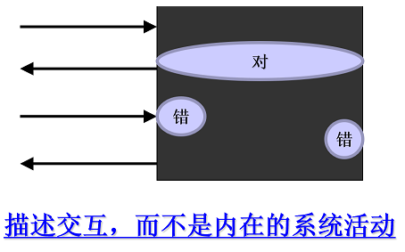

* 把系统内部活动当用例

     
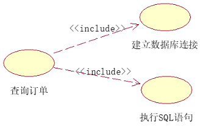

### 9.4.4 确定用例之间的关系
* 用例之间的关系：包含、扩展、泛化
* 小型图书系统用例图如下页所示。

  >小型图书资料管理系统

	* 一个小型图书资料管理系统需要实现对图书资料的借出、归还、查询和管理。该系统有图书管理员和普通用户两种用户，普通读者必须先进行注册才能使用该系统。
	* 图书管理员负责添加、更新和删除系统中的图书资料信息，并登记和查询图书资料的借出或归还情况。
	* 图书管理员负责书目的添加、更新、删除工作。（比如“红楼梦”，同一个版本，内容完全一样，图书馆中会有多本，区别是它们的编号即条形码即书目号）
	* 普通读者可以按照作者或主题等检索图书资料信息，并且可以预定目前借不到的图书资料。一旦预定的图书资料被归还，系统会立即发送Email给预订者进行通知。

     
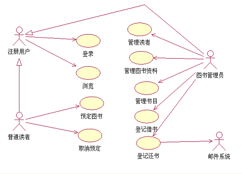

	* 用例简要描述
		* 登录：普通读者登录后才具有浏览、预定图书、取消预定等能力。
        	* 图书管理员登录后才具有借书、还书管理书籍等能力。
		* 浏览：用户可以浏览检索（根据书名，作者名等）图书馆的书籍信息。
        	* 图书管理员可以检索借书还书状况。
		* 预定图书：普通读者可以通过网上预定某本图书借阅。一旦该图书归还，即通知预订者。
		* 取消预定
     		* 普通读者可以通过网上取消某本图书的预定
		* 管理读者
	    	* 图书管理员具有查询、增加、删除、修改读者信息的功能。
		* 管理图书资料   图书管理员具有查询、增加、删除、修改图书资料的功能
		* 管理书目
     		* 图书管理员具有查询、增加、删除、书目的功能。
		* 登记借书
     		* 图书管理员根据普通读者的图书证和要借书目，新增一条借书记录功能。
		* 登记还书 
    		* 普通读者归还书籍，图书管理员具有记录还书信息的功能。 
        

### 9.4.5 编写用例描述文档
* 用例文档又称为用例规约或用例描述。
* 顾名思义，用例文档是用于描述用例的文档，每一个用例对应于一个用例文档。在用例文档中需要用文字的方式描述用例的执行过程，即执行者与系统的交互过程 。
* 用例建模包括用例图的绘制和用例文档的编写，其核心在于编写用例文档。
* 用例建模是软件需求分析到最终实现的第一步，它从用户的角度来描述软件系统的功能，描述人们如何使用软件系统。

  >eg:

     
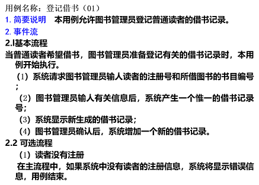

     
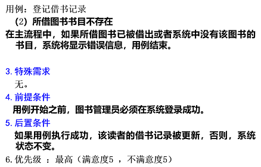

* 用例描述文档组成
	* 用例名称：与用例图同，并写相应编号
	* 简要说明/描述：简要描述功能
	* 优先级：标识软件客户对该用例实现状况的期许（满意度1-5、不满意度1-5）。
	* 事件流：就是用例执行时，由一序列活动组成的控制流。
	* 基本事件流：对用例中常规、预期路径的描述。
	* 其他事件流：主要是对一些异常情况、选择分支进行描述。
	* 非功能需求
	* 前置条件：在用例启动时参与者（actor）与系统应置于什么状态。
	* 后置条件：用例结束时系统应置于什么状态。
		* 即用例结束时的系统状态或持久数据情况。
	* 扩展点：如果有包含用例或扩展用例，此处写出用例名，并说明什么情况下使用。

  >eg:某校网上选课系统的用例分析
     
	>* 管理员通过系统管理界面登录后进入系统，建立本学期要开设的各种课程，将课程信息保存到系统中，并可以对课程能进行改动和删除。
	>* 学生可通过客户机浏览器登录后进入系统，选择课程。选课流程为：查询可选课程，选择课程，支付课程费用（可用支付宝和网银、微信三种支付方式）。

     
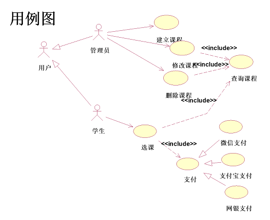

### 9.4.6 用例的粒度
* 怎样确定用例的粒度？
	* 用例的粒度（用例的大小）可大可小，一般一个系统易控制在**20个**用例左右。
	* 用例是系统级的、抽象的描述，不是细化的（是做什么，非怎样做）
	* 对复杂的系统可以划分为若干个子系统处理。
* 场景与用例步骤的先后次序简述：
	* 根据对需求的熟悉程度。不熟悉，向各类相关人员打听，他用到了系统的什么功能，怎么用的，描述为场景。再抽取出用例。
熟悉，则用例到场景，再到用例。

     
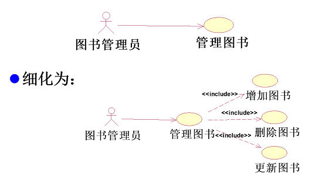

