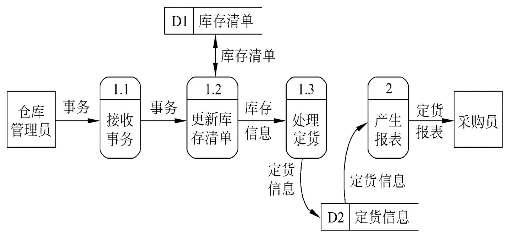

# 2.5  数据字典(DD   Data   Dictionary)

### 2.5.1  数据字典

* 1、数据字典
    * 是关于数据的信息的集合，也就是对数据流图中包含的所有元素的定义的集合。
    * 数据流图和数据字典是系统逻辑模型的主要组成部分。
          
* 2、数据字典的组成（掌握）：
    * 数据流
    * 数据流分量(即数据元素-不可再分解的数据单位)
    * 数据存储
    * 处理(用其它工具描述更方便，如IPO图)
      
      >对数据的处理用其他工具(如IPO图或PDL)描述更方便。

* 3、细化，描绘系统的主要功能（功能级数据流图）

   

   
   ----------------

   

* 4、符号（理解）：
    * `=`意思是等价于(或定义为)；
    * `+`意思是和(即，连接两个分量)；
    * `［ ］`意思是或(即，从方括弧内列出的若干个分量中选择一个)，通常用` | `号隔开供选择的分量；
    * `{  }`意思是重复(即，重复花括弧内的分量)；常常使用上限和下限进一步注释表示重复的花括弧。
    * `(  )`意思是可选(即，圆括弧里的分量可有可无)。 

* 5、例子

    >eg1
    
    * 购书单=学号+姓名+1{书号+数量+单价}10+书费合计
    * 学生用书表={学院编号+专业编号+年级+{书号}}
    * 年级=[ 1 | 2 | 3 | 4 ]
    * 学号=10{数字}10
    
    >eg2：描述c语言中标识符定义

    * 标识符 = 字母下划线字符 + 字母下划线数字串
    * 字母下划线数字串 =0{ 字母|数字|下划线｝7
    * 字母下划线字符 =［字母字符｜下划线字符］
    * 字母=。。。。

### 2.5.2 IPO图(INPUT PROCESS OUTPUT    了解格式)

* IPO图：是输入、处理、输出图的简称，它是美国IBM公司发展完善起来的一种图形工具，能够方便地描绘输入数据、对数据的处理和输出数据之间的关系。
* 两种形式。
    * IPO
    * 改进的IPO

* 改进的IPO

   

   
   -------------
   
   

   
   ------------
   
   

### 2.5.3  数据字典的用途

* 数据字典最重要的用途是作为分析阶段的工具；
* 数据字典中包含的每个数据元素的控制信息是很有价值的。很容易估计改变一个数据将产生的影响；
* 数据字典是开发数据库的第一步，而且是很有价值的一步。

