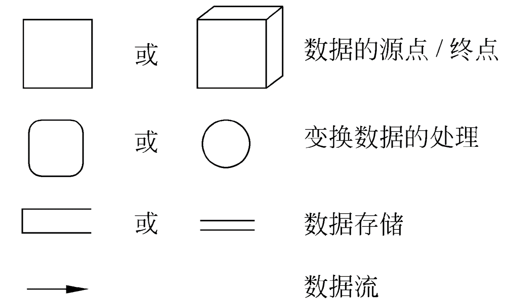
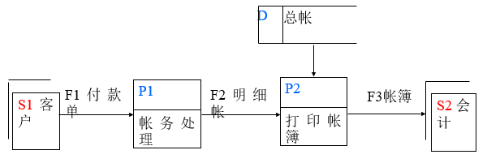
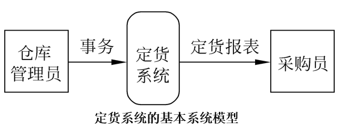
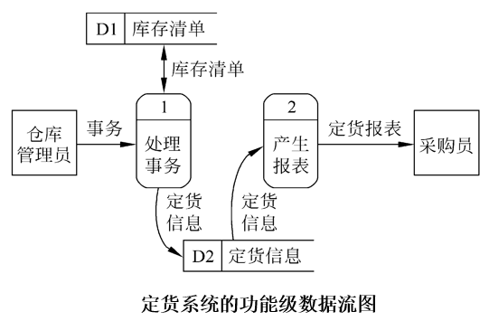
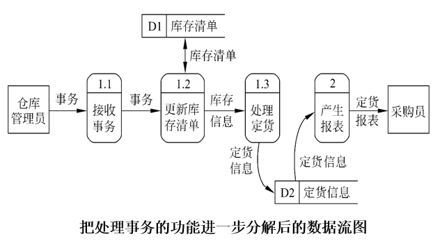
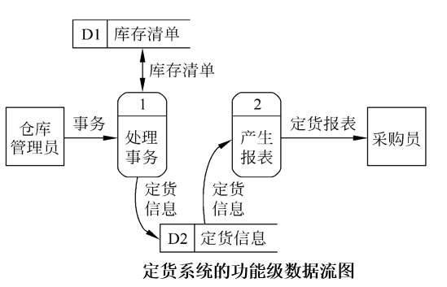
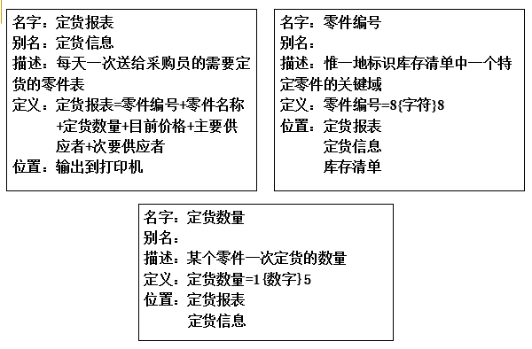
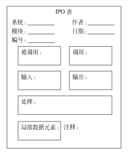
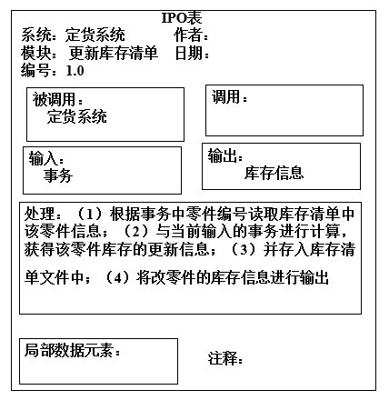

<h1 align="center">第二章 可行性研究</h1>

* [2.1 可行性研究的任务](#21-可行性研究的任务)
* [2.2 可行性研究过程](#22-可行性研究过程)
	* [2.2.1 可行性研究过程](#221-可行性研究过程)
	* [2.2.2 可行性研究报告的编写](#222-可行性研究报告的编写)
* [2.3 数据流图（DFD，Data Flow Diagram）](#23-数据流图DFDData-Flow-Diagram)
	* [2.3.1 符号](#231-符号)
	* [2.3.2 数据流图的绘制方法](#232-数据流图的绘制方法)
	* [2.3.3 数据流图](#233-数据流图)
	* [2.3.4 用途](#234-用途)
* [2.4 数据字典(DD Data Dictionary)](#24-数据字典DD-Data-Dictionary)
	* [2.4.1 数据字典](#241-数据字典)
	* [2.4.2 IPO图(INPUT PROCESS OUTPUT 了解格式)](#242-IPO图INPUT-PROCESS-OUTPUT-了解格式)
	* [2.4.3 数据字典的用途](#243-数据字典的用途)
* [2.5 成本/效益分析](#25-成本效益分析)
	* [2.5.1 成本估计](#251-成本估计)
	* [2.5.2 成本/效益分析的方法](#252-成本效益分析的方法)

# 2.1 可行性研究的任务

   

* 任务：有可行的解吗
* 从哪些方面考虑可行性？
    * 主要方面：
      * 技术可行性，使用现有的技术能实现这个系统吗?
      * 经济可行性，这个系统的经济效益能超过它的开发成本吗?
      * 操作可行性，系统的操作方式在这个用户组织内行得通吗?
    * 其他方面：
      * 运行可行性，系统的运行方式是否可行？
      * 法律可行性，系统是否侵犯他人、集体或国家的利益，是否违反法律？ 

* 《计算机软件开发规范》指出：可行性研究主要任务：了解客户的要求及现实环境，从技术、经济和社会因素等三方面研究并论证本软件项目，编写可行性研究报告，制定初步项目开发计划。
* 主要文档：
   * **可行性论证报告**（立即进行/推迟进行/不能或不值得进行）：主要包含有 **现有系统的物理模型**（系统流程图）、**目标系统的高层逻辑模型**（数据流图）、**成本效益分析**等

# 2.2 可行性研究过程

### 2.2.1 可行性研究过程

* 1、复查系统规模和目标
    * 对问题定义阶段书写的关于规模和目标的报告书进一步复查确认。
* 2、研究目前正在使用的系统 
    * 新的目标系统必须也能完成旧系统的基本功能；另一方面，新系统必须能解决旧系统中存在的问题。 
    * 描述现有系统物理模型 
        * 手段：通过系统流程图描述现有物理系统。
* 3、导出新系统的高层逻辑模型  
    * 手段：   根据现有系统物理模型，及用户需求，构造顶层数据流图，得到新系统逻辑模型。
* 4、进一步定义问题
    * 分析员应该和用户一起再次复查问题定义、工程规模和目标。 
    
    ----------------
    
    >**可行性研究的前4个步骤实质上构成一个循环**。 
    
    ----------------

 * 5、导出和评价供选择的解法
    * 使用软件工程的方法和经验导出解：
    * 选择解：
        * 首先从技术角度出发排除不可行方案；
        * 其次考虑操作可行性，去掉用户不能接受的方案；
        * 接下来考虑经济可行性，估计余下的每个可能的系统的开发成本和运行费用，进行成本/效益分析；
        * 最后为每个在各方面都可行的系统制定实现进度表。
* 6、推荐行动方针
    * 根据可行性研究结果应该做出的一个关键性决定，是否继续进行这项开发工程。
    * 若继续开发，选择一种最好的解法，说明选择这个解决方案的理由。

    >是否继续开发，使用哪种方法开发（选择解）

* 7、草拟开发计划
    * 分析员应该为所推荐的方案草拟一份开发计划。
        * 工程进度表、
        * 所需人和物资源、
        * 估计系统生命周期每个阶段的成本、
        * 各阶段(需求分析)的详细进度表
        * 成本估计。 

    ------------------
    
    * 工程进度表
    
      <table>
          <tr>
              <td>阶段</td>
              <td>所需时间（人月）</td>
          </tr>
          <tr>
              <td>可行性研究</td>
              <td>0.5</td>
          </tr>
          <tr>
              <td>需求分析</td>
              <td>1</td>
          </tr>
          <tr>
              <td>概要设计</td>
              <td>0.5</td>
          </tr>
          <tr>
              <td>详细设计</td>
              <td>1</td>
          </tr>
          <tr>
              <td>实现</td>
              <td>2</td>
          </tr>
          <tr>
              <td>总计</td>
              <td>5</td>
          </tr>
      </table>
    
    * 项目实施计划
        * 1、系统概述：包括项目目标，主要功能，系统特点，以及关于开发工作的安排
        * 2、系统资源：包括开发和运行该系统所需要的各种资源（如硬件、软件、人员和组织机构等）
        * 3、费用预算：分阶段的人员费用、机时费用及其他费用
        * 4、进度安排：各阶段起始时间、完成文档及验证方式
        * 5、要交付的产品清单
    
    ------------------

* 8、书写文档提交审查
    * 把可行性研究各个步骤的工作结果写成清晰的文档，请用户、客户组织的负责人及评审组审查，以决定是否继续这项工程及是否接受分析员推荐的方案。 

### 2.2.2 可行性研究报告的编写

    1 引言
      1.1 编写目的
      1.2 背景
      1.3 定义
      1.4 参考资料
    2 可行性研究的前提
      2.1 要求
      2.2 目标
      2.3 条件、假定和限制
      2.4 进行可行性研究的方法
      2.5 评价尺度
    3 对现有系统的分析
      3.1 数据流程和处理流程
      3.2 工作负荷
      3.3 费用开支
      3.4 人员
      3.5 设备
      3.6 局限性
    4 所建议的系统
      4.1 对所建议系统的说明
      4.2 数据流程和处理流程
      4.3 改进之处
      4.4 影响
      4.5 局限性
      4.6 技术条件方面的可行性
    5 可选择的其它系统方案
      5.1 可选择的其它系统1
      5.2 可选择的其它系统2
         ......
    6 投资及收益分析
      6.1 支出
      6.2 收益
      6.3 收益/投资比
      6.4 投资回收周期
      6.5 敏感性分析
    7 社会条件方面的可行性
      7.1 法律方面的可行性 
      7.2 使用方面的可行性

# 2.3 数据流图（DFD，Data Flow Diagram）

* 定义：是一种图形化技术，它描绘信息流和数据在软件中从输入移动到输出的过程中所经受的变换。
* 在数据流图中没有任何具体的物理部件，它只是描绘数据在软件中流动和被处理的逻辑过程。
* 描述：系统中数据的形式 及对数据的操作

### 2.3.1 符号

* 基本符号

   

* 数据源点/终点：通常是人或部门，可重复表示；
* 处理：一个处理框可以代表一系列程序、单个程序或程序的一个模块； 要描述清楚进行的是什么操作。
* 数据存储：可以表示一个文件、文件的一部分、数据库的元素或记录的一部分等，数据存储是处于静止状态的数据； 
* 数据流：描绘所有可能的数据流向，而不应该描绘出现某个数据流的条件 ，数据流是处于运动中的数据。

    >eg
    
    * 下图是一个简单的DFD。它表示数据流“付款单”从外部项“客户”（源点）流出，经加工“帐务处理”转换成数据流“明细帐”，再经加工“打印帐簿”转换成数据流“帐簿”，最后流向外部项“会计”（终点），加工“打印帐簿”在进行转换时，从数据存储“总帐”中读取数据。
    
    
        

>例：定货系统(绘制DFD) 
   >>零件入库或出库称为事务，通过放在仓库中的CRT终端把事务报告给定货系统，及时修改库存清单主文件。 
   >>当某种零件的库存量少于库存量的临界值时，就应该再次定货。 
   >>假设采购部每天需要一张定货报表，报表按零件编号排序，表中列出所有需要再次定货的零件。对于每个需要再次定货的零件，应该列出下述数据：零件编号，零件名称，定货数量，目前价格，主要供应者，次要供应者。

### 2.3.2 数据流图的绘制方法

* 一、前期准备

  * 1、寻找数据   
       * 源点、终点
       * 处理
       * 数据存储
       * 数据流

  * 2、用分层的思想，以数据流动及对数据的处理描述工作过程

  * 3、构造分层DFD图的过程就是结构化的系统建模过程，其基本步骤如下：
       * （1）确定外部实体，画顶层数据流图。以项目开发计划确定的目标为基础，经过需求获取工作，可以划定系统的边界，确定系统的数据源点和终点，进而找出外部实体的输入和输出数据流，画出顶层数据流图。
       * （2）再分解顶层的加工。从数据源点出发，按照系统的逻辑需要，逐步画出一系列逻辑加工，直至数据终点。自顶向下，对每个加工进行内部分解，画出分层数据流图。
       * （3）对数据流图进一步求精。对数据流图进行复查求精，需要分析员和用户共同参与，分析员借助数据流图向用户阐述输入数据如何一步步转变为输出结果。用户对分析员的阐述予以纠正和补充，分析员在此基础上对数据流图进一步求精。

       >当进一步涉及到如何具体实现一个功能时就不再分解了

* 二、画基本系统模型

    * 由若干个数据源点/终点和一个处理组成。

        

    * 涉及到的处理及数据
      * 事务：零件编号  事务类型  数量
      * 订货报表：零件编号，零件名称，定货数量，目前价格，主要供应者，次要供应者

* 三、细化，描绘系统的主要功能（功能级数据流图）

     

    * 涉及到的处理及数据

      * 处理
          * （1）处理事务：当有零件入库或出库时，修改库存清单主文件，并生成订货信息
          * （2）产生报表：根据订货信息，生成报表
      * 数据：
          * （1）库存清单：零件编号，零件名称  ，库存量，库存临界值，库存最大值，目前价格，主要供应者，次要供应者
          * （2）订货信息：零件编号，零件名称，库存量，临界值，库存最大值，库存临界值，目前价格，主要供应者，次要供应者

* 四、对系统主要功能进一步细化

     

   

### 2.3.3 数据流图

* 1、数据流图 ：它从数据传递和加工角度，以图形方式来表达系统的逻辑功能、数据在系统内部的逻辑流向和逻辑变换过程，是结构化系统分析方法的主要表达工具及用于表示软件模型的一种图示方法。

* 2、细化时注意
      
     * 当进一步分解涉及如何具体的实现一个功能时就不应该再分解了。
      
     * 当对数据流图分层细化时必须保持信息连续性，也就是说，当把一个处理分解为一系列处理时，分解前和分解后的输入输出数据流必须相同。
      
     * 注意对处理进行编号的方法。 

### 2.3.4 用途 

* 作为交流信息的工具
      
     * 供有关人员审查确认
      
     * 供用户理解和评价
      
     * 数据流图应该分层，超过9个时应该画分图 
* 作为分析和设计的工具
      
     * 描绘系统所完成的功能 
      
     * 辅助物理系统的设计时，以定时要求为指南，画出许多组自动化边界，对应不同的物理系统。 
      
     * 导出更详细的设计步骤——面向数据流的设计方法 

# 2.4 数据字典(DD Data Dictionary)

### 2.4.1 数据字典

* 1、数据字典
    * 是关于数据的信息的集合，也就是对数据流图中包含的所有元素的定义的集合。
    * 数据流图和数据字典是系统逻辑模型的主要组成部分。
          
* 2、数据字典的组成（掌握）：
    * 数据流
    * 数据流分量(即数据元素-不可再分解的数据单位)
    * 数据存储
    * 处理(用其它工具描述更方便，如IPO图)
      
      >对数据的处理用其他工具(如IPO图或PDL)描述更方便。

* 3、细化，描绘系统的主要功能（功能级数据流图）

   

   
   ----------------

   

* 4、符号（理解）：
    * `=`意思是等价于(或定义为)；
    * `+`意思是和(即，连接两个分量)；
    * `［ ］`意思是或(即，从方括弧内列出的若干个分量中选择一个)，通常用` | `号隔开供选择的分量；
    * `{  }`意思是重复(即，重复花括弧内的分量)；常常使用上限和下限进一步注释表示重复的花括弧。
    * `(  )`意思是可选(即，圆括弧里的分量可有可无)。 

* 5、例子

    >eg1
    
    * 购书单=学号+姓名+1{书号+数量+单价}10+书费合计
    * 学生用书表={学院编号+专业编号+年级+{书号}}
    * 年级=[ 1 | 2 | 3 | 4 ]
    * 学号=10{数字}10
    
    >eg2：描述c语言中标识符定义

    * 标识符 = 字母下划线字符 + 字母下划线数字串
    * 字母下划线数字串 =0{ 字母|数字|下划线｝7
    * 字母下划线字符 =［字母字符｜下划线字符］
    * 字母=。。。。

### 2.4.2 IPO图(INPUT PROCESS OUTPUT 了解格式)

* IPO图：是输入、处理、输出图的简称，它是美国IBM公司发展完善起来的一种图形工具，能够方便地描绘输入数据、对数据的处理和输出数据之间的关系。
* 两种形式。
    * IPO
    * 改进的IPO

* 改进的IPO

   

   
   -------------
   
   

   

### 2.4.3 数据字典的用途

* 数据字典最重要的用途是作为分析阶段的工具；
* 数据字典中包含的每个数据元素的控制信息是很有价值的。很容易估计改变一个数据将产生的影响；
* 数据字典是开发数据库的第一步，而且是很有价值的一步。

# 2.5 成本/效益分析

* 成本/效益分析的目的正是要从经济角度分析开发一个特定的新系统是否划算，从而帮助客户组织的负责人正确地作出是否投资于这项开发工程的决定。 

### 2.5.1 成本估计

* 1、代码行技术
    * 方法：通常根据经验和历史数据估计实现一个功能需要的源程序行数。一旦估计出源代码行数以后，用每行代码的平均成本乘以行数就可以确定软件的成本。每行代码的平均成本主要取决于软件的复杂程度和工资水平。
    * 特点：简单；当有以往开发类似工程的历史数据可供参考时，这个方法是非常有效的。 
    * 代码行技术分析一个过程控制系统：
    
        <table align="center">
           <tr>
              <td>功能</td>
              <td>生产率(行/人月)</td>
              <td>估计行数</td>
              <td>每行成本(元／行)</td>
              <td>成本(元)</td>
              <td>人力(人月)</td>
           </tr>
           <tr>
              <td>获取实时数据</td>
              <td>92</td>
              <td>840</td>
              <td>108</td>
              <td>90720</td>
              <td>9.1</td>
           </tr>
           <tr>
              <td>更新数据库</td>
              <td>102</td>
              <td>1210</td>
              <td>54</td>
              <td>65340</td>
              <td>11.8</td>
           </tr>
           <tr>
              <td>脱机分析</td>
              <td>134</td>
              <td>600</td>
              <td>72</td>
              <td>43200</td>
              <td>4.4</td>
           </tr>
           <tr>
              <td>产生报告</td>
              <td>145</td>
              <td>450</td>
              <td>33</td>
              <td>14850</td>
              <td>3.1</td>
           </tr>
           <tr>
              <td>实时控制</td>
              <td>80</td>
              <td>1100</td>
              <td>135</td>
              <td>148500</td>
              <td>13.7</td>
           </tr>
           <tr>
              <td>总计</td>
              <td></td>
              <td></td>
              <td></td>
              <td>362610</td>
              <td>42.1</td>
           </tr>
        </table>

* 2、任务分解技术
    * 方法：首先把软件开发工程分解为若干个相对独立的任务。再分别估计每个单独的开发任务的成本，最后累加起来得出软件开发工程的总成本。估计每个任务的成本时，通常先估计完成该项任务需要用的人力(以人月为单位)，再乘以每人每月的平均工资而得出每个任务的成本。
    * 任务分解技术估计软件开发成本： 

      <table>
         <tr>
            <td>任务</td>
            <td>估计人力（人月）</td>
            <td>元／人月</td>
            <td>成本（元）</td>
         </tr>
         <tr>
            <td>需求分析</td>
            <td>5</td>
            <td>10200</td>
            <td>51000</td>
         </tr>
         <tr>
            <td>设计</td>
            <td>15</td>
            <td>9600</td>
            <td>144000</td>
         </tr>
         <tr>
            <td>编码和单元测试</td>
            <td>8</td>
            <td>7950</td>
            <td>63600</td>
         </tr>
         <tr>
            <td>综合测试</td>
            <td>16.5</td>
            <td>8700</td>
            <td>143550</td>
         </tr>
         <tr>
            <td>总计</td>
            <td>44.5</td>
            <td></td>
            <td>402150</td>
         </tr>
      </table>

* 3、自动估计成本技术 
    * 方法：采用自动估计成本的软件工具
    * 特点：可以减轻人的劳动，并且使得估计的结果更客观。但是，采用这种技术必须有长期搜集的大量历史数据为基础，并且需要有良好的数据库系统支持。 

### 2.5.2 成本/效益分析的方法

* 成本/效益分析要估计开发成本、运行费用和新系统将带来的经济效益。
* 运行费用：取决于系统的操作费用(操作员人数，工作时间，消耗的物资等等)和维护费用。
* 系统的经济效益：等于因使用新系统而增加的收入加上使用新系统可以节省的运行费用。 

  -------------------
  
  >成本/效益分析涉及的4个概念： 

* 1、货币的时间价值
    * 通常用利率的形式表示货币的时间价值。
    * 假设年利率为 i ，如果现在存入 P 元，则 n 年后可以得到的钱数为 `F = P ( 1 + i )ⁿ`
    * 反之，如果 n 年后能收入 F 元钱，那么这些钱的现在价值是 `P = F / ( 1 + i )ⁿ`

* 2、投资回收期
    * 所谓投资回收期就是使累计的经济效益等于最初投资所需要的时间。
    * 通常用投资回收期衡量一项开发工程的价值。 
    
    >例：投资回收期 = 2 + 774.88 / 1779.44 = 2.44年

* 3、纯收入
    * 纯收入是在整个生命周期之内系统的累计经济效益(折合成现在值)与投资之差。
    * 这相当于比较投资开发一个软件系统和把钱存在银行中(或贷给其他企业)这两种方案的优劣。
    
    >例：纯收入 = 9011.94 – 5000 = 4011.94元 

* 4、投资回收率
    * 用来衡量投资效益的大小，并且可以把它和年利率相比较。
    
       * P = F1/( 1 + j ) + F2/( 1 + j )² + …+ Fn( 1 + j )ⁿ
       
       * 其中：P是现在的投资额；Fi是第i年年底的效益；n是系统的使用寿命；j是投资回收率。
         
       >例：投资回收率 = 41% ~ 42%

