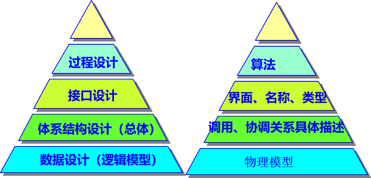
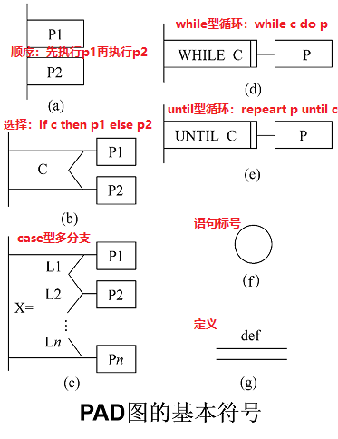
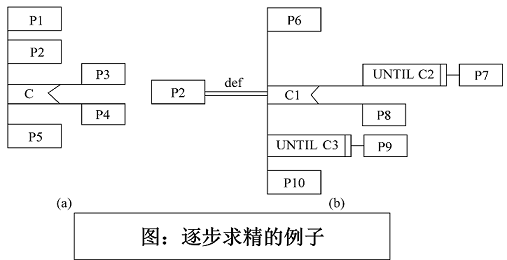
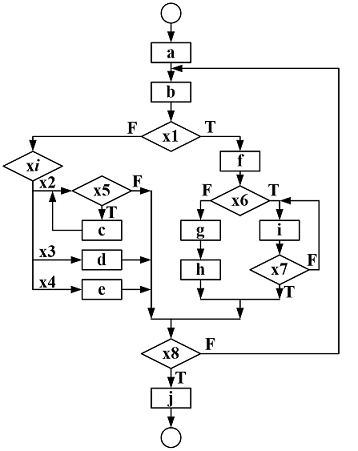
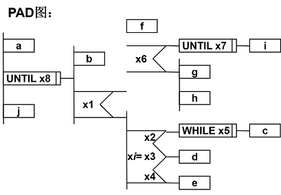
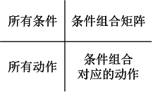
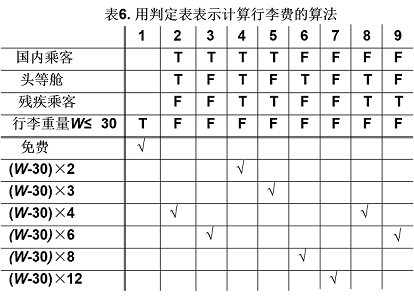
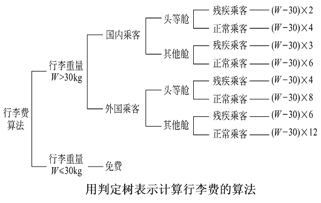

<h1 align="center">第五章  详细设计</h1>

* [5.1 过程设计的工具](#51-过程设计的工具)
	* [5.1.1 PAD图](#511-PAD图)
	* [5.1.2 判定表](#512-判定表)
	* [5.1.3 判定树](#513-判定树)
	* [5.1.4 过程设计语言](#514-过程设计语言)

>详细设计阶段的根本目标：确定应该怎样具体地实现所要求的系统。
>经过这个阶段的设计工作，应该得出对目标系统的精确描述，从而在编码阶段可以把这个描述直接翻译成用某种程序设计语言书写的程序(画流程图，盒图等)。
>包含数据、算法、接口等方面。
 

* 软件设计--概要设计——详细设计

   <div align="center"></div>

	* [概要设计](../第四章、总体设计/第四章总体设计.md)


# 5.1 过程设计的工具
### 5.1.1 PAD图
* PAD是问题分析图(problem analysis diagram)的英文缩写，自1973年由日本日立公司发明以后，已得到一定程度的推广。
* 它用二维树形结构的图来表示程序的控制流，将这种图翻译成程序代码比较容易。 

   <div align="center"></div>

* PAD图的主要优点如下：
	* 使用表示结构化控制结构的PAD符号设计出来的程序必然是结构化程序。
	* PAD图所描绘的程序结构十分清晰。
	* PAD图表现程序逻辑易读、易懂、易记。　
	* 容易将PAD图转换成高级语言源程序，这种转换可用软件工具自动完成。
	* 即可表示程序逻辑，也可描绘数据结构。
	* PAD图的符号支持自顶向下、逐步求精方法的使用。

   <div align="center"></div>

* eg:某程序流程图如右图所示，用PAD图表示。 

   <div align="center"></div>
   <div align="center"></div>

### 5.1.2 判定表
* 当算法中包含多重嵌套的条件选择时，用程序流程图、盒图、PAD图或后面即将介绍的过程设计语言(PDL)都不易清楚地描述。
* 判定表却能够清晰地表示复杂的条件组合与应做的动作之间的对应关系。 
* 适合：**单一条件只有两种结果供选择**
* 一张判定表由4部分组成：
	* 左上部列出所有条件；
	* 左下部是所有可能做的动作；
	* 右上部是表示各种条件组合的一个矩阵；
	* 右下部是和每种条件组合相对应的动作。 

    <div align="center"></div>

* 判定表的**优点**：
	* 能清晰地表示复杂的条件组合与应做的动作之间的对应关系。
* 判定表的**缺点**：          
	* 判定表的含义不是一眼就能看出来的，初次接触这种工具的人理解它需要有一个简短的学习过程。
	* 当数据元素的值多于两个时，判定表的简洁程度也将下降。

* eg：假设某航空公司规定，乘客可以免费托运重量不超过30kg的行李。当行李重量超过30kg时，对头等舱的国内乘客超重部分每公斤收费4元，对其他舱的国内乘客超重部分每公斤收费6元。对外国乘客超重部分每公斤收费比国内乘客多一倍，对残疾乘客超重部分每公斤收费比正常乘客少一半。

    <div align="center"></div>

### 5.1.3 判定树
* 判定树是判定表的变种，也能清晰地表示复杂的条件组合与应做的动作之间的对应关系。
* 多年来判定树一直受到人们的重视，是一种比较常用的系统分析和设计的工具。
* 判定树的**优点**：
	* 它的形式简单，一眼就可以看出其含义，因此易于掌握和使用。
* 判定树的**缺点**：
	* 简洁性不如判定表，数据元素的同一个值往往要重复写多遍，而且越接近树的叶端重复次数越多。
	* 画判定树时分枝的次序可能对最终画出的判定树的简洁程度有较大影响。 

    <div align="center"></div>

### 5.1.4 过程设计语言
* 过程设计语言(PDL )也称为伪码(Pseudocode )，它是用正文形式表示数据和处理过程的设计工具。
* 使用伪代码的目的是为了使被描述的算法可以容易地以任何一种编程语言（Pascal，C，Java，etc）实现。因此，伪代码必须结构清晰、代码简单、可读性好，并且类似自然语言。 介于自然语言与编程语言之间。 

  >eg:伪码描述

  ```pdl
  算法 Euclid(m, n)
  // 计算 m 和 n 最大公约数的欧氏算法
  // 输入：两个不全为0的非负整数 m≥n
  // 输出：m 和 n 的最大公约数
  while  n≠0  do   
  	r ← m mod n
  	m←n
  	n ←r 
  endwhile   
  return  m
  ```

	* **优点：表达能力强，抽象性强，容易理解**

* 伪码的特点：（并参看伪代码部分语法格式）
	* 在伪代码中，每一条指令占一行。
	* 指令后不跟任何符号。
	* “缩进”表示程序中的分支程序结构。
	* 变量不需声明
	* 赋值语句用符号←表示

* 结构化语言描述

  >【简单示例】输入3个数，打印输出其中最大的数。可用如下的伪代码表示： 
  ```pdl
  begin（算法开始） 
  输入 A，B，C 
  IF A>B 则 A→Max 
  否则 B→Max 
  IF C>Max 则 C→Max 
  print Max 
  end （算法结束） 
  ```


