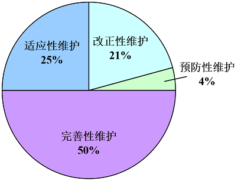
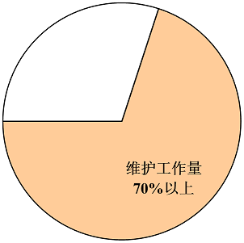
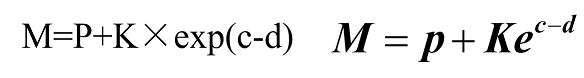

<h1 align="center">第八章  维护</h1>

* [8.1 软件维护的定义及种类](#81-软件维护的定义及种类)
	* [8.1.1 改正性维护](#811-改正性维护)
	* [8.1.2 适应性维护](#812-适应性维护)
	* [8.1.3 完善性维护](#813-完善性维护)
	* [8.1.4 预防性维护](#814-预防性维护)
	* [8.1.5 各类维护总结](#815-各类维护总结)
* [8.2 维护的特点](#82-维护的特点)

# 8.1 软件维护的定义及种类
* 1.定义
	* 所谓软件维护就是在软件已经交付使用之后，为了改正错误或满足新的需要而修改软件的过程。
* 2.可分为4项活动： 
	* 改正性维护 
	* 适应性维护 
	* 完善性维护 
	* 预防性维护 

### 8.1.1 改正性维护
* 把诊断和改正错误的过程称为改正性维护。
* 改正性维护占17%～21%。 

### 8.1.2 适应性维护
* 为了和变化了的环境适当地配合而进行的修改软件的活动，是既必要又经常的维护活动。
* 包括外部环境和数据环境的变化。
* 适应性维护占18%～25%。 

### 8.1.3 完善性维护
* 为了满足在用户提出的增加新功能或修改已有功能的要求和一般性的改进要求，需要进行完善性维护。
* 包括功能和性能的要求。
* 完善性维护占50%～66%。

### 8.1.4 预防性维护
* “把今天的方法学应用于昨天的系统以满足明天的需要。” 
* 采用先进的软件工程方法对需要维护的软件或软件中的某一部分，主动地进行重新设计、编码和测试。
* 预防性维护占4%左右。 
* 只有预防性维护是主动的，其他维护都是被动的。

### 8.1.5 各类维护总结
* 各类维护工作量所占比例

	

* 维护工作量在软件生命周期所占比例

	

* 适应性维护和完善性维护占了绝大部分工作量。维护是系统开发过程的自然延续，同样也涉及到需求描述、设 计、实现和测试活动。

# 8.2 维护的特点
* 1、维护的问题    
	* 理解别人写的程序通常非常困难，而且困难程度随着软件配置成分的减少而迅速增加。
	* 需要维护的软件往往没有合格的文档，或者文档资料显著不足。 
	* 绝大多数软件在开发时没有考虑将来的修改。
	* 软件维护不是一项吸引人的工作。
	* 软件人员流动性很高。 
* 2、维护工作量的模型
	* 模型

		

	
		* M是维护中消耗的总工作量；
		* p是生产性工作量(分析设计、编写程序代码、测试)；
		* K是一个经验常数；
		* c是复杂程度； d是对软件熟悉程度的度量。

	* 模型指明：如果使用了不好的软件开发方法(未按软件工程要求做)，原来参加开发的人员或小组不能参加维护，则工作量(及成本)将按指数级增加。

* 3、降低软件维护费用的方法
	* （1）从开发阶段的一开始就按质量标准构建系统，给予“可维护性”属性以足够的重视，这样可以使系统的整个生命周期成本减少。

	* （2）采用演化式的系统开发模型（如增量、螺旋），建立能结合新需求而演化和变更的系统。
	* （3）实施软件再工程，改善系统结构，提高可维护性。

